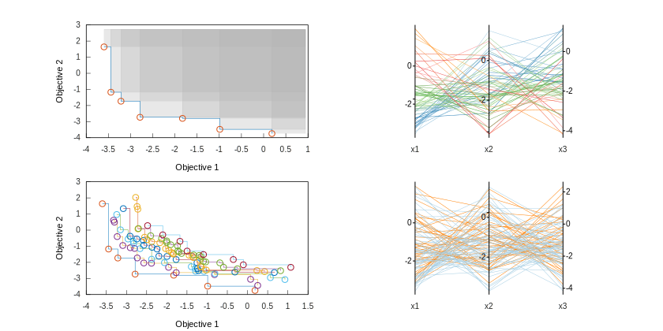
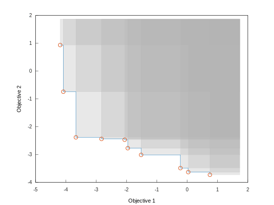

# Pareto

> Spatial Containers, Pareto Fronts, and Pareto Archives

[](https://alandefreitas.github.io/pareto/)

<br/>

While most problems need to simultaneously organize objects according to many criteria, associative containers can only index objects in a single dimension. This library provides a number of containers with optimal asymptotic complexity to represent multi-dimensional associative containers. 

These containers are useful in many applications such as games, maps, nearest neighbor search, range search, compression algorithms, statistics, mechanics, graphics libraries, database queries, finance, multi-criteria decision making, optimization, machine learning, hyper-parameter tuning, approximation algorithms, networks, routing algorithms, robust optimization, design, and systems control.

<br/>

[](https://github.com/alandefreitas/pareto/actions?query=workflow%3APareto+event%3Apush)
[](https://GitHub.com/alandefreitas/pareto/releases/)
[](https://alandefreitas.github.io/pareto/)
[](https://codedocs.xyz/alandefreitas/pareto/)
[](https://github.com/alandefreitas/pareto/discussions)

<br/>

<!-- https://github.com/bradvin/social-share-urls -->
[](https://www.facebook.com/sharer/sharer.php?t=Pareto%20Fronts%20and%20Archives%20/%20C%2B%2B%20and%20Python&u=https://github.com/alandefreitas/pareto/)
[](http://sns.qzone.qq.com/cgi-bin/qzshare/cgi_qzshare_onekey?url=https://github.com/alandefreitas/pareto/&title=Pareto%20Fronts%20and%20Archives%20/%20C%2B%2B%20and%20Python&summary=Pareto%20Fronts%20and%20Archives%20/%20C%2B%2B%20and%20Python)
[](http://sns.qzone.qq.com/cgi-bin/qzshare/cgi_qzshare_onekey?url=https://github.com/alandefreitas/pareto/&title=Pareto%20Fronts%20and%20Archives%20/%20C%2B%2B%20and%20Python&summary=Pareto%20Fronts%20and%20Archives%20/%20C%2B%2B%20and%20Python)
[](http://www.reddit.com/submit?url=https://github.com/alandefreitas/pareto/&title=Pareto%20Fronts%20and%20Archives%20/%20C%2B%2B%20and%20Python)
[](https://twitter.com/intent/tweet?text=Pareto%20Fronts%20and%20Archives%20/%20C%2B%2B%20and%20Python&url=https://github.com/alandefreitas/pareto/&hashtags=MOO,MultiObjectiveOptimization,Cpp,ScientificComputing,Optimization,Developers)
[](https://www.linkedin.com/shareArticle?mini=false&url=https://github.com/alandefreitas/pareto/&title=Pareto%20Fronts%20and%20Archives%20/%20C%2B%2B%20and%20Python)
[](https://api.whatsapp.com/send?text=Pareto%20Fronts%20and%20Archives%20/%20C%2B%2B%20and%20Python:+https://github.com/alandefreitas/pareto/)
[](https://lineit.line.me/share/ui?url=https://github.com/alandefreitas/pareto/&text=Pareto%20Fronts%20and%20Archives%20/%20C%2B%2B%20and%20Python)
[](https://telegram.me/share/url?url=https://github.com/alandefreitas/pareto/&text=Pareto%20Fronts%20and%20Archives%20/%20C%2B%2B%20and%20Python)
[](https://news.ycombinator.com/submitlink?u=https://github.com/alandefreitas/pareto/&t=Pareto%20Fronts%20and%20Archives%20/%20C%2B%2B%20and%20Python)

<br/>

<!-- START mdsplit-ignore -->

<h2>

[READ THE DOCUMENTATION FOR A QUICK START](https://alandefreitas.github.io/pareto/)

</h2>

<!-- START doctoc generated TOC please keep comment here to allow auto update -->
<!-- DON'T EDIT THIS SECTION, INSTEAD RE-RUN doctoc TO UPDATE -->
<details>
<summary>Table of Contents</summary>

- [Quick start](#quick-start)
  - [Spatial Containers](#spatial-containers)
  - [Front Container](#front-container)
  - [Archive Container](#archive-container)
  - [Interfaces](#interfaces)
  - [Performance](#performance)
- [Integration](#integration)
  - [C++](#c)
  - [Python](#python)
  - [Installing](#installing)
  - [Building](#building)
- [Spatial Containers](#spatial-containers-1)
  - [Containers](#containers)
  - [Types](#types)
  - [Constructors](#constructors)
  - [Allocators](#allocators)
  - [Element Access](#element-access)
  - [Iterators](#iterators)
  - [Capacity and Reference Points](#capacity-and-reference-points)
  - [Modifiers](#modifiers)
  - [Lookup and Queries](#lookup-and-queries)
  - [Observers](#observers)
  - [Relational Operators](#relational-operators)
- [Front Container](#front-container-1)
  - [Front Concept](#front-concept)
  - [Types](#types-1)
  - [Constructors](#constructors-1)
  - [Allocators](#allocators-1)
  - [Element Access](#element-access-1)
  - [Iterators](#iterators-1)
  - [Capacity and Reference Points](#capacity-and-reference-points-1)
  - [Dominance Relationships](#dominance-relationships)
  - [Indicators](#indicators)
  - [Modifiers](#modifiers-1)
  - [Lookup and Queries](#lookup-and-queries-1)
  - [Observers](#observers-1)
  - [Relational Operators](#relational-operators-1)
- [Archive Container](#archive-container-1)
  - [Archive Concept](#archive-concept)
  - [Types](#types-2)
  - [Constructors](#constructors-2)
  - [Allocators](#allocators-2)
  - [Element Access](#element-access-2)
  - [Iterators](#iterators-2)
  - [Capacity and Reference Points](#capacity-and-reference-points-2)
  - [Dominance Relationships](#dominance-relationships-1)
  - [Indicators](#indicators-1)
  - [Modifiers](#modifiers-2)
  - [Lookup and Queries](#lookup-and-queries-2)
  - [Observers](#observers-2)
  - [Relational Operators](#relational-operators-2)
- [Benchmarks](#benchmarks)
  - [Construct](#construct)
  - [Insert](#insert)
  - [Erase](#erase)
  - [Dominance](#dominance)
  - [Query Intersection](#query-intersection)
  - [Query Nearest](#query-nearest)
  - [IGD indicator](#igd-indicator)
  - [Hypervolume indicator](#hypervolume-indicator)
- [Contributing](#contributing)
  - [Ideas](#ideas)
  - [Contributing Guidelines](#contributing-guidelines)
  - [Contributors](#contributors)
  - [Thanks](#thanks)
- [References](#references)

</details>
<!-- END doctoc generated TOC please keep comment here to allow auto update -->

<!-- END mdsplit-ignore -->


## Quick start

### Spatial Containers

This library defines and implements **spatial containers**, which are an extension of the *AssociativeContainer* named requirement for multi-dimensional containers:

=== "C++"

    ```cpp hl_lines="4"
    // Unidimensional associative container 
    std::map<double, unsigned> m;
    // Multidimensional associative container
    pareto::spatial_map<double, 3, unsigned> n;
    ```

=== "Python"

    ```python hl_lines="4"
    # Unidimensional associative container
    m = sortedcontainers.SortedDict()
    # Multidimensional associative container
    n = pareto.spatial_map(3)
    ```

Spatial containers allow you to later find its elements with query iterators:

=== "C++"

    ```cpp
    spatial_map<double, 2, unsigned> m;
    m(-2.5, -1.5) = 17;
    m(-2.1, -0.5) = 32;
    m(-1.6, 0.9) = 36;
    m(-0.6, 0.9) = 13;
    m(-0.5, 0.8) = 32;
    std::cout << "Closest elements to [0, 0]:" << std::endl;
    for (auto it = m.find_nearest({0.,0.}, 2); it != m.end(); ++it) {
        std::cout << it->first << ": " << it->second << std::endl;
    }
    std::cout << "Elements between [-1, -1] and [+1, +1]:" << std::endl;
    for (auto it = m.find_intersection({-1.,-1.}, {+1, +1}); it != m.end(); ++it) {
        std::cout << it->first << ": " << it->second << std::endl;
    }
    ```

=== "Python"

    ```python
    m = pareto.spatial_map()
    m[-2.5, -1.5] = 17
    m[-2.1, -0.5] = 32
    m[-1.6, 0.9] = 36
    m[-0.6, 0.9] = 13
    m[-0.5, 0.8] = 32
    print("Closest elements to [0, 0]:")
    for [k, v] in m.find_nearest(pareto.point([0.,0.]), 2):
        print(k, ":", v)
    
    print("Elements between [-1, -1] and [+1, +1]:")
    for [k, v] in m.find_intersection(pareto.point([-1.,-1.]), pareto.point([+1, +1])):
        print(k, ":", v)

    ```

=== "Output"

    ```console
    Closest elements to [0, 0]:
    [-0.5, 0.8]: 32
    [-0.6, 0.9]: 13
    Elements between [-1, -1] and [+1, +1]:
    [-0.6, 0.9]: 13
    [-0.5, 0.8]: 32
    ```

Multi-dimensional associative containers are useful in applications where you need to simultaneously order objects according to a number for criteria, such as in:

* games
* maps
* nearest neighbor search
* range search
* compression algorithms
* statistics
* mechanics
* graphics libraries
* database queries. 
  
Many applications already need to implement such kinds of containers, although in a less generic way.

!!! info "Complexity"
    Inserting, removing, and finding solutions cost $O(m \log n)$, where $m$ is the number of dimensions and $n$ is the number of elements. 

!!! tip "Unidimensional Spatial Containers"
    When $m=1$, a `pareto::spatial_map` internally decays into a `std::multimap`, which is useful for applications where we don't know $m$ beforehand or need to handle many possible values of $m$ without maintaining two different implementations.

!!! info "Runtime dimensions"
    Some problems are so dynamic that even the number of dimensions changes at runtime. In these applications, you can set the number of compile-time dimensions to `0`, and the containers will accept keys with any number of dimensions. This, of course, comes at a cost of an extra dynamic memory allocation per element.

The usual `find(k)`, `lower_bound(k)`, and `upper_bound(k)` functions of unidimensional maps are not enough for spatial
containers. We fix this with **query iterators**, that explore the spatial data according to a list of predicates.
Queries can limit or expand their search region with a conjunction of predicates such as intersections, disjunctions,
and nearest points.

!!! tip "Predicate Lists"
    To make queries more efficient, the `pareto::predicate_list` object compresses redundant predicates and sorts these predicates by how restrictive they are. All tree nodes store their minimum bounding rectangles, and these underlying data structures are then explored to avoid nodes that might not pass the predicate list. This allows us to find each query element in $O(m \log n)$ time, regardless of how complex the query is.

### Front Container

The `pareto::front` object defines a container for **Pareto fronts**, which is both an adapter and an extension of the spatial containers to deal with objects representing conflicting alternatives:

=== "C++"

    ```cpp
    // Three-dimensional Pareto front
    pareto::front<double, 3, unsigned> m;
    ```

=== "Python"

    ```python
    # Three-dimensional Pareto front
    # The dimension will be set when you insert the first element
    m = pareto.front()
    ```

When inserting a new element in the front, all solutions *dominated* by the new solution are erased with spatial queries. 


=== "C++"

    ```cpp
    front<double, 2, unsigned> pf;
    pf(0., 1.) = 17; // Good at x[0]
    pf(1., 0.) = 32; // Good at x[1]
    pf(2., 1.) = 36; // Dominated by [1., 0.]
    for (const auto &[k, v] : pf) {
        std::cout << k << " -> " << v << std::endl;
    }
    ```

=== "Python"

    ```python
    pf = pareto.front()
    # Good at x[0]
    pf[0., 1.] = 17
    # Good at x[1]
    pf[1., 0.] = 32
    # Dominated by [1., 0.]
    pf[2., 1.] = 36
    for [k, v] in pf:
        print(k, " -> ", v)
    ```

=== "Output"

    ```console
    [0, 1] -> 17
    [1, 0] -> 32
    ```

Pareto fronts are useful in any application where we need to store the best objects according to a number of criteria, such as:

* finance
* multi-criteria decision making
* optimization
* machine learning
* hyper-parameter tuning
* approximation algorithms
* P2P networks
* routing algorithms
* robust optimization
* design
* systems control

!!! tip 
    You can think of fronts as a container for dynamic multidimensional max/min-finding. 

!!! example 
     Suppose you want to choose between a number of investment portfolios. By looking at the historical data, you have noticed each portfolio has an average return and some average risk (something like the covariance between the assets). Because there is an exponential number of portfolio candidates, you can instead iteratively update the front with the best portfolios for your criteria and use these portfolios as a reference to test new portfolios. You would then have front like the following:

     

These objectives often go in different directions (e.g., minimize price vs. maximize quality). In these situations, you can specify a direction for each dimension.

=== "C++"

    ```cpp
    // C++ Three-dimensional Pareto front
    pareto::front<double, 2, unsigned> m({min, max});
    ```

=== "Python"

    ```python
    # Python Three-dimensional Pareto front
    m = pareto.front(['min','max'])
    ```

!!! example
    

    In more than two dimensions, we usually represent the fronts with parallel coordinates:

    

!!! tip "Plotting Fronts"
    The header `pareto/matplot/front.h` includes some snippets to plot these fronts with [Matplot++](https:://www.github.com/alandefreitas/matplotplusplus).

Data scientists often use linear lists to represent these fronts, with a cost of $O(mn^2)$ for several operations. This
makes it unfeasible to represent the thousands or millions of solutions we usually have in a non-polynomial
multidimensional optimization problem due to the curse of dimensionality. With spatial indexes, this cost reduces to
only $O(m \log n)$.

!!! tip "Indicators"
    Because Pareto fronts include solutions that are incomparable by definition, we need metrics to tell us the quality of a front. The `front` objects implement lots of performance indicators that can give us measures of:

    * hypervolume
    * convergence
    * cardinality
    * distribution
    * correlation


### Archive Container

The `pareto::archive` container is also both an adapter and an extension of spatial containers to cache objects representing conflicting alternatives:

=== "C++"

    ```cpp
    // Three-dimensional Pareto archive
    pareto::archive<double, 3, unsigned> m;
    ```

=== "Python"

    ```python
    # Python Three-dimensional Pareto archive
    m = pareto.archive()
    ```

They are useful in dynamic applications where the best objects might not be available in the future and we might need a second best. Archives are especially useful in all dynamic applications that use fronts, such as:

* P2P networks
* multi-criteria decision making
* generate-and-test optimization algorithms
* robust optimization

!!! tip
    You can think of archives as a multidimensional stack.

!!! example
    This is what a two-dimensional archive would look like:

    

!!! tip "Plotting Archives"
    The header `pareto/matplot/archive.h` includes some snippets to plot these archives with [Matplot++](https:://www.github.com/alandefreitas/matplotplusplus).

!!! info "Archive Capacity"
    All archive constructors include an optional parameter to define the maximum number of elements in the archive. If no maximum capacity for the archive is explicitly set, the capacity is set to $\min(50 \times 2^m, 100000)$. The exponential factor $2^m$ in this heuristic is meant to take the curse of dimensionality in consideration.

Data scientists often use linear lists to represent these fronts, with a cost of $O(mn^3)$ p1 for several operations. With spatial indexes, this cost reduces to just $O(m \log^2 n)$.

You have probably noticed by now that containers for fronts and archives have lots of use cases:

| Use case                                                     | Common keys                                                 |
| ------------------------------------------------------------ | ----------------------------------------------------------- |
| Machine Learning                                             | Accuracy vs. Complexity vs. Time                            |
| Approximation algorithms                                     | Error vs. Time                                              |
| Product design                                               | Investment vs. Profit vs. Safety vs. Performance  vs. Scope |
| P2P networks                                                 | Latency vs. Trust vs. Availability                          |
| Robust optimization                                          | Average quality vs. Robustness                              |
| Design                                                       | Average quality vs. Standard deviation                      |
| Systems control                                              | Performance vs. Price vs. Quality                           |
| Portfolio optimization                                       | Expected return vs. Risk                                    |
| [More...](https://en.wikipedia.org/wiki/Multi-objective_optimization#Examples_of_applications) | ...                                                         |

### Interfaces

These containers formally follow and extend on the named requirements of the C++ standard library. If you know how to use `std::map`, you already know how to use 90% any of these containers. You can use `m.erase(it)`, `m.insert(v)`, `m.empty()`, `m.size()`, `m.begin()` , and `m.end()` like you would with any other associative container.

!!! important "Python Bindings"
    Although this library is completely implemented in C++17, because data scientists love Python, we also include Python bindings for all these data structures. We further replicate the syntax of the native Python data structures, so that `m.erase(k)` becomes `del m[k]`, `if m.empty()` becomes `if m:`, and  `m.insert(k,v)` becomes `m[k] = v`. If you're a C++ programmer using Python, the C++ container syntax is still available in Python.

!!! summary "C++ Concepts / Named Requirements"
    Formally, these containers implement the [Container](https://en.cppreference.com/w/cpp/named_req/Container), [ReversibleContainer](https://en.cppreference.com/w/cpp/named_req/ReversibleContainer), [AllocatorAwareContainer](https://en.cppreference.com/w/cpp/named_req/AllocatorAwareContainer), and [AssociativeContainer](https://en.cppreference.com/w/cpp/named_req/AssociativeContainer) Concepts / Named Requirements. Their iterators also implement the [LegacyBidirectionalIterator](https://en.cppreference.com/w/cpp/named_req/BidirectionalIterator) concepts and they can use memory allocators that follow the [Allocator](https://en.cppreference.com/w/cpp/named_req/Allocator) concept. The extensions are formally defined as the concepts [SpatialContainer](tests/unit_tests/concepts.cpp), [FrontContainer](tests/unit_tests/concepts.cpp), and [ArchiveContainer](tests/unit_tests/concepts.cpp), whose pre- and post- conditions are checked with our unit tests.

All that means they work transparently with other native data structures. We include lots of unit tests, benchmarks, and continuous integration to make sure this compatibility is maintained. This also means they're easy to integrate with other libraries. For instance, the source file [`examples/matplotpp_example.cpp`](examples/matplotpp_example.cpp) and the headers in [`source/pareto/matplot`](source/pareto/matplot) exemplify how to create the plots you are seeing in this documentation with [Matplot++](https://github.com/alandefreitas/matplotplusplus). 

### Performance

The problem of storing multidimensional data is simple to explain but not so easy to solve. It might seem like linear lists, even with their $O(n^2)$ pair-wise comparisons, wouldn't fair much worse than these alternative containers. Even large scale multidimensional problems have at least some subproblems with less than a hundred solutions.

One common problem in scientific applications is that most of these containers can only outperform linear lists when
storing thousands of objects. This happens mainly because data structures based on trees require one memory allocation
per node.

!!! info "Setting the Number of Dimensions"
    The first strategy we use to mitigate this problem is to allow the number of dimensions to be set at compile-time or runtime. This reduces the number of memory allocations because setting the dimension at runtime require one extra memory allocation per node.

!!! info "Memory Allocation"
    However, to make these associative containers fully competitive with linear lists in all scenarios, we need memory allocators. To avoid one dynamic allocation per node, pool allocators, like linear lists, pre-allocate fixed-size chucks of memory for tree nodes.

    All containers implement the [AllocatorAwareContainer](https://en.cppreference.com/w/cpp/named_req/AllocatorAwareContainer) concept, that includes constructors that can receive custom allocators. All memory allocations happen through these custom allocators. If no allocator is provided, the build script will try to infer a proper allocator for each data structure.

## Integration

### C++

#### Embed as header-only

Copy the files from the `source` directory of this project to your `include` directory.

If you want to use `std::pmr` allocators by default, set the macro `BUILD_PARETO_WITH_PMR` before including the files.

=== "C++"

    ```cpp
    #def BUILD_PARETO_WITH_PMR
    #include <pareto/front.h>
    ```

Each header in `pareto` represents a data structure.

!!! warning Make sure you have C++17+ installed

#### Embed as CMake subdirectory

You can use pareto directly in CMake projects as a subproject.

Clone the whole project inside your own project:

```bash
git clone https://github.com/alandefreitas/pareto/
```

and add the subdirectory to your CMake script:

```cmake
add_subdirectory(pareto)
```

When creating your executable, link the library to the targets you want:

```cmake
add_executable(my_target main.cpp)
target_link_libraries(my_target PRIVATE pareto)
```

Your target will be able to see the pareto headers now.

#### Embed with CMake FetchContent

FetchContent is a CMake command to automatically download the repository:

```cmake
include(FetchContent)

FetchContent_Declare(pareto
        GIT_REPOSITORY https://github.com/alandefreitas/pareto
        GIT_TAG origin/master # or whatever tag you want
        )

FetchContent_GetProperties(pareto)
if (NOT pareto_POPULATED)
    FetchContent_Populate(pareto)
    add_subdirectory(${pareto_SOURCE_DIR} ${pareto_BINARY_DIR} EXCLUDE_FROM_ALL)
endif ()

# ...
target_link_libraries(my_target PRIVATE pareto)
```

Your target will be able to see the pareto headers now.

#### Embed with CPM.cmake

[CPM.cmake](https://github.com/TheLartians/CPM.cmake) is a nice wrapper around the CMake FetchContent function.
Install [CPM.cmake](https://github.com/TheLartians/CPM.cmake) and then use this command to add Pareto to your build
script:

```cmake
CPMAddPackage(
        NAME Pareto
        GITHUB_REPOSITORY alandefreitas/pareto
        GIT_TAG origin/master # or whatever tag you want
)
# ...
target_link_libraries(my_target PUBLIC pareto)
```

Your target will be able to see the pareto headers now.

#### Find as CMake package

If you are using CMake and have the library installed on your system, you can then find Pareto with the
usual `find_package` command:

```cmake
find_package(Pareto REQUIRED)
# ...
target_link_libraries(my_target PUBLIC pareto)
```

Your target will be able to see the pareto headers now.

!!! warning "find_package on windows"
There is no easy default directory for find_package on windows. You have
to [set it](https://stackoverflow.com/questions/21314893/what-is-the-default-search-path-for-find-package-in-windows-using-cmake)
yourself.

### Python

#### Embed as project file

Get the python binary from the [release section](https://github.com/alandefreitas/pareto/releases) and put it in your
project directory. You can then use the library with:

```python
import pareto
```

#### Find as package

If you have installed the library on your system, all you need in your source code is:

```python
import pareto
```

!!! warning There's no `pip install pareto` yet. Because this is a compiled library, creating a pip package is a little
more complicated. It's still in our to-do list.

### Installing

Get one of binary packages from the [release section](https://github.com/alandefreitas/pareto/releases). These file
names have the following syntax:

* Python Binary <OS>
    * This is only the binary for Python.
    * Copy this file to your site-packages directory or to your project directory.
    * No need to `pip install`
* pareto-< version >-< OS >.< package extension >
    * These packages contain the Python bindings and the C++ library.
* Binary Packages < OS >
    * These files contain all packages for a given OS.

If using one the installers, make sure you install the Python bindings to your site-packages directory (this is the
default directory for most packages). You can find your site-packages directory with:

```bash
python -c "from distutils.sysconfig import get_python_lib; print(get_python_lib());"
```

These binaries refer to the last release version. If you need a more recent version of pareto, you can download
the [binary packages from the CI artifacts](https://github.com/alandefreitas/pareto/actions?query=workflow%3APareto+event%3Apush)
or build the library [from the source files](#build-from-source).

Once the package is installed, you can use the Python library with

```
import pareto
```

or link your C++ program to the library and include the directories where you installed pareto.

Unless you changed the default options, the C++ library is likely to be in `/usr/local/` (Linux / Mac OS)
or `C:/Program Files/` (Windows). The installer will try to find the directory where you usually keep your libraries but
that's not always perfect.

CMake should be able to locate the `ParetoConfig.cmake` script automatically if you installed the library
under `/usr/local/` (Linux / Mac OS).

!!! warning "find_package on windows"
There is no easy default directory for `find_package` on windows. You have
to [set it](https://stackoverflow.com/questions/21314893/what-is-the-default-search-path-for-find-package-in-windows-using-cmake)
yourself.

### Building

#### Dependencies

**C++**

Update your C++ compiler to at least C++17:

=== "Ubuntu"

    ```bash
    # install GCC10
    sudo apt install build-essential
    sudo add-apt-repository ppa:ubuntu-toolchain-r/test
    sudo apt-get update
    sudo apt install gcc-10
    sudo apt install g++-10
    sudo update-alternatives --install /usr/bin/gcc gcc /usr/bin/gcc-10 10
    sudo update-alternatives --install /usr/bin/g++ g++ /usr/bin/g++-10 10
    # Choose gcc-10 there as the default compiler
    update-alternatives --config g++
    ```

=== "Mac OS"

    ```bash
    # Download clang
    curl --output clang.tar.xz -L https://github.com/llvm/llvm-project/releases/download/llvmorg-11.0.0/clang+llvm-11.0.0-x86_64-apple-darwin.tar.xz
    mkdir clang
    tar -xvJf clang.tar.xz -C clang
    # Copy the files to use/local
    cd clang/clang+llvm-11.0.0-x86_64-apple-darwin
    sudo cp -R * /usr/local/
    # Make it your default compiler
    export CXX=/usr/local/bin/clang++
    ```

=== "Windows"

    Update your [Visual Studio Compiler](https://visualstudio.microsoft.com/).

**CMake**

Update your CMake to at least CMake 3.16+. You can check your CMake version with:

```bash
cmake --version
```

If you need to update it, then

=== "Ubuntu + apt"

    ```bash
    sudo apt upgrade cmake
    ```

=== "Mac OS + Homebrew"

    ```bash
    sudo brew upgrade cmake
    ```

=== "Website"

    Download CMake from [https://cmake.org/download/](https://cmake.org/download/) and install it

**Python**

Make sure you have Python 3.6.9+ installed:

```bash
python3 --version
```

If you need to update, then

=== "Ubuntu"

    Use `apt-get` or download it from https://www.python.org/downloads/.

=== "Mac OS"

    ```bash
    sudo brew upgrade python3
    ```

    or download the latest release version from https://www.python.org/downloads/

=== "Windows"

    Download Python from [https://www.python.org/downloads/](https://www.python.org/downloads/) and install it

If using a Python installer, make sure you add the application directory to your PATH environment variable.

#### Building

After installing or updating the dependencies, clone the project with

```bash
git clone https://github.com/alandefreitas/pareto.git
cd pareto
```

and then build it with

=== "Ubuntu"

    ```bash
    mkdir build
    cd build
    cmake -version
    cmake .. -DCMAKE_BUILD_TYPE=Release -DCMAKE_CXX_FLAGS="-O2"
    cmake --build . -j 2 --config Release
    # The next command for installing
    sudo cmake --install .
    # The next command for building the packages / installers
    sudo cpack .
    ```

=== "Mac OS"

    ```bash
    mkdir build
    cd build
    cmake -version
    cmake .. -DCMAKE_BUILD_TYPE=Release -DCMAKE_CXX_FLAGS="-O2"
    cmake --build . -j 2 --config Release
    # The next command for installing
    cmake --install .
    # The next command for building the packages / installers
    cpack .
    ```

=== "Windows"

    ```bash
    mkdir build
    cd build
    cmake -version
    cmake .. -DCMAKE_BUILD_TYPE=Release -DCMAKE_CXX_FLAGS="/O2"
    cmake --build . -j 2 --config Release
    # The next command for installing
    cmake --install .
    # The next command for building the packages / installers
    cpack .
    ```

## Spatial Containers

### Containers

Just like you can create a uni-dimensional map with:

=== "C++"

    ```cpp
    std::multimap<double, unsigned> m1;
    // or
    std::unordered_map<double, unsigned> m2;
    ```

=== "Python"

    ```python
    m1 = sortedcontainers.SortedDict()
    # or
    m2 = dict()
    ```

Spatial containers allow you to create an $m$-dimensional map with something like:

=== "C++"

    ```cpp
    pareto::spatial_map<double, 2, unsigned> m1;
    pareto::spatial_map<double, 3, unsigned> m2;
    pareto::spatial_map<double, 4, unsigned> m3;
    pareto::spatial_map<double, 5, unsigned> m4;
    ```

=== "Python"

    ```python
    # The dimension will be set when you insert the first point
    m1 = pareto.spatial_map()
    ```

A `spatial_map` is currently defined as an alias to an `r_tree`. If you want to be specific about which data structure to use, you can directly define:

=== "C++"

    ```cpp
    pareto::r_tree<double, 3, unsigned> m1;
    pareto::r_star_tree<double, 3, unsigned> m2;
    pareto::kd_tree<double, 3, unsigned> m3;
    pareto::quad_tree<double, 3, unsigned> m4;
    pareto::implicit_tree<double, 3, unsigned> m5;
    ```

=== "Python"

    ```python
    m1 = pareto.r_tree()
    m2 = pareto.r_star_tree()
    m3 = pareto.kd_tree()
    m4 = pareto.quad_tree()
    m5 = pareto.implicit_tree()
    ```

Here's a summary of what each container is good at:

| Container       | Best Application                                             | Optimal |
| --------------- | ------------------------------------------------------------ | ------- |
| `kd_tree`       | Non-uniformly distributed objects                           | Yes     |
| `r_tree`        | Non-uniformly distributed objects that might overlap in space | Yes     |
| `r_star_tree`   | Same as `r_tree` with more expensive insertion and less expensive queries | Yes     |
| `quad_tree`     | Uniformly distributed objects                               | No      |
| `implicit_tree` | Benchmarks only                                              | No      |

Although `pareto::front` and `pareto::archive` also implement the *SpatialContainer* concept, they serve a different purpose we discuss in Sections [Front Concept](#front-concept) and [Archive Concept](#archive-concept). However, their interface remains unchanged for the most common use cases:

=== "C++"

    ```cpp
    pareto::front<double, 3, unsigned> pf;
    pareto::archive<double, 3, unsigned> ar;
    ```

=== "Python"

    ```python
    pf = pareto.front()
    ar = pareto.archive()
    ```

!!! info "Complexity"
    * Containers with optimal asymptotic complexity have a $O(m \log n)$ cost to search, insert and remove elements.

    * Quadtrees do not have optimal asymptotic complexity because removing elements might require reconstructing subtrees with cost $O(m n \log n)$. 

    * The container `implicit_tree` is emulates a tree with a `std::vector`. You can think of it as a multidimensional [`flat_map`](https://www.boost.org/doc/libs/1_75_0/doc/html/boost/container/flat_map.html). However, unlike a flat map, sorting the elements in a single dimension does not make operations much unless $m \leq 3$. Its basic operations cost $O(mn)$ and it's mostly used as a reference for our benchmarks.

### Types

This table summarizes the public types in all SpatialContainers:

| Name                                                         | Type                                                         | Notes                                                        |
| ------------------------------------------------------------ | ------------------------------------------------------------ | ------------------------------------------------------------ |
| [**Container**](https://en.cppreference.com/w/cpp/named_req/Container) |                                                              |                                                              |
| `value_type`                                                 | `std::pair<const pareto::point<K,M>,T>`                      | The pair key is `const`, like in other associative containers |
| `reference`                                                  | `value_type&`                                                |                                                              |
| `const_reference`                                            | `value_type const &`                                         |                                                              |
| `iterator`                                                   | Iterator pointing to a `value_type`                          | A [LegacyBidirectionalIterator](https://en.cppreference.com/w/cpp/named_req/ForwardIterator) convertible to `const_iterator` |
| `const_iterator`                                             | Iterator pointing to a `const value_type`                    | Implements [LegacyBidirectionalIterator](https://en.cppreference.com/w/cpp/named_req/ForwardIterator) concept |
| `difference_type`                                            | A signed integer                                             |                                                              |
| `size_type`                                                  | An unsigned integer                                          |                                                              |
| [**ReversibleContainer**](https://en.cppreference.com/w/cpp/named_req/ReversibleContainer) |                                                              |                                                              |
| `reverse_iterator`                                           | `std::reverse_iterator<iterator>`                            |                                                              |
| `const_reverse_iterator`                                     | `std::reverse_iterator<const_iterator>`                      |                                                              |
| [**AssociativeContainer**](https://en.cppreference.com/w/cpp/named_req/AssociativeContainer) |                                                              |                                                              |
| `key_type`                                                   | `pareto::point<K,M>`                                         | `key_type` is not const, so you can use it to construct and manipulate new points |
| `mapped_type`                                                | `T`                                                          |                                                              |
| `key_compare`                                                | `std::function<bool(const value_type &, const value_type &)>` | `key_compare` defines a lexicographic ordering relation over keys using `dimension_compare` |
| `value_compare`                                              | `std::function<bool(const value_type &, const value_type &)>` | `value_compare` defines an ordering relation over `value_type` using `key_compare` |
| [**AllocatorAwareContainer**](https://en.cppreference.com/w/cpp/named_req/AllocatorAwareContainer) |                                                              |                                                              |
| `allocator_type`                                             | `A`, or `pareto::default_allocator<value_type>` by default   | `allocator_type::value_type` is the same as `value_type`     |
| **SpatialContainer**                                         |                                                              |                                                              |
| `dimension_type`                                                | `K`                                                          |                                                              |
| `dimension_compare`                                             | `C`, or `std::less<K>` by default                            | `dimension_compare` defines an ordering relation over each `key_value` dimension using `C` |
| `box_type`                                                   | `pareto::query_box<dimension_type, M>`                          |                                                              |
| `predicate_list_type`                                        | `pareto::predicate_list<dimension_type, M, T>`                  |                                                              |

**Notes**

`dimension_type` refers to a single dimension in `key_type`. Although this is usually a number, it might be an object of any other type.

!!! info "Key type"
    While the container is defined with the uni-dimensional key `K`, the container expands that into an `M`-dimensional point of type `pareto::point<K,M>`.  This does not break any named requirement for containers, as types can be different from their template parameters.

!!! info "Iterators to constant keys"
    The first type in `value_type` (`const pareto::point<K,M>`) is `const`. This is a requirement of associative containers. Otherwise, the user could externally change keys through references and the container nodes would no longer be properly ordered.

!!! info "Bidirectional Iterators"
    A `spatial_map<K,M,T,A>::iterator` is a [LegacyBidirectionalIterator](https://en.cppreference.com/w/cpp/named_req/ForwardIterator) convertible to a `const_iterator` (but to the other way around). This means iterators can move forward and backward. However, we can also use **queries** to explore specific regions of space, so it's still reasonably easy to look for random points and things like that.

<!-- Include example -->

### Constructors

The constructors defined by `pareto::spatial_map<K,M,T,C,A>::spatial_map` (or any other [spatial container](#containers)) instantiate new containers from a variety of data sources and optionally using a user supplied allocator `alloc` or comparison function object `comp`.

| Method                                                       |
| ------------------------------------------------------------ |
| **Container** + **AllocatorAwareContainer**     |
| `explicit spatial_map(const allocator_type &alloc = allocator_type())` |
| `spatial_map(const spatial_map &rhs)`                        |
| `spatial_map(const spatial_map &rhs, const allocator_type &alloc)` |
| `spatial_map(spatial_map &&rhs) noexcept`                    |
| `spatial_map(spatial_map &&rhs, const allocator_type &alloc) noexcept` |
| **AssociativeContainer** + **AllocatorAwareContainer** |
| `explicit spatial_map(const C &comp, const allocator_type &alloc = allocator_type())` |
| `template <class InputIt> spatial_map(InputIt first, InputIt last, const C &comp = C(), const allocator_type &alloc = allocator_type())` |
| `spatial_map(std::initializer_list<value_type> il, const C &comp = C(), const allocator_type &alloc = allocator_type())` |
| `template <class InputIt> spatial_map(InputIt first, InputIt last, const allocator_type &alloc)` |
| `spatial_map(std::initializer_list<value_type> il, const allocator_type &alloc)` |
| **AssociativeContainer** + **AllocatorAwareContainer** Assignment |
| `spatial_map &operator=(const spatial_map &rhs)`             |
| `spatial_map &operator=(spatial_map &&rhs) noexcept`         |
| **AssociativeContainer** Assignment                          |
| `spatial_map &operator=(std::initializer_list<value_type> il) noexcept` |

**Parameters**

| Parameter       | Description                                                  |
| --------------- | ------------------------------------------------------------ |
| `alloc`         | allocator to use for all memory allocations of this container |
| `comp`          | comparison function object to use for all comparisons of keys |
| `first`, `last` | the range to copy the elements from                          |
| `rhs`           | another container to be used as source to initialize the elements of the container with |
| `il`            | initializer list to initialize the elements of the container with |

**Requirements**

| Type requirements                                            |
| ------------------------------------------------------------ |
| -`InputIt` must meet the requirements of [*LegacyInputIterator*](https://en.cppreference.com/w/cpp/named_req/InputIterator). |
| -`Compare` must meet the requirements of [*Compare*](https://en.cppreference.com/w/cpp/named_req/Compare). |
| -`Allocator` must meet the requirements of [*Allocator*](https://en.cppreference.com/w/cpp/named_req/Allocator). |

**Complexity**

| Method                              | Complexity                                         |
| ----------------------------------- | -------------------------------------------------- |
| Empty constructor                   | $O(1)$                                             |
| Copy constructor                    | $O(mn)$                                            |
| Move constructor                    | $O(1)$ if `get_allocator() == rhs.get_allocator()` |
| Construct from range, or assignment | $O(m n \log n)$                                    |

**Example**

=== "C++"

    ```cpp
    #include <pareto/spatial_map.h>
    #include <pareto/kd_tree.h>
    // ...
    // Constructing the default spatial map
    pareto::spatial_map<double, 3, unsigned> m;
    // Constructing a kd-tree spatial map
    pareto::kd_tree<double, 3, unsigned> m;
    ```

=== "Python"

    ```python
    import pareto
    # ...
    # Constructing the default spatial map
    m = pareto.spatial_map() 
    # // Constructing a kd-tree spatial map
    m = pareto.kd_tree() 
    ```

### Allocators

| Method                                           |
| ------------------------------------------------ |
| **AllocatorAwareContainer**                      |
| `allocator_type get_allocator() const noexcept;` |

**Return value**

The associated allocator.

**Complexity**

$$
O(1)
$$

**Notes**

One of the reasons associative containers perform much worse than sequence containers for small containers is that associative containers, being internally represented as trees, require one memory allocation for each new element. An allocator is an object that defines how memory is allocated for a container. Because tree nodes usually have fixed size, pool allocators for associative containers usually allocate a large block of memory for nodes before new nodes are created. Thus, associative containers can have a performance similar to sequential containers even when the container has few elements.  


!!! info "The Allocator Concept"
    An allocator must implement the [Allocator](https://en.cppreference.com/w/cpp/named_req/Allocator) concept, while an allocator aware container must implement the [*AllocatorAwareContainer*](https://en.cppreference.com/w/cpp/named_req/AllocatorAwareContainer) concept, which includes constructors accepting allocators as parameters. Internally, a container that is allocator aware should use only the allocator to create new nodes.

Besides the constructors defined in the previous section, spatial containers also define the function `allocator_type get_allocator() const;` to return the current allocator being used by the container. If two allocators compare equal, that means they use the same memory resources. When two containers do not use the same allocator, the move constructor costs $O(mn)$ instead of $O(1)$.

!!! info "Default Allocator"
    By default, all containers in this library use a `std::pmr::polymorphic_allocator` with an internal `std::pmr::unsynchronized_pool_resource` as their default allocator (see our [Benchmarks](#benchmarks)). 

!!! warning "PMR implementations"
    Because many compilers haven't completely implemented `std::pmr` yet, the build script will look for `std::pmr` and fallback to `std::allocator` if `std::pmr` is not available yet.

!!! note "Note on previous versions of Pareto"
    Previous versions of this library included a stateful memory allocator based on pools and slots. Because the C++ requirements for allocators are not kind to simple stateful allocators whose elements have fixed size, our allocator ended up looking more and more like a simpler version of the `std::pmr::polymorphic_allocator`. 
    Fortunately, these `std::pmr` is now part of the standard library and our containers are now allocator aware, so you can just use `pmr` or any other efficient allocator for these containers. 

**Example**

=== "C++"

    ```cpp
    #include <pareto/spatial_map.h>
    // ...
    pareto::spatial_map<double, 3, unsigned> m;
    // Get a copy of the container allocator
    auto alloc = m.get_allocator();
    ```

### Element Access

| Method                                                       |
| ------------------------------------------------------------ |
| **MapContainer**                                             |
| Access and throw exception if it doesn't exist               |
| `mapped_type &at(const key_type &k);`                        |
| `const mapped_type &at(const key_type &k) const;`            |
| Access and create new element if it doesn't exist            |
| `mapped_type &operator[] (const key_type &k);`                |
| `mapped_type &operator[] (key_type &&k);`                     |
| `template <typename... Targs> mapped_type &operator()(const dimension_type &x1, const Targs &...xs);` |

**Parameters**

* `k` - the key of the element to find
* `x1` - the value of the element to find in the first dimension
* `xs` - the value of the element to find in other dimensions

**Return value**

A reference to the element associated with that key.

**Exceptions**

[`std::out_of_range`](https://en.cppreference.com/w/cpp/error/out_of_range) if the container does not have an element with the specified `key`

**Complexity**

$$
O(m \log n)
$$

**Notes**

While the `at` function throws an error when the element is not found, `operator[]` creates a new element with that key if the element is not found. Like other libraries that handle multidimensional data, we use the `operator()` for element access as a convenience because the `operator[]` does not allow multiple parameters. We can still use `operator[]` with a `front::key_type` though. 

!!! note
    Like `std::map`, and unlike `std::multimap`, spatial containers implement the element access operators even though duplicate keys are permitted. The reason `std::multimap` does not implement these operators is because the operator might be ambiguous when there is more than one element that matches the given key. 

    By convention we formally remove this ambiguity by always using the first element that matches that key. It's up to the library user to decide if this behaviour is appropriate for their application. If not, the modifier functions should be used instead.

**Example**

=== "C++"

    ```cpp
    spatial_map<double, 3, unsigned> m;
    // Set some values
    m(-2.57664, -1.52034, 0.600798) = 17;
    m(-2.14255, -0.518684, -2.92346) = 32;
    m(-1.63295, 0.912108, -2.12953) = 36;
    m(-0.653036, 0.927688, -0.813932) = 13;
    m(-0.508188, 0.871096, -2.25287) = 32;
    m(-2.55905, -0.271349, 0.898137) = 6;
    m(-2.31613, -0.219302, 0) = 8;
    m(-0.639149, 1.89515, 0.858653) = 10;
    m(-0.401531, 2.30172, 0.58125) = 39;
    m(0.0728106, 1.91877, 0.399664) = 25;
    m(-1.09756, 1.33135, 0.569513) = 20;
    m(-0.894115, 1.01387, 0.462008) = 11;
    m(-1.45049, 1.35763, 0.606019) = 17;
    m(0.152711, 1.99514, -0.112665) = 13;
    m(-2.3912, 0.395611, 2.78224) = 11;
    m(-0.00292544, 1.29632, -0.578346) = 20;
    m(0.157424, 2.30954, -1.23614) = 6;
    m(0.453686, 1.02632, -2.24833) = 30;
    m(0.693712, 1.12267, -1.37375) = 12;
    m(1.49101, 3.24052, 0.724771) = 24;
    // Access value
    std::cout << "Element access: " << m(1.49101, 3.24052, 0.724771) << std::endl;
    ```

=== "Python"

    ```python
    m = pareto.spatial_map()
    # Set some values
    m[-2.57664, -1.52034, 0.600798] = 17
    m[-2.14255, -0.518684, -2.92346] = 32
    m[-1.63295, 0.912108, -2.12953] = 36
    m[-0.653036, 0.927688, -0.813932] = 13
    m[-0.508188, 0.871096, -2.25287] = 32
    m[-2.55905, -0.271349, 0.898137] = 6
    m[-2.31613, -0.219302, 0] = 8
    m[-0.639149, 1.89515, 0.858653] = 10
    m[-0.401531, 2.30172, 0.58125] = 39
    m[0.0728106, 1.91877, 0.399664] = 25
    m[-1.09756, 1.33135, 0.569513] = 20
    m[-0.894115, 1.01387, 0.462008] = 11
    m[-1.45049, 1.35763, 0.606019] = 17
    m[0.152711, 1.99514, -0.112665] = 13
    m[-2.3912, 0.395611, 2.78224] = 11
    m[-0.00292544, 1.29632, -0.578346] = 20
    m[0.157424, 2.30954, -1.23614] = 6
    m[0.453686, 1.02632, -2.24833] = 30
    m[0.693712, 1.12267, -1.37375] = 12
    m[1.49101, 3.24052, 0.724771] = 24
    # Access value
    print('Element access:', m[1.49101, 3.24052, 0.724771])
    ```

=== "Output"

    ```console
    Element access: 24
    ```

### Iterators

| Method                                                       |
| ------------------------------------------------------------ |
| **MultimapContainer**                                        |
| Get constant iterators                                       |
| `const_iterator begin() const noexcept;`                     |
| `const_iterator end() const noexcept;`                       |
| `const_iterator cbegin() const noexcept;`                    |
| `const_iterator cend() const noexcept;`                      |
| Get iterators                                                |
| `iterator begin() noexcept;`                                 |
| `iterator end() noexcept;`                                   |
| Get reverse iterators                                        |
| `std::reverse_iterator<const_iterator> rbegin() const noexcept;` |
| `std::reverse_iterator<const_iterator> rend() const noexcept;` |
| `std::reverse_iterator<iterator> rbegin() noexcept`;         |
| `std::reverse_iterator<iterator> rend() noexcept;`           |
| Get constant reverse iterators                               |
| `std::reverse_iterator<const_iterator> crbegin() const noexcept;` |
| `std::reverse_iterator<const_iterator> crend() const noexcept;` |

**Return value**

* `begin()` - Iterator to the first element in the container
* `end()` - Iterator to the past-the-end element in the container (see notes)

**Complexity**

$$
O(1)
$$

**Notes**

At each iteration, these iterators report the next tree element in a depth-first search algorithm. The reverse iterators perform a reversed depth-first search algorithm, where we get the next element at the rightmost element of the left sibling node or return the parent node when there are no more siblings.

!!! info
    All spatial maps have two kinds of iterators: the usual iterators and query iterators. Query iterators contain a list of predicates and skip all elements that do not match these predicates. The functions in this section describe only the usual iterators. 

    Query iterators and normal iterators compare equal when they point to the same element, but this doesn't mean their next element is the same element.

!!! info "Python Iterators"
    The Python interface uses ranges instead of single iterators. The `begin` and `end` functions are not directly exposed.

!!! note "Note for C++ Beginners"

    The iterators `begin()` point to the first element in the container. The iterators `end()` point to one position after the last element in the container.

    

    This means that, given an iterator `it` initially equivalent to `begin()`, we can iterate elements `while (it != end()) { ++it; }`. If the `spatial_map` is empty, `begin()` returns an iterator equal to `end()`.

The functions beginning with `c` return constant iterators. When we dereference a constant iterators with `operator*`, they only return references to constant values (`const value_type&`).

The functions beginning with `r` return reverse iterators. Reverse iterators go from the last to the first element.

!!! example "Example of reverse iterators"
    

The functions beginning with `cr` return constant reverse iterators.	

!!! note "Intermediate C++**
    Like all other associative containers, non-const iterators return references to `std::pair<const key_type, mapped_type>` and not  `std::pair<key_type, mapped_type>` like one might think. This is meant to protect the associative relationship between nodes in the container. 

**Example**

Continuing from the previous example:

=== "C++"

    ```cpp
    std::cout << "Iterators:" << std::endl;
    for (const auto& [point, value]: m) {
        std::cout << point << " -> " << value << std::endl;
    }

    std::cout << "Reversed Iterators:" << std::endl;
    for (auto it = m.rbegin(); it != m.rend(); ++it) {
        std::cout << it->first << " -> " << it->second << std::endl;
    }
    ```

=== "Python"

    ```python
    print('Iterators')
    for [point, value] in m:
        print(point, '->', value)
    
    print('Reversed Iterators')
    for [point, value] in reversed(m):
        print(point, '->', value)
    ```

=== "Output"

    ```console
    Iterators:
    [-2.14255, -0.518684, -2.92346] -> 32
    [-1.63295, 0.912108, -2.12953] -> 36
    [-0.653036, 0.927688, -0.813932] -> 13
    [-0.508188, 0.871096, -2.25287] -> 32
    [0.453686, 1.02632, -2.24833] -> 30
    [0.693712, 1.12267, -1.37375] -> 12
    [-2.57664, -1.52034, 0.600798] -> 17
    [-2.55905, -0.271349, 0.898137] -> 6
    [-2.31613, -0.219302, 0] -> 8
    [-0.894115, 1.01387, 0.462008] -> 11
    [-2.3912, 0.395611, 2.78224] -> 11
    [-0.639149, 1.89515, 0.858653] -> 10
    [-0.401531, 2.30172, 0.58125] -> 39
    [-1.09756, 1.33135, 0.569513] -> 20
    [-1.45049, 1.35763, 0.606019] -> 17
    [-0.00292544, 1.29632, -0.578346] -> 20
    [0.0728106, 1.91877, 0.399664] -> 25
    [0.152711, 1.99514, -0.112665] -> 13
    [0.157424, 2.30954, -1.23614] -> 6
    [1.49101, 3.24052, 0.724771] -> 24
    Reversed Iterators:
    [1.49101, 3.24052, 0.724771] -> 24
    [0.157424, 2.30954, -1.23614] -> 6
    [0.152711, 1.99514, -0.112665] -> 13
    [0.0728106, 1.91877, 0.399664] -> 25
    [-0.00292544, 1.29632, -0.578346] -> 20
    [-1.45049, 1.35763, 0.606019] -> 17
    [-1.09756, 1.33135, 0.569513] -> 20
    [-0.401531, 2.30172, 0.58125] -> 39
    [-0.639149, 1.89515, 0.858653] -> 10
    [-2.3912, 0.395611, 2.78224] -> 11
    [-0.894115, 1.01387, 0.462008] -> 11
    [-2.31613, -0.219302, 0] -> 8
    [-2.55905, -0.271349, 0.898137] -> 6
    [-2.57664, -1.52034, 0.600798] -> 17
    [0.693712, 1.12267, -1.37375] -> 12
    [0.453686, 1.02632, -2.24833] -> 30
    [-0.508188, 0.871096, -2.25287] -> 32
    [-0.653036, 0.927688, -0.813932] -> 13
    [-1.63295, 0.912108, -2.12953] -> 36
    [-2.14255, -0.518684, -2.92346] -> 32
    ```

### Capacity and Reference Points

| Method                                               |
| ---------------------------------------------------- |
| **MultimapContainer**                                |
| Check size                                           |
| `[[nodiscard]] bool empty() const noexcept;`         |
| `[[nodiscard]] size_type size() const noexcept;`     |
| `[[nodiscard]] size_type max_size() const noexcept;` |
| **SpatialContainer**                                 |
| Check dimensions                                     |
| `[[nodiscard]] size_t dimensions() const noexcept;`  |
| Get max/min values                                   |
| `dimension_type max_value(size_t dimension) const;`     |
| `dimension_type min_value(size_t dimension) const;`     |

**Parameters**

* `dimension` - index of the dimension for which we want the minimum or maximum value

**Return value**

* `empty()`- `true` if and only if container (equivalent but more efficient than `begin() == end()`)
* `size()` - The number of elements in the container
* `max_size()` - An upper bound on the maximum number of elements the container can hold
* `dimensions()` - Number of dimensions in the container (same as `M`, when `M != 0`)
* `max_value()` - Maximum value in a given dimension
* `min_value()` - Minimum value in a given dimension

**Complexity**

$$
O(1)
$$

**Notes**

Because all container nodes keep their minimum bounding rectangles, we can get these values in constant time.

**Example**

Continuing from the previous example:

=== "C++"

    ```cpp
    if (!m.empty()) {
        std::cout << "Map is not empty" << std::endl;
    } else {
        std::cout << "Map is empty" << std::endl;
    }
    std::cout << m.size() << " elements in the spatial map" << std::endl;
    std::cout << m.dimensions() << " dimensions" << std::endl;
    for (size_t i = 0; i < m.dimensions(); ++i) {
        std::cout << "Min value in dimension " << i << ": " << m.min_value(i) << std::endl;
        std::cout << "Max value in dimension " << i << ": " << m.max_value(i) << std::endl;
    }
    ```

=== "Python"

    ```python
    if m:
        print('Map is not empty')
    else:
        print('Map is empty')

    print(len(m), 'elements in the spatial map')
    print(m.dimensions(), 'dimensions')
    for i in range(m.dimensions()):
        print('Min value in dimension', i, ': ', m.min_value(i))
        print('Max value in dimension', i, ': ', m.max_value(i))
    
    ```

=== "Output"

    ```console
    Map is not empty
    20 elements in the spatial map
    3 dimensions
    Min value in dimension 0: -2.57664
    Max value in dimension 0: 1.49101
    Min value in dimension 1: -1.52034
    Max value in dimension 1: 3.24052
    Min value in dimension 2: -2.92346
    Max value in dimension 2: 2.78224
    ```


### Modifiers

| Method                                                       |
| ------------------------------------------------------------ |
| **Container** + **AllocatorAwareContainer**                  |
| Exchanges the contents of the container with those of `rhs`  |
| `void swap(kd_tree &rhs) noexcept;`                          |
| **Multimap**                                                 |
| Erases all elements from the container                       |
| `void clear();`                                              |
| Inserts element(s) into the container                        |
| `iterator insert(const value_type &v);`                      |
| `iterator insert(value_type &&v);`                           |
| `template <class P> iterator insert(P &&v);`                 |
| `iterator insert(iterator, const value_type &v);`            |
| `iterator insert(const_iterator, const value_type &v);`      |
| `iterator insert(const_iterator, value_type &&v);`           |
| `template <class P> iterator insert(const_iterator hint, P &&v);` |
| `template <class Inputiterator> void insert(Inputiterator first, Inputiterator last);` |
| `void insert(std::initializer_list<value_type> init);`       |
| Inserts a new element into the container constructed in-place with the given `args` |
| `template <class... Args> iterator emplace(Args &&...args);` |
| `template <class... Args> iterator emplace_hint(const_iterator, Args &&...args);` |
| Removes specified elements from the container                |
| `iterator erase(const_iterator position);`                   |
| `iterator erase(iterator position);`                         |
| `iterator erase(const_iterator first, const_iterator last);` |
| `size_type erase(const key_type &k);`                        |
| Attempts to extract ("splice") each element in `source` and insert it into `*this` |
| `void merge(spatial_map &source) noexcept;`                      |
| `void merge(spatial_map &&source) noexcept;`                      |

**Parameters**

* `rhs` - container to exchange the contents with
* `v` - element value to insert
* `first`, `last` - range of elements to insert/erase
* `init` - initializer list to insert the values from
* `hint` - iterator, used as a suggestion as to where to start the search
* `position` - iterator pointer to element to erase
* `k` - key value of the elements to remove
* `source` - container to get elements from

**Return value**

* `iterator` - Iterator to the new element (`insert`) or following the last removed element (`erase`)
* `size_type` - Number of elements erased

**Complexity**

* `insert`, `emplace`,  `erase`: $O(m \log n)$
* `swap`: $O(1)$
* `merge`: $O(mn)$

**Notes**

The containers cannot take advantage of the hints yet.

**Example**

Continuing from the previous example:

=== "C++"

    ```cpp
    m.insert({{1.49101, 3.24052, 0.724771}, 24});
    m.erase({1.49101, 3.24052, 0.724771});
    ```

=== "Python"

    ```python
    m.insert([pareto.point([1.49101, 3.24052, 0.724771]), 24])
    del m[1.49101, 3.24052, 0.724771]
    ```

### Lookup and Queries

| Method                                                       |
| ------------------------------------------------------------ |
| **Multimap**                                                 |
| Returns the number of elements matching specific key         |
| `size_type count(const key_type &p) const;`                  |
| `template <class L> size_type count(const L &p) const`       |
| Finds element with specific key                              |
| `iterator find(const key_type &p);`                          |
| `const_iterator find(const key_type &p) const;`              |
| `template <class L> iterator find(const L &p)`               |
| `template <class L> const_iterator find(const L &p) const;`  |
| Checks if the container contains element with specific key   |
| `bool contains(const key_type &p) const;`                    |
| `template <class L> bool contains(const L &p) const;`        |
| **SpatialContainer**                                         |
| Get iterator to first element that passes the predicates     |
| `const_iterator find(const predicate_list_type &ps) const noexcept;` |
| `iterator find(const predicate_list_type &ps) noexcept;`     |
| Find intersection between point and container                |
| `iterator find_intersection(const key_type &p);`           |
| `const_iterator find_intersection(const key_type &p) const;` |
| Find intersection between container and query box            |
| `iterator find_intersection(const key_type &lb, const key_type &ub);` |
| `const_iterator find_intersection(const key_type &lb, const key_type &ub) const;` |
| Find points inside a query box (excluding borders)           |
| `iterator find_within(const key_type &lb, const key_type &ub);` |
| `const_iterator find_within(const key_type &lb, const key_type &ub) const` |
| Find points outside a query box                              |
| `iterator find_disjoint(const key_type &lb, const key_type &ub);` |
| `const_iterator find_disjoint(const key_type &lb, const key_type &ub) const;` |
| Find the elements closest to a point                         |
| `iterator find_nearest(const key_type &p);`                |
| `const_iterator find_nearest(const key_type &p) const;`    |
| `iterator find_nearest(const key_type &p, size_t k);`      |
| `const_iterator find_nearest(const key_type &p, size_t k) const;` |
| `iterator find_nearest(const box_type &b, size_t k);`        |
| `const_iterator find_nearest(const box_type &b, size_t k) const;` |
| Find min/max elements                                        |
| `iterator max_element(size_t dimension)`                     |
| `const_iterator max_element(size_t dimension) const`         |
| `iterator min_element(size_t dimension)`                     |
| `const_iterator min_element(size_t dimension) const`         |

**Parameters**

* `ps` - a list of predicates
* `p` - a point of type `key_value` or convertible to `key_value`
* `lb` and `ub` - lower and upper bounds of the query box
* `k` - number of nearest elements

**Return value**

* `count()`: `size_type`: number of elements with a given key
* `container()`: `bool`: `true` if and only if the container contains an element with the given key `p`
* `find_*`: `iterator` and `const_iterator` - Iterator to the first element that passes the query predicates
  * `find` returns a normal iterator
  * all other `find_*` functions return a query iterator (see below)
* `size_type` - Number of elements erased

**Complexity**

$$
O(m \log n)
$$

**Notes**

**Query iterators** might store a list of predicates that limit iterators to query results. A query iterator skips all elements that do not match its predicates.

There are five types of predicates:

|  Predicate type           |   Description     |
|---------------------------|-------------------|
| `intersects`            |   return only elements that intersect a given query box.   |
| `within`            |   return only elements within a given query box. This is the same as `intersects` but it excludes the borders.   |
| `disjoint`            |   return only elements that do not intersect a given query box.   |
| `nearest`            |   return only the $k$ nearest elements to a reference point or query box.   |
| `satisfies`            |   return only elements that pass a predicate provided by the user.   |

!!! info "Predicate lists"
    Query iterators contain an element of type `pareto::predicate_list`. 
    When a `predicate_list` is being constructed, it will:
    1) compress to predicates to eliminate any redundancy in the search requirements, and 
    2) sort the predicates by how restrictive they are so that the search for the next element is as efficient as possible.

!!! warning "Comparing Iterators"
    Although a normal iterator and a query iterator that point to the same element compare equal, this does not mean their `operator++` will return the same element. The past-the-end element of all query iterators is also the `end()` iterator.

!!! warning "Lower and Upper bounds"
    Because of how spatial container work, we do not guarantee equivalent elements are necessarily stored in sequence. Thus, unlike `std::multimap` there are no `equal_range`, `lower_bound` and `upper_bound` functions. The same behaviour must be achieved with the `find_intersection` function.

**Examples**

Continuing from the previous example:

=== "C++"

    ```cpp
    for (auto it = m.find_intersection({-10,-10,-10}, {-2.3912, 0.395611, 2.78224}); it != m.end(); ++it) {
        std::cout << it->first << " -> " << it->second << std::endl;
    }
    for (auto it = m.find_within({-10,-10,-10}, {-2.3912, 0.395611, 2.78224}); it != m.end(); ++it) {
        std::cout << it->first << " -> " << it->second << std::endl;
    }
    for (auto it = m.find_disjoint({-10,-10,-10}, {+0.71, +1.19, +0.98}); it != m.end(); ++it) {
        std::cout << it->first << " -> " << it->second << std::endl;
    }
    for (auto it = m.find_nearest({-2.3912, 0.395611, 2.78224}, 2); it != m.end(); ++it) {
        std::cout << it->first << " -> " << it->second << std::endl;
    }
    auto it = m.find_nearest({2.5, 2.5, 2.5});
    std::cout << it->first << " -> " << it->second << std::endl;
    ```

=== "Python"

    ```python
    for [point, value] in m.find_intersection(pareto.point([-10, -10, -10]), pareto.point([-1.21188, -1.24192, +10])):
        print(point, '->', value)

    for [point, value] in m.find_within(pareto.point([-10, -10, -10]), pareto.point([-1.21188, -1.24192, +10])):
        print(point, '->', value)
    
    for [point, value] in m.find_disjoint(pareto.point([+0.2, +0.19, -1]), pareto.point([+0.71, +1.19, +10])):
        print(point, '->', value)
    
    for [point, value] in m.find_nearest(pareto.point([-1.21188, -1.24192, 10]), 2):
        print(point, '->', value)
    
    for [point, value] in m.find_nearest(pareto.point([2.5, 2.5, 10])):
        print(point, '->', value)
    ```

=== "Output"

    ```console
    [-2.57664, -1.52034, 0.600798] -> 17
    [-2.55905, -0.271349, 0.898137] -> 6
    [-2.3912, 0.395611, 2.78224] -> 11
    [-2.57664, -1.52034, 0.600798] -> 17
    [-2.55905, -0.271349, 0.898137] -> 6
    [-2.3912, 0.395611, 2.78224] -> 11
    [-0.639149, 1.89515, 0.858653] -> 10
    [-0.401531, 2.30172, 0.58125] -> 39
    [-1.09756, 1.33135, 0.569513] -> 20
    [-1.45049, 1.35763, 0.606019] -> 17
    [-0.00292544, 1.29632, -0.578346] -> 20
    [0.0728106, 1.91877, 0.399664] -> 25
    [0.152711, 1.99514, -0.112665] -> 13
    [0.157424, 2.30954, -1.23614] -> 6
    [-2.3912, 0.395611, 2.78224] -> 11
    [-2.55905, -0.271349, 0.898137] -> 6
    [0.0728106, 1.91877, 0.399664] -> 25
    ```

### Observers

| Method                                                       |
| ------------------------------------------------------------ |
| **Multimap**                                                 |
| Returns the function that compares keys                      |
| `key_compare key_comp() const noexcept;`                     |
| Returns the function that compares keys in objects of type value_type |
| `value_compare value_comp() const noexcept`                  |
| **SpatialMap**                                               |
| Returns the function that compares keys in a single dimension |
| `dimension_compare dimension_comp() const noexcept;`               |

**Return value**

A callable function that compares dimensions, keys, or values.

**Complexity**

$$
O(1)
$$

**Notes**

These functions return copies of the container's constructor argument `comp`, or a wrappers around these copies.

!!! info "Observers"
    These observers are useful in template functions that might receive spatial containers unknown to the function.    
    
    Most applications don't really need these observers. If you created the container, you already know the container compares its keys.  

=== "C++"

    ```cpp
    auto fn = m.dimension_comp();
    if (fn(2.,3.)) {
        std::cout << "2 is less than 3" << std::endl;
    } else {
        std::cout << "2 is not less than 3" << std::endl;
    }
    ```

=== "Output"

    ```console
    2 is less than 3
    ```

### Relational Operators

These are non-member functions.

| Method                                                       |
| ------------------------------------------------------------ |
| **Multimap**                                                 |
| Compares the values in the multimap                          |
| `template <class K, size_t M, class T, class C, class A> bool operator==(const spatial_map<K, M, T, C, A> &lhs, const spatial_map<K, M, T, C, A> &rhs);` |
| `template <class K, size_t M, class T, class C, class A> bool operator!=(const spatial_map<K, M, T, C, A> &lhs, const spatial_map<K, M, T, C, A> &rhs);` |

**Parameters**

* `lhs`, `rhs` - `spatial_map`s whose contents to compare

**Return value**

`true` if the **internal** contents of the `spatial_map`s are equal, false otherwise. 

**Complexity**

$$
O(n)
$$

**Notes**

!!! warning
    This operator tells us if the internal trees are equal and not if they contain the same elements. This is because the standard defines that this operation should take $O(n)$ time. Two trees might contain the same elements in different subtrees if their insertion order was different. 

    If you need to compare if *the elements* of `lhs` and `rhs` are the same, regardless of their internal representation, you have to iterate `lhs` and iteratively call `find` on the second container. This operation takes $O(m n \log n)$ time.

We do not include `operator<`,  `operator>`,  `operator<=`,  `operator>=` for spatial containers because [std::lexicographical_compare](https://en.cppreference.com/w/cpp/algorithm/lexicographical_compare) would be semantically meaningless in a multidimensional context where we need to return a value in $O(n)$ time and, by definition, there is no priority between key dimensions. 

**Example**

=== "C++"

    ```cpp
    spatial_map<double, 3, unsigned> m2(m);
    if (m == m2) {
        std::cout << "The containers have the same elements" << std::endl;
    } else {
        if (m.size() != m2.size()) {
            std::cout << "The containers do not have the same elements" << std::endl;
        } else {
            std::cout << "The containers might not have the same elements" << std::endl;
            // You need a for loop after here to make sure
        }
    }

    spatial_map<double, 3, unsigned> m3(m.begin(), m.end());
    if (m == m3) {
        std::cout << "The containers have the same elements" << std::endl;
    } else {
        if (m.size() != m3.size()) {
            std::cout << "The containers do not have the same elements" << std::endl;
        } else {
            std::cout << "The containers might not have the same elements" << std::endl;
            // You need a for loop after here to make sure
        }
    }
    ```

=== "Python"

    ```python
    m2 = pareto.spatial_map(m)
    if m == m2:
        print('The containers have the same elements')
    else:
        if len(m) != len(m2):
            print('The containers do not have the same elements')
        else:
            print('The containers might not have the same elements')
            # You need a for loop after here to make sure
    
    m3 = pareto.spatial_map()
    for [k, v] in m:
        m3[k] = v
    
    if m == m3:
        print('The containers have the same elements')
    else:
        if len(m) != len(m3):
            print('The containers do not have the same elements')
        else:
            print('The containers might not have the same elements')
            # You need a for loop after here to make sure
    ```

=== "Output"

    ```console
    The containers have the same elements
    The containers might not have the same elements
    ```

## Front Container

### Front Concept

Most lifelike problems involve several conflicting goals. For this reason, the concepts of Pareto fronts and archives have applications that range from economics to engineering. In Game Theory, we have these kinds of outcomes:

|  Outcome        |    Description      |
|-----------------|---------------------|
| **Pareto efficient** or **Pareto optimal** | No other outcome can increase the utility in one goal without decreasing the utility of any other goal |
| **Pareto inefficient** | There is another that can improve at least one goal without harming other goals |
| **Pareto improvement** over $p$ | Better than the Pareto inefficient outcome $p$ |
| **Pareto dominated** by $p$ | Outcome $p$ can improve at least one goal without harming other goals |
| **Pareto dominated** by $p$ | Outcome $p$ can improve at least one goal without harming other goals |

Although many outcomes can be Pareto optimal, no outcome dominates an outcome that is Pareto optimal. The set of all Pareto optimal outcomes is the **Pareto front** (also *Pareto frontier*, or *Pareto set*).

!!! example "Example: Pareto front"
    This is a two-dimensional Pareto front. The region in gray is dominated by the front.
    
    

    In this example, we consider lower values of $f(x)$ to be a gain of utility

!!! summary "Formal Definition: Pareto front"
    The set $P$ of all Pareto optimal outcomes, is defined as

    $$
    P = \{\; x \;|\; \tilde \exists y\; \exists i\; (f_i(y) < f_i(x)) \;\} = \{\; x \;|\; \tilde \exists y\; (y \prec x)\}
    $$

    where $f_i(x)$ is the $i$-th goal in our problem

Every game has at least one outcome that is Pareto optimal.

The container `pareto::front` is an extension and an adapter of spatial containers for Pareto fronts. The container uses query predicates to find and erase any dominated solution whenever a new solution is inserted.

### Types

This table summarizes the public types in a `pareto::front<K,M,T,C>`:

| Concept/Type Name                                            | Type                                                         | Notes                                                        |
| ------------------------------------------------------------ | ------------------------------------------------------------ | ------------------------------------------------------------ |
| [**Container**](https://en.cppreference.com/w/cpp/named_req/Container) |                                                              |                                                              |
| `value_type`                                                 | `container_type::value_type`                                 | The pair key is `const`, like in other associative containers |
| `reference`                                                  | `value_type&`                                                |                                                              |
| `const_reference`                                            | `value_type const &`                                         |                                                              |
| `iterator`                                                   | Iterator pointing to a `value_type`                          | A [LegacyBidirectionalIterator](https://en.cppreference.com/w/cpp/named_req/ForwardIterator) convertible to `const_iterator` |
| `const_iterator`                                             | Iterator pointing to a `const value_type`                    | Implements [LegacyBidirectionalIterator](https://en.cppreference.com/w/cpp/named_req/ForwardIterator) concept |
| `difference_type`                                            | A signed integer                                             |                                                              |
| `size_type`                                                  | An unsigned integer                                          |                                                              |
| [**ReversibleContainer**](https://en.cppreference.com/w/cpp/named_req/ReversibleContainer) |                                                              |                                                              |
| `reverse_iterator`                                           | `std::reverse_iterator<iterator>`                            |                                                              |
| `const_reverse_iterator`                                     | `std::reverse_iterator<const_iterator>`                      |                                                              |
| [**AssociativeContainer**](https://en.cppreference.com/w/cpp/named_req/AssociativeContainer) |                                                              |                                                              |
| `key_type`                                                   | `pareto::point<K,M>`                                         | Unlike in `value_type`, `key_type`  is not const, so you can use it to construct and manipulate new points |
| `mapped_type`                                                | `T`                                                          |                                                              |
| `key_compare`                                                | `std::function<bool(const value_type &, const value_type &)>` | `key_compare` defines a lexicographic ordering relation over keys using `dimension_compare` |
| `value_compare`                                              | `std::function<bool(const value_type &, const value_type &)>` | `value_compare` defines an ordering relation over `value_type` using `key_compare` |
| [**AllocatorAwareContainer**](https://en.cppreference.com/w/cpp/named_req/AllocatorAwareContainer) |                                                              |                                                              |
| `allocator_type`                                             | `container_type::allocator_type`                             | `allocator_type::value_type` is the same as `value_type`     |
| **SpatialContainer**                                         |                                                              |                                                              |
| `dimension_type`                                                | `K`                                                          |                                                              |
| `dimension_compare`                                             | `container_type::dimension_compare`, or `std::less<K>` by default | `dimension_compare` defines an ordering relation over each `key_value` dimension using `C` |
| `box_type`                                                   | `pareto::query_box<dimension_type, M>`                          |                                                              |
| `predicate_list_type`                                        | `pareto::predicate_list<dimension_type, M, T>`                  |                                                              |
| **SpatialAdapter**                                           |                                                              |                                                              |
| `container_type`                                             | `C`                                                          | `C` needs to follow the SpatialContainer concept             |

**Notes**

The underlying container `C` (or `front::container_type`) used to store the values also needs to be a **SpatialContainer**. The allocator type and comparison functions are provided by these containers. If no container is provided, the default `pareto::spatial_map` is used as default. 

!!! tip "Concepts"
    All other requirements of a **SpatialContainer** also apply here. Even if you only intend to use fronts in your application, we recommend you to read the sections on spatial containers.

!!! note "Container Adapters"
    The type names and template parameters for the *SpatialAdapter* concept are inspired by other container adapters, such as `std::stack`. However, `pareto::front` is both an adapter and an extension of `SpatialContainer`. That is, unlike `std::stack`, its interface expands on top of the underlying container rather than limiting it.

### Constructors

| Method                                                       |
| ------------------------------------------------------------ |
| **Container** + **AllocatorAwareContainer** Constructors     |
| `explicit front(const allocator_type &alloc = allocator_type())` |
| `front(const front &rhs)`                                    |
| `front(const front &rhs, const allocator_type &alloc)`       |
| `front(front &&rhs) noexcept`                                |
| `front(front &&rhs, const allocator_type &alloc) noexcept`   |
| **AssociativeContainer** + **AllocatorAwareContainer** Constructors |
| `explicit front(const C &comp, const allocator_type &alloc = allocator_type())` |
| `template <class InputIt> front(InputIt first, InputIt last, const C &comp = C(), const allocator_type &alloc = allocator_type())` |
| `front(std::initializer_list<value_type> il, const C &comp = C(), const allocator_type &alloc = allocator_type())` |
| `template <class InputIt> front(InputIt first, InputIt last, const allocator_type &alloc)` |
| `front(std::initializer_list<value_type> il, const allocator_type &alloc)` |
| **FrontContainer**                                          |
| `template <class InputIt, class DirectionIt> front(InputIt first, InputIt last, DirectionIt first_dir, DirectionIt last_dir,       const dimension_compare &comp = dimension_compare(), const allocator_type &alloc = allocator_type())` |
| `template <class DirectionIt> front(std::initializer_list<value_type> il, DirectionIt first_dir, DirectionIt last_dir, const dimension_compare &comp = dimension_compare(), const allocator_type &alloc = construct_allocator<allocator_type>())` |
| `template <class InputIt> front(InputIt first, InputIt last, std::initializer_list<bool> il_dir, const dimension_compare &comp = dimension_compare(), const allocator_type &alloc = construct_allocator<allocator_type>())` |
| `front(std::initializer_list<value_type> il, std::initializer_list<bool> il_dir, const dimension_compare &comp = dimension_compare(),       const allocator_type &alloc = construct_allocator<allocator_type>())` |
| `front(std::initializer_list<bool> il_dir, const dimension_compare &comp = dimension_compare(), const allocator_type &alloc = construct_allocator<allocator_type>())` |
| `template <class InputIt, class DirectionIt> front(InputIt first, InputIt last, DirectionIt first_dir, DirectionIt last_dir, const allocator_type &alloc)` |
| `template <class DirectionIt> front(std::initializer_list<value_type> il, DirectionIt first_dir, DirectionIt last_dir, const allocator_type &alloc)` |
| `template <class InputIt> front(InputIt first, InputIt last, std::initializer_list<bool> il_dir, const allocator_type &alloc)` |
| `front(std::initializer_list<value_type> il, std::initializer_list<bool> il_dir, const allocator_type &alloc)` |
| `front(std::initializer_list<bool> il_dir, const allocator_type &alloc)` |
| **AssociativeContainer** + **AllocatorAwareContainer** Assignment |
| `front &operator=(const front &rhs)`                         |
| `front &operator=(front &&rhs) noexcept`                     |
| **AssociativeContainer** Assignment                          |
| `front &operator=(std::initializer_list<value_type> il) noexcept` |

**Parameters**

| Parameter               | Description                                                  |
| ----------------------- | ------------------------------------------------------------ |
| `alloc`                 | allocator to use for all memory allocations of this container |
| `comp`                  | comparison function object to use for all comparisons of keys |
| `first`, `last`         | the range to copy the elements from                          |
| `rhs`                   | another container to be used as source to initialize the elements of the container with |
| `il`                    | initializer list to initialize the elements of the container with |
| `first_dir`, `last_dir` | the range to copy the target directions from                 |
| `il_dir`                | initializer list to initialize the target directions of the container with |

**Requirements**

| Type requirements                                            |
| ------------------------------------------------------------ |
| -`InputIt` and `DirectionIt` must meet the requirements of [*LegacyInputIterator*](https://en.cppreference.com/w/cpp/named_req/InputIterator). |
| -`Compare` must meet the requirements of [*Compare*](https://en.cppreference.com/w/cpp/named_req/Compare). |
| -`Allocator` must meet the requirements of [*Allocator*](https://en.cppreference.com/w/cpp/named_req/Allocator). |

**Complexity**

| Method                              | Complexity                                         |
| ----------------------------------- | -------------------------------------------------- |
| Empty constructor                   | $O(1)$                                             |
| Copy constructor                    | $O(mn)$                                            |
| Move constructor                    | $O(1)$ if `get_allocator() == rhs.get_allocator()` |
| Construct from range, or assignment | $O(m n \log n)$                                    |

**Notes**

All constructors in **FrontContainer** replicate the constructors for spatial containers with an extra parameter to provide target directions (minimization / maximization). If the dimensions are not supposed to be minimized, we can define one optimization direction for each dimension. 

!!! note "Default directions"
    By default, all directions are minimized. Whenever we insert an element in a front, it erases all elements dominated by the new solution:

    

!!! example "Varying directions"
    If we set all directions to `maximization`, this is what a 2-dimensional front looks like:
    
    

    And these are the combinations for two-dimensional fronts:

    
    
    In more than two dimensions, we usually represent fronts with parallel coordinates:
    
    

!!! tip "Plotting fronts"
    The header [`pareto/matplot/front.h`](source/pareto/matplot/front.h) contains an example of a function to plot fronts with [Matplot++](https://github.com/alandefreitas/matplotplusplus). The file [`examples/matplotpp_example.cpp`](examples/matplotpp_example.cpp) includes an example that uses these plot functions. In Python, you can use [Matplotlib](https://matplotlib.org) like you would with any other linear list of points.

**Example**

=== "C++"

    ```cpp
    #include <pareto/front.h>
    #include <pareto/kd_tree.h>
    // ...
    // Constructing the default front
    front<double, 3, unsigned> pf({min, max, min});
    // Constructing a front based on kd trees
    front<double, 3, unsigned, kd_tree<double, 3, unsigned>> pf2({min, max, min});
    ```

=== "Python"

    ```python
    import pareto
    # ...
    # Constructing the default front
    pf = pareto.front(['min', 'max', 'min']);
    # Constructing a front based on kd trees
    pf2 = pareto.kd_front(['min', 'max', 'min']);
    ```

### Allocators

| Method                                           |
| ------------------------------------------------ |
| **AllocatorAwareContainer**                      |
| `allocator_type get_allocator() const noexcept;` |

**Return value**

The associated allocator.

**Complexity**

$$
O(1)
$$

**Notes**

This function returns the allocator of the underlying container. 

!!! info
    See the section on spatial map allocators for more information.

**Example**

=== "C++"

    ```cpp
    #include <pareto/front.h>
    // ...
    pareto::front<double, 3, unsigned> pf;
    // Get a copy of the container allocator
    auto alloc = pf.get_allocator();
    ```

### Element Access

| Method                                                       |
| ------------------------------------------------------------ |
| **MapContainer**                                             |
| Access and throw exception if it doesn't exist               |
| `mapped_type &at(const key_type &k);`                        |
| `const mapped_type &at(const key_type &k) const;`            |
| Access and create new element if it doesn't exist            |
| `mapped_type &operator[] (const key_type &k);`                |
| `mapped_type &operator[] (key_type &&k);`                     |
| `template <typename... Targs> mapped_type &operator()(const dimension_type &x1, const Targs &...xs);` |

**Parameters**

* `k` - the key of the element to find
* `x1` - the value of the element to find in the first dimension
* `xs` - the value of the element to find in other dimensions

**Return value**

A reference to the element associated with that key.

**Exceptions**

[`std::out_of_range`](https://en.cppreference.com/w/cpp/error/out_of_range) if the container does not have an element with the specified `key`

**Complexity**

$$
O(m \log n)
$$

**Notes**

Unlike in a `pareto::spatial_map`, the `insert` operation for fronts is allowed to fail when the new element is already dominated by the front. In this case, the `operator[]` will return a reference to a placeholder that is not ultimately inserted in the front.

!!! info
    See the section on spatial containers / element access for more information.

**Example**

=== "C++"

    ```cpp
    front<double, 3, unsigned> pf({min, max, min});
    // Set some values
    pf(-2.57664, -1.52034, 0.600798) = 17;
    pf(-2.14255, -0.518684, -2.92346) = 32;
    pf(-1.63295, 0.912108, -2.12953) = 36;
    pf(-0.653036, 0.927688, -0.813932) = 13;
    pf(-0.508188, 0.871096, -2.25287) = 32;
    pf(-2.55905, -0.271349, 0.898137) = 6;
    pf(-2.31613, -0.219302, 0) = 8;
    pf(-0.639149, 1.89515, 0.858653) = 10;
    pf(-0.401531, 2.30172, 0.58125) = 39;
    pf(0.0728106, 1.91877, 0.399664) = 25;
    pf(-1.09756, 1.33135, 0.569513) = 20;
    pf(-0.894115, 1.01387, 0.462008) = 11;
    pf(-1.45049, 1.35763, 0.606019) = 17;
    pf(0.152711, 1.99514, -0.112665) = 13;
    pf(-2.3912, 0.395611, 2.78224) = 11;
    pf(-0.00292544, 1.29632, -0.578346) = 20;
    pf(0.157424, 2.30954, -1.23614) = 6;
    pf(0.453686, 1.02632, -2.24833) = 30;
    pf(0.693712, 1.12267, -1.37375) = 12;
    pf(1.49101, 3.24052, 0.724771) = 24;

    // Access value
    if (pf.contains({1.49101, 3.24052, 0.724771})) {
        std::cout << "Element access: " << pf(1.49101, 3.24052, 0.724771) << std::endl;
    } else {
        std::cout << "{1.49101, 3.24052, 0.724771} was dominated" << std::endl;
    }
    ```

=== "Python"

    ```python
    pf = pareto.front()
    # Set some values
    pf[-2.57664, -1.52034, 0.600798] = 17
    pf[-2.14255, -0.518684, -2.92346] = 32
    pf[-1.63295, 0.912108, -2.12953] = 36
    pf[-0.653036, 0.927688, -0.813932] = 13
    pf[-0.508188, 0.871096, -2.25287] = 32
    pf[-2.55905, -0.271349, 0.898137] = 6
    pf[-2.31613, -0.219302, 0] = 8
    pf[-0.639149, 1.89515, 0.858653] = 10
    pf[-0.401531, 2.30172, 0.58125] = 39
    pf[0.0728106, 1.91877, 0.399664] = 25
    pf[-1.09756, 1.33135, 0.569513] = 20
    pf[-0.894115, 1.01387, 0.462008] = 11
    pf[-1.45049, 1.35763, 0.606019] = 17
    pf[0.152711, 1.99514, -0.112665] = 13
    pf[-2.3912, 0.395611, 2.78224] = 11
    pf[-0.00292544, 1.29632, -0.578346] = 20
    pf[0.157424, 2.30954, -1.23614] = 6
    pf[0.453686, 1.02632, -2.24833] = 30
    pf[0.693712, 1.12267, -1.37375] = 12
    pf[1.49101, 3.24052, 0.724771] = 24
    
    # Access value
    if [1.49101, 3.24052, 0.724771] in pf:
        print('Element access:', pf[1.49101, 3.24052, 0.724771])
    else:
        print("[1.49101, 3.24052, 0.724771] was dominated")

    ```

=== "Output"

    ```console
    Element access: 24
    ```


### Iterators

| Method                                                       |
| ------------------------------------------------------------ |
| **MultimapContainer**                                        |
| Get constant iterators                                       |
| `const_iterator begin() const noexcept;`                     |
| `const_iterator end() const noexcept;`                       |
| `const_iterator cbegin() const noexcept;`                    |
| `const_iterator cend() const noexcept;`                      |
| Get iterators                                                |
| `iterator begin() noexcept;`                                 |
| `iterator end() noexcept;`                                   |
| Get reverse iterators                                        |
| `std::reverse_iterator<const_iterator> rbegin() const noexcept;` |
| `std::reverse_iterator<const_iterator> rend() const noexcept;` |
| `std::reverse_iterator<iterator> rbegin() noexcept`;         |
| `std::reverse_iterator<iterator> rend() noexcept;`           |
| Get constant reverse iterators                               |
| `std::reverse_iterator<const_iterator> crbegin() const noexcept;` |
| `std::reverse_iterator<const_iterator> crend() const noexcept;` |

**Return value**

* `begin()` - Iterator to the first element in the container
* `end()` - Iterator to the past-the-end element in the container (see notes)

**Complexity**

$$
O(1)
$$

**Notes**

All requirements of a **SpatialContainer** also apply here.

!!! info
    See the section on spatial containers / iterators for more information.

**Example**

Continuing from the previous example:

=== "C++"

    ```cpp
    std::cout << "Iterators:" << std::endl;
    for (const auto& [point, value]: pf) {
        std::cout << point << " -> " << value << std::endl;
    }

    std::cout << "Reversed Iterators:" << std::endl;
    for (auto it = pf.rbegin(); it != pf.rend(); ++it) {
        std::cout << it->first << " -> " << it->second << std::endl;
    }
    ```

=== "Python"

    ```python
    print('Iterators')
    for [point, value] in m:
        print(point, '->', value)
    
    print('Reversed Iterators')
    for [point, value] in reversed(m):
        print(point, '->', value)
    ```

=== "Output"

    ```console
    Iterators:
    [-2.14255, -0.518684, -2.92346] -> 32
    [-1.63295, 0.912108, -2.12953] -> 36
    [-0.653036, 0.927688, -0.813932] -> 13
    [-0.508188, 0.871096, -2.25287] -> 32
    [0.453686, 1.02632, -2.24833] -> 30
    [0.693712, 1.12267, -1.37375] -> 12
    [-2.57664, -1.52034, 0.600798] -> 17
    [-2.55905, -0.271349, 0.898137] -> 6
    [-2.31613, -0.219302, 0] -> 8
    [-0.894115, 1.01387, 0.462008] -> 11
    [-2.3912, 0.395611, 2.78224] -> 11
    [-0.639149, 1.89515, 0.858653] -> 10
    [-0.401531, 2.30172, 0.58125] -> 39
    [-1.09756, 1.33135, 0.569513] -> 20
    [-1.45049, 1.35763, 0.606019] -> 17
    [-0.00292544, 1.29632, -0.578346] -> 20
    [0.0728106, 1.91877, 0.399664] -> 25
    [0.152711, 1.99514, -0.112665] -> 13
    [0.157424, 2.30954, -1.23614] -> 6
    [1.49101, 3.24052, 0.724771] -> 24
    Reversed Iterators:
    [1.49101, 3.24052, 0.724771] -> 24
    [0.157424, 2.30954, -1.23614] -> 6
    [0.152711, 1.99514, -0.112665] -> 13
    [0.0728106, 1.91877, 0.399664] -> 25
    [-0.00292544, 1.29632, -0.578346] -> 20
    [-1.45049, 1.35763, 0.606019] -> 17
    [-1.09756, 1.33135, 0.569513] -> 20
    [-0.401531, 2.30172, 0.58125] -> 39
    [-0.639149, 1.89515, 0.858653] -> 10
    [-2.3912, 0.395611, 2.78224] -> 11
    [-0.894115, 1.01387, 0.462008] -> 11
    [-2.31613, -0.219302, 0] -> 8
    [-2.55905, -0.271349, 0.898137] -> 6
    [-2.57664, -1.52034, 0.600798] -> 17
    [0.693712, 1.12267, -1.37375] -> 12
    [0.453686, 1.02632, -2.24833] -> 30
    [-0.508188, 0.871096, -2.25287] -> 32
    [-0.653036, 0.927688, -0.813932] -> 13
    [-1.63295, 0.912108, -2.12953] -> 36
    [-2.14255, -0.518684, -2.92346] -> 32
    ```

### Capacity and Reference Points

| Method                                                       |
| ------------------------------------------------------------ |
| **MultimapContainer**                                        |
| Check size                                                   |
| `[[nodiscard]] bool empty() const noexcept;`                 |
| `[[nodiscard]] size_type size() const noexcept;`             |
| `[[nodiscard]] size_type max_size() const noexcept;`         |
| **SpatialContainer**                                         |
| Check dimensions                                             |
| `[[nodiscard]] size_type dimensions() const noexcept;`       |
| Get max/min values                                           |
| `dimension_type max_value(size_type dimension) const;`          |
| `dimension_type min_value(size_type dimension) const;`          |
| **FrontContainer**                                          |
| Reference points                                             |
| `key_type ideal() const;`                                    |
| `dimension_type ideal(size_type dimension) const;`              |
| `key_type nadir() const;`                                    |
| `dimension_type nadir(size_type dimension) const;`              |
| `key_type worst() const;`                                    |
| `dimension_type worst(size_type dimension) const;`              |
| Target directions                                            |
| `[[nodiscard]] bool is_minimization() const noexcept`        |
| `[[nodiscard]] bool is_maximization() const noexcept`        |
| `[[nodiscard]] bool is_minimization(size_t dimension) const noexcept` |
| `[[nodiscard]] bool is_maximization(size_t dimension) const noexcept` |

**Parameters**

* `dimension` - index of the dimension for which we want the minimum or maximum value

**Return value**

* `empty()`- `true` if and only if container (equivalent but more efficient than `begin() == end()`)
* `size()` - The number of elements in the container
* `max_size()` - An upper bound on the maximum number of elements the container can hold
* `dimensions()` - Number of dimensions in the container (same as `M`, when `M != 0`)
* `max_value(d)` - Maximum value in a given dimension `d`
* `min_value(d)` - Minimum value in a given dimension `d`
* `ideal()` - Key with best value possible in each dimension
* `ideal(d)` - Best value possible in a given dimension `d`
* `nadir()` - Key with worst value possible in each dimension
* `nadir(d)` - Worst value possible in a given dimension `d`
* `worst()` - Key with worst value possible in each dimension
* `worst(d)` - Worst value possible in a given dimension `d`
* `is_minimization()`, `is_maximization()`: true if and only if all directions are minimization / maximization
* `is_minimization(i)`, `is_maximization(i)`: true if and only if dimension `i` is minimization / maximization

**Complexity**

$$
O(1)
$$

**Notes**

Because all container nodes keep their minimum bounding rectangles, we can find these values in constant time. These reference points are important components of other queries and indicators for fronts, so it's useful to obtain these values in constant time. 

!!! info "The nadir point" 
    Although `nadir` and `worst` return the same values for fronts, they are semantically different and, do not return the same values for archives. The nadir point refers to the worst objective values over the efficient set of values in a multiobjective optimization problem, while the worst point simply refers to the worst values in a container.

    The nadir point approximation is usually obtained by iteratively optimizing a problem as $m$ uni-dimensional problems. The best estimate of the nadir point happens to be the worst point here because the front container doesn't have enough information about the underlying problem. This, however, is not the case for the archive container, which is the reason why we keep this distinction here.

**Example**

Continuing from the previous example:

=== "C++"

    ```cpp
    if (pf.empty()) {
        std::cout << "Front is empty" << std::endl;
    } else {
        std::cout << "Front is not empty" << std::endl;
    }
    std::cout << pf.size() << " elements in the front" << std::endl;
    std::cout << pf.dimensions() << " dimensions" << std::endl;
    for (size_t i = 0; i < pf.dimensions(); ++i) {
        if (pf.is_minimization(i)) {
            std::cout << "Dimension " << i << " is minimization" << std::endl;
        } else {
            std::cout << "Dimension " << i << " is maximization" << std::endl;
        }
        std::cout << "Best value in dimension " << i << ": " << pf.ideal(i) << std::endl;
        std::cout << "Min value in dimension " << i << ": " << pf.min_value(i) << std::endl;
        std::cout << "Max value in dimension " << i << ": " << pf.max_value(i) << std::endl;
        std::cout << "Best value in dimension " << i << ": " << pf.ideal(i) << std::endl;
        std::cout << "Nadir value in dimension " << i << ": " << pf.nadir(i) << std::endl;
        std::cout << "Worst value in dimension " << i << ": " << pf.worst(i) << std::endl;
    }
    std::cout << "Ideal point: " << pf.ideal() << std::endl;
    std::cout << "Nadir point: " << pf.nadir() << std::endl;
    std::cout << "Worst point: " << pf.worst() << std::endl;
    ```

=== "Python"

    ```python
    if pf:
        print('Front is not empty')
    else:
        print('Front is empty')
    
    print(len(pf), 'elements in the front')
    print(pf.dimensions(), 'dimensions')
    for i in range(pf.dimensions()):
        if pf.is_minimization(i):
            print('Dimension', i, ' is minimization')
        else:
            print('Dimension', i, ' is maximization')
        print('Best value in dimension', i, ':', pf.ideal(i))
        print('Min value in dimension', i, ':', pf.min_value(i))
        print('Max value in dimension', i, ':', pf.max_value(i))
        print('Best value in dimension', i, ':', pf.ideal(i))
        print('Nadir value in dimension', i, ':', pf.nadir(i))
        print('Worst value in dimension', i, ':', pf.worst(i))
    
    print('Ideal point:', pf.ideal())
    print('Nadir point:', pf.nadir())
    print('Worst point:', pf.worst())
    
    ```

=== "Output"

    ```console
    Front is not empty
    20 elements in the front
    3 dimensions
    Dimension 0 is minimization
    Best value in dimension 0: -2.57664
    Min value in dimension 0: -2.57664
    Max value in dimension 0: 1.49101
    Best value in dimension 0: -2.57664
    Nadir value in dimension 0: 1.49101
    Worst value in dimension 0: 1.49101
    Dimension 1 is maximization
    Best value in dimension 1: 3.24052
    Min value in dimension 1: -1.52034
    Max value in dimension 1: 3.24052
    Best value in dimension 1: 3.24052
    Nadir value in dimension 1: -1.52034
    Worst value in dimension 1: -1.52034
    Dimension 2 is minimization
    Best value in dimension 2: -2.92346
    Min value in dimension 2: -2.92346
    Max value in dimension 2: 2.78224
    Best value in dimension 2: -2.92346
    Nadir value in dimension 2: 2.78224
    Worst value in dimension 2: 2.78224
    Ideal point: [-2.57664, 3.24052, -2.92346]
    Nadir point: [1.49101, -1.52034, 2.78224]
    Worst point: [1.49101, -1.52034, 2.78224]
    ```

### Dominance Relationships

| Method                                                     |
| ---------------------------------------------------------- |
| **FrontContainer**                                        |
| Front-Point Dominance                                      |
| `bool dominates(const key_type &p)`                        |
| `bool strongly_dominates(const key_type &p) const`         |
| `bool is_partially_dominated_by(const key_type &p) const`  |
| `bool is_completely_dominated_by(const key_type &p) const` |
| `bool non_dominates(const key_type &p) const`              |
| Front-Front Dominance                                      |
| `bool dominates(const front &P) const`                     |
| `bool strongly_dominates(const front &P) const`            |
| `bool is_partially_dominated_by(const front &P) const`     |
| `bool is_completely_dominated_by(const front &P) const`    |
| `bool non_dominates(const front &P) const`                 |

**Parameters**

* `p` - point we are checking for dominance
* `P` - front we are checking for dominance

**Return value**

* `bool`- `true` if and only if the point `p` or front `P` is dominated, is strongly dominated, partially dominates, completely dominates, or non-dominates `*this`

**Complexity**

* `is_completely_dominated_by`:  $O(1)$ for points and $O(n)$ for fronts
* All others:  $O(m \log n)$ for points and $O(m n \log n)$ for fronts

**Notes**

A solution $x_1$ (weakly) dominates $x_2$  (denoted $x_1 \prec x_2$) if $x_1$ is 1) better than $x_2$ in at least one dimension and 2) not worse
than $x_2$ in any dimension:

!!! example "Point-point dominance"
    

    The `pareto::point` object contains function to check dominance between points without depending on the front. 

We can also check for dominance between fronts and points (denoted $p \prec P$ or $P \prec p$). This is a fundamental component of the insertion and removal algorithms.

!!! example "Front-point dominance"
    

!!! warning "Non-dominance"
    Saying $p$ non-dominates $P$ is different from saying $p$ does not dominate $P$. The first means $p$ and $P$ are incomparable, the second means $p$ and $P$ are either incomparable or $p$ dominates $P$.

At last, we can check dominance relationships between fronts. The dominance relationships between front $P_1$ and front $P_2$ (denoted $P_1 \prec P_2$) is defined when all points in $P_1$ are dominated by some point in $P_2$. This establishes an order relationship which is a chief component of the archive data structure.

**Example**

Continuing from the previous example:

=== "C++"

    ```cpp
    // Point-point dominance
    using point_type = front<double, 3, unsigned>::key_type;
    point_type p1({0, 0, 0});
    point_type p2({1, 1, 1});
    std::vector<bool> is_minimization = {true, false, true};
    std::cout << (p1.dominates(p2, is_minimization) ? "p1 dominates p2" : "p1 does not dominate p2") << std::endl;
    std::cout << (p1.strongly_dominates(p2, is_minimization) ? "p1 strongly dominates p2" : "p1 does not strongly dominate p2") << std::endl;
    std::cout << (p1.non_dominates(p2, is_minimization) ? "p1 non-dominates p2" : "p1 does not non-dominate p2") << std::endl;
    
    // Front-point dominance
    std::cout << (pf.dominates(p2) ? "pf dominates p2" : "pf does not dominate p2") << std::endl;
    std::cout << (pf.strongly_dominates(p2) ? "pf strongly dominates p2" : "pf does not strongly dominate p2") << std::endl;
    std::cout << (pf.non_dominates(p2) ? "pf non-dominates p2" : "pf does not non-dominate p2") << std::endl;
    std::cout << (pf.is_partially_dominated_by(p2) ? "pf is partially dominated by p2" : "pf is not is partially dominated by p2") << std::endl;
    std::cout << (pf.is_completely_dominated_by(p2) ? "pf is completely dominated by p2" : "pf is not is completely dominated by p2") << std::endl;
    
    // Front-front dominance
    front<double, 3, unsigned> pf2({min, max, min});
    for (const auto& [p,v]: pf) {
        pf2[point_type({p[0] - 1, p[1] + 1, p[2] - 1})] = v;
    }
    std::cout << (pf.dominates(pf2) ? "pf dominates pf2" : "pf does not dominate pf2") << std::endl;
    std::cout << (pf.strongly_dominates(pf2) ? "pf strongly dominates pf2" : "pf does not strongly dominate pf2") << std::endl;
    std::cout << (pf.non_dominates(pf2) ? "pf non-dominates pf2" : "pf does not non-dominate pf2") << std::endl;
    std::cout << (pf.is_partially_dominated_by(pf2) ? "pf is partially dominated by pf2" : "pf is not is partially dominated by pf2") << std::endl;
    std::cout << (pf.is_completely_dominated_by(pf2) ? "pf is completely dominated by pf2" : "pf is not is completely dominated by pf2") << std::endl;
    ```

=== "Python"

    ```python
    # Point-point dominance
    p1 = pareto.point([0, 0, 0])
    p2 = pareto.point([1, 1, 1])
    is_minimization = [True, False, True]
    print('p1 dominates p2' if p1.dominates(p2, is_minimization) else 'p1 does not dominate p2')
    print('p1 strongly dominates p2' if p1.strongly_dominates(p2, is_minimization) else 'p1 does not strongly dominate p2')
    print('p1 non-dominates p2' if p1.non_dominates(p2, is_minimization) else 'p1 does not non-dominate p2')
    
    # Front-point dominance
    print('pf dominates p2' if pf.dominates(p2) else 'pf does not dominate p2')
    print('pf strongly dominates p2' if pf.strongly_dominates(p2) else 'pf does not strongly dominate p2')
    print('pf non-dominates p2' if pf.non_dominates(p2) else 'pf does not non-dominate p2')
    print('pf is partially dominated by p2' if pf.is_partially_dominated_by(p2) else 'pf is not is partially dominated by p2')
    print('pf is completely dominated by p2' if pf.is_completely_dominated_by(p2) else 'pf is not is completely dominated by p2')
    
    # Front-front dominance
    pf2 = pareto.front(['min', 'max', 'min'])
    for [p, v] in pf:
        pf2[pareto.point([p[0] - 1, p[1] + 1, p[2] - 1])] = v
    
    print('pf dominates pf2' if pf.dominates(pf2) else 'pf does not dominate pf2')
    print('pf strongly dominates pf2' if pf.strongly_dominates(pf2) else 'pf does not strongly dominate pf2')
    print('pf non-dominates pf2' if pf.non_dominates(pf2) else 'pf does not non-dominate pf2')
    print('pf is partially dominated by pf2' if pf.is_partially_dominated_by(pf2) else 'pf is not is partially dominated by pf2')
    print('pf is completely dominated by pf2' if pf.is_completely_dominated_by(pf2) else 'pf is not is completely dominated by pf2')
    ```

=== "Output"

    ```console
    p1 does not dominate p2
    p1 does not strongly dominate p2
    p1 non-dominates p2
    pf dominates p2
    pf strongly dominates p2
    pf does not non-dominate p2
    pf is not is partially dominated by p2
    pf is not is completely dominated by p2
    pf does not dominate pf2
    pf does not strongly dominate pf2
    pf does not non-dominate pf2
    pf is partially dominated by pf2
    pf is completely dominated by pf2
    ```

### Indicators

#### Hypervolume

| Method                                                       |
| ------------------------------------------------------------ |
| **FrontContainer**                                          |
| Exact Hypervolume                                            |
| `dimension_type hypervolume() const`                            |
| `dimension_type hypervolume(key_type reference_point) const`  |
| Monte-Carlo Hypervolume                                      |
| `dimension_type hypervolume(size_t sample_size) const`          |
| `dimension_type hypervolume(size_t sample_size, const key_type &reference_point) const` |

**Parameters**

* `reference_point` - point used as reference for the hypervolume calculation. When not provided, it defaults to the `nadir()` point.
* `sample_size` - number of samples for the hypervolume estimate

**Return value**

* Hypervolume indicator

**Complexity**

* Exact hypervolume: $O(n^{m-2} \log n)$
* Monte-Carlo hypervolume approximation:  $O(s m \log n)$, where $s$ is the number of samples

**Notes**

Because the solutions in a front are incomparable, we need performance indicators to infer the quality of a front. [Indicators](http://www.optimization-online.org/DB_FILE/2018/10/6887.pdf) can measure several front attributes, such as cardinality, convergence, distribution, and spread. Correlation indicators can also estimate the relationship between objectives in a set.

The most popular indicator of a front quality is its hypervolume, as it measures both convergence and distribution quality. The front hypervolume refers to the total hypervolume dominated by the front. 

!!! info "Hypervolume Approximation"
    When $m$ is large, the exact hypervolume calculation becomes impractical. Our benchmarks provide a reference on the impact of these approximations.

**Example**

Continuing from the previous example:

=== "C++"

    ```cpp
    std::cout << "Exact hypervolume: " << pf.hypervolume(pf.nadir()) << std::endl;
    std::cout << "Hypervolume approximation (10000 samples): " << pf.hypervolume(10000, pf.nadir()) << std::endl;
    ```

=== "Python"

    ```python
    print('Exact hypervolume:', pf.hypervolume(pf.nadir()))
    print('Hypervolume approximation (10000 samples):', pf.hypervolume(10000, pf.nadir()))
    ```

=== "Output"

    ```console
    Exact hypervolume: 55.4029
    Hypervolume approximation (10000 samples): 54.4734
    ```

#### Cardinality

| Method                                          |
| ----------------------------------------------- |
| **FrontContainer**                             |
| `double coverage(const front &rhs) const`       |
| `double coverage_ratio(const front &rhs) const` |

**Parameters**

* `rhs` - front being compared

**Return value**

* C-metric indicator

**Complexity**

$$
O(m n \log n)
$$

**Notes**

Cardinality indicators compare two fronts and indicate how many points in one front are non-dominated by points in the other front. The coverage ratio compares which front dominates more points in the other with `lhs.coverage(rhs) / rhs.coverage(lhs)`.

**Example**

Continuing from the previous example:

=== "C++"

    ```cpp
    std::cout << "C-metric: " << pf.coverage(pf2) << std::endl;
    std::cout << "Coverage ratio: " << pf.coverage_ratio(pf2) << std::endl;
    std::cout << "C-metric: " << pf2.coverage(pf) << std::endl;
    std::cout << "Coverage ratio: " << pf2.coverage_ratio(pf) << std::endl;
    ```

=== "Python"

    ```python
    print('C-metric:', pf.coverage(pf2))
    print('Coverage ratio:', pf.coverage_ratio(pf2))
    print('C-metric:', pf2.coverage(pf))
    print('Coverage ratio:', pf2.coverage_ratio(pf))
    ```

=== "Output"

    ```console
    C-metric: 0
    Coverage ratio: 0
    C-metric: 1
    Coverage ratio: inf
    ```

#### Convergence

| Method                                              |
| --------------------------------------------------- |
| **FrontContainer**                                 |
| Convergence Indicators                              |
| `double gd(const front &reference) const`           |
| `double igd(const front &reference) const`          |
| `double igd_plus(const front &reference) const`     |
| `double hausdorff(const front &reference) const`    |
| Standard deviation of Convergence Indicators        |
| `double std_gd(const front &reference) const`       |
| `double std_igd(const front &reference) const`      |
| `double std_igd_plus(const front &reference) const` |

**Parameters**

* `reference` - Target front. An estimate of the best front possible for the problem.

**Return value**

* How far the current front is from the reference front

**Complexity**

$$
O(m n \log n)
$$

**Notes**

Convergence indicators measure the distance from a front approximation to the exact Pareto front, or at least a better approximation of the exact front.

**Example**

=== "C++"

    ```cpp
    front<double, 3, unsigned> pf_star({min, max, min});
    for (const auto &[p,v] : pf) {
        pf_star(p[0] - 1.0, p[1] + 1.0, p[2] - 1.0) = v;
    }
    std::cout << "GD: " << pf.gd(pf_star) << std::endl;
    std::cout << "STDGD: " << pf.std_gd(pf_star) << std::endl;
    std::cout << "IGD: " << pf.igd(pf_star) << std::endl;
    std::cout << "STDGD: " << pf.std_igd(pf_star) << std::endl;
    std::cout << "Hausdorff: " << pf.hausdorff(pf_star) << std::endl;
    std::cout << "IGD+: " << pf.igd_plus(pf_star) << std::endl;
    std::cout << "STDIGD+: " << pf.std_igd_plus(pf_star) << std::endl;
    ```

=== "Python"

    ```python
    pf_star = pareto.front(['min', 'max', 'min'])
    for [p, v] in pf:
        pf_star[p[0] - 1.0, p[1] + 1.0, p[2] - 1.0] = v
    
    print('GD:', pf.gd(pf_star))
    print('STDGD:', pf.std_gd(pf_star))
    print('IGD:', pf.igd(pf_star))
    print('STDGD:', pf.std_igd(pf_star))
    print('Hausdorff:', pf.hausdorff(pf_star))
    print('IGD+:', pf.igd_plus(pf_star))
    print('STDIGD+:', pf.std_igd_plus(pf_star))
    ```

=== "Output"

    ```console
    GD: 1.54786
    STDGD: 0.0465649
    IGD: 1.52137
    STDGD: 0.0472864
    Hausdorff: 1.54786
    IGD+: 1.48592
    STDIGD+: 0.0522492
    ```


#### Distribution

| Method                                                       |
| ------------------------------------------------------------ |
| **FrontContainer**                                          |
| Front Distribution                                           |
| `[[nodiscard]] double uniformity() const`                    |
| `[[nodiscard]] double average_distance() const`              |
| `[[nodiscard]] double average_nearest_distance(size_t k = 5) const` |
| `[[nodiscard]] double average_crowding_distance() const`     |
| Point Distribution                                           |
| `double crowding_distance(const_iterator element, key_type worst_point, key_type ideal_point) const` |
| `double crowding_distance(const_iterator element) const`     |
| `double crowding_distance(const key_type &point) const`    |

**Parameters**

* `k` - number of nearest elements to consider
* `element` - element for which we want the crowding distance (see below)
* `key_type` - point for which we want the crowding distance (see below)
* `worst_point`, `ideal_point` - reference extreme points for the crowding distance

**Return value**

* `uniformity`: minimal distance between two points in the front
* `average_distance`: average distance between points in the front
* `average_nearest_distance`: average distance between points and their nearest points
* `average_crowding_distance`: average crowding distance (see below) between points in the front
* `crowding_distance`: the crowding distance of a single element

**Complexity**

* `uniformity`: $O(m n \log n)$
* `average_distance`: $O(m n^2)$
* `average_nearest_distance`: $O(k m n \log n)$
* `average_crowding_distance`: $O(m n \log n)$
* `crowding_distance`: $O(m \log n)$

**Notes**

Distribution indicators measure how uniformly the points are distributed on the front. This is useful for a better approximation of the target front.

!!! info "The Crowding Distance"
    The crowding distance indicator replaces the usual euclidean distance between points ($\sqrt{\sum_{i=1}^m (p_i - q_i)^2}$) with the coordinate distance between the nearest points in each dimension ($\sum_{i=1}^m | p_i - nearest_{1}(p_i, m) | + | p_i - nearest_2(p_i, m)|$).

**Example**

=== "C++"

    ```cpp
    std::cout << "Uniformity: " << pf.uniformity() << std::endl;
    std::cout << "Average distance: " << pf.average_distance() << std::endl;
    std::cout << "Average nearest distance: " << pf.average_nearest_distance(5) << std::endl;
    auto near_origin = pf.find_nearest({0.0, 0.0, 0.0});
    std::cout << "Crowding distance: " << pf.crowding_distance(near_origin) << std::endl;
    std::cout << "Average crowding distance: " << pf.average_crowding_distance() << std::endl;
    ```

=== "Python"

    ```python
    print("Uniformity:", pf.uniformity())
    print("Average distance:", pf.average_distance())
    print("Average nearest distance:", pf.average_nearest_distance(5))
    near_origin = next(pf.find_nearest(pareto.point([0.0, 0.0])))
    print("Crowding distance:", pf.crowding_distance(near_origin[0]))
    print("Average crowding distance:", pf.average_crowding_distance())
    ```

=== "Output"

    ```console
    Uniformity: 0.355785
    Average distance: 2.75683
    Average nearest distance: 1.45177
    Crowding distance: 3.04714
    Average crowding distance: 4.04349
    ```

#### Correlation

| Method                                                       |
| ------------------------------------------------------------ |
| **FrontContainer**                                          |
| Conflict / Harmony                                           |
| `dimension_type direct_conflict(const size_t a, const size_t b) const` |
| `[[nodiscard]] double maxmin_conflict(const size_t a, const size_t b) const` |
| `[[nodiscard]] double conflict(const size_t a, const size_t b) const` |
| Normalized Conflict / Harmony                                |
| `[[nodiscard]] double normalized_direct_conflict(const size_t a, const size_t b) const` |
| `[[nodiscard]] double normalized_maxmin_conflict(const size_t a, const size_t b) const` |
| `[[nodiscard]] double normalized_conflict(const size_t a, const size_t b) const` |

**Parameters**

* `a`, `b` - dimension indices

**Return value**

* The direct, max-min, or non-parametric conflict between two objectives. 
* The normalized indicators divide the results by the maximum value possible for that correlation indicator.

**Complexity**

* Direct: $O(n)$
* Max-min: $O(n)$
* Non-parametric: $O(n \log n)$

**Notes**

[Correlation indicators](https://www.sciencedirect.com/science/article/pii/S0020025514011347?casa_token=wnN_oqBidiEAAAAA:zi9MWYuwle_I0ECfqoMibXr-xGkjsgs86mE2-S0pu2pSnkv-mgyR2wpT5X4cnv7s2gsm0lc8DWg) can measure the relationship between objectives in a front. The more conflict between a pair of objectives, the more important it is to focus on these objectives. Objectives with little conflict are good candidates to be latter aggregated into a simpler objective function.

**Example**

=== "C++"

    ```cpp
    std::cout << "Direct conflict(0,1): " << pf.direct_conflict(0,1) << std::endl;
    std::cout << "Normalized direct conflict(0,1): " << pf.normalized_direct_conflict(0,1) << std::endl;
    std::cout << "Maxmin conflict(0,1): " << pf.maxmin_conflict(0,1) << std::endl;
    std::cout << "Normalized maxmin conflict(0,1): " << pf.normalized_maxmin_conflict(0,1) << std::endl;
    std::cout << "Non-parametric conflict(0,1): " << pf.conflict(0,1) << std::endl;
    std::cout << "Normalized conflict(0,1): " << pf.normalized_conflict(0,1) << std::endl;

    std::cout << "Direct conflict(1,2): " << pf.direct_conflict(1,2) << std::endl;
    std::cout << "Normalized direct conflict(1,2): " << pf.normalized_direct_conflict(1,2) << std::endl;
    std::cout << "Maxmin conflict(1,2): " << pf.maxmin_conflict(1,2) << std::endl;
    std::cout << "Normalized maxmin conflict(1,2): " << pf.normalized_maxmin_conflict(1,2) << std::endl;
    std::cout << "Non-parametric conflict(1,2): " << pf.conflict(1,2) << std::endl;
    std::cout << "Normalized conflict(1,2): " << pf.normalized_conflict(1,2) << std::endl;
    ```

=== "Python"

    ```python
    print('Direct conflict(0,1):', pf.direct_conflict(0, 1))
    print('Normalized direct conflict(0,1):', pf.normalized_direct_conflict(0, 1))
    print('Maxmin conflict(0,1):', pf.maxmin_conflict(0, 1))
    print('Normalized maxmin conflict(0,1):', pf.normalized_maxmin_conflict(0, 1))
    print('Non-parametric conflict(0,1):', pf.conflict(0, 1))
    print('Normalized conflict(0,1):', pf.normalized_conflict(0, 1))
    
    print('Direct conflict(1,2):', pf.direct_conflict(1, 2))
    print('Normalized direct conflict(1,2):', pf.normalized_direct_conflict(1, 2))
    print('Maxmin conflict(1,2):', pf.maxmin_conflict(1, 2))
    print('Normalized maxmin conflict(1,2):', pf.normalized_maxmin_conflict(1, 2))
    print('Non-parametric conflict(1,2):', pf.conflict(1, 2))
    print('Normalized conflict(1,2):', pf.normalized_conflict(1, 2))
    ```

=== "Output"

    ```console
    Direct conflict(0,1): 34.3539
    Normalized direct conflict(0,1): 0.360795
    Maxmin conflict(0,1): 7.77615
    Normalized maxmin conflict(0,1): 0.388808
    Non-parametric conflict(0,1): 184
    Normalized conflict(0,1): 0.92
    Direct conflict(1,2): 32.0107
    Normalized direct conflict(1,2): 0.280515
    Maxmin conflict(1,2): 5.85805
    Normalized maxmin conflict(1,2): 0.292903
    Non-parametric conflict(1,2): 146
    Normalized conflict(1,2): 0.73
    ```

### Modifiers

| Method                                                       |
| ------------------------------------------------------------ |
| **Container** + **AllocatorAwareContainer**                  |
| Exchanges the contents of the container with those of `rhs`  |
| `void swap(kd_tree &rhs) noexcept;`                          |
| **Multimap**                                                 |
| Erases all elements from the container                       |
| `void clear();`                                              |
| Inserts element(s) into the container                        |
| `iterator insert(const value_type &v);`                      |
| `iterator insert(value_type &&v);`                           |
| `template <class P> iterator insert(P &&v);`                 |
| `iterator insert(iterator, const value_type &v);`            |
| `iterator insert(const_iterator, const value_type &v);`      |
| `iterator insert(const_iterator, value_type &&v);`           |
| `template <class P> iterator insert(const_iterator hint, P &&v);` |
| `template <class Inputiterator> void insert(Inputiterator first, Inputiterator last);` |
| `void insert(std::initializer_list<value_type> init);`       |
| Inserts a new element into the container constructed in-place with the given `args` |
| `template <class... Args> iterator emplace(Args &&...args);` |
| `template <class... Args> iterator emplace_hint(const_iterator, Args &&...args);` |
| Removes specified elements from the container                |
| `iterator erase(const_iterator position);`                   |
| `iterator erase(iterator position);`                         |
| `iterator erase(const_iterator first, const_iterator last);` |
| `size_type erase(const key_type &k);`                        |
| Attempts to extract ("splice") each element in `source` and insert it into `*this` |
| `void merge(front &source) noexcept;`                      |
| `void merge(front &&source) noexcept;`                      |

**Parameters**

* `rhs` - container to exchange the contents with
* `v` - element value to insert
* `first`, `last` - range of elements to insert/erase
* `init` - initializer list to insert the values from
* `hint` - iterator, used as a suggestion as to where to start the search
* `position` - iterator pointer to element to erase
* `k` - key value of the elements to remove
* `source` - container to get elements from

**Return value**

* `iterator` - Iterator to the new element (`insert`) or following the last removed element (`erase`)
* `size_type` - Number of elements erased

**Complexity**

* `insert`, `emplace`,  `erase`: $O(m \log n)$
* `swap`: $O(1)$
* `merge`: $O(mn)$

**Notes**

The insertion operator will already remove any points that are dominated by the new point so that the front invariants are never broken. For this reason, unlike in a spatial container, the insertion operator might fail in fronts. This `insert` function returns an iterator to the new element and a boolean indicating if an element has been inserted. 

**Example**

Continuing from the previous example:

=== "C++"

    ```cpp
    pf.insert({{1.49101, 3.24052, 0.724771}, 24});
    pf.erase({1.49101, 3.24052, 0.724771});
    ```

=== "Python"

    ```python
    pf.insert([pareto.point([1.49101, 3.24052, 0.724771]), 24])
    del pf[1.49101, 3.24052, 0.724771]
    ```

### Lookup and Queries

| Method                                                       |
| ------------------------------------------------------------ |
| **Multimap**                                                 |
| Returns the number of elements matching specific key         |
| `size_type count(const key_type &p) const;`                  |
| `template <class L> size_type count(const L &p) const`       |
| Finds element with specific key                              |
| `iterator find(const key_type &p);`                          |
| `const_iterator find(const key_type &p) const;`              |
| `template <class L> iterator find(const L &p)`               |
| `template <class L> const_iterator find(const L &p) const;`  |
| Checks if the container contains element with specific key   |
| `bool contains(const key_type &p) const;`                    |
| `template <class L> bool contains(const L &p) const;`        |
| **SpatialContainer**                                         |
| Get iterator to first element that passes the predicates     |
| `const_iterator find(const predicate_list_type &ps) const noexcept;` |
| `iterator find(const predicate_list_type &ps) noexcept;`     |
| Find intersection between point and container                |
| `iterator find_intersection(const key_type &p);`           |
| `const_iterator find_intersection(const key_type &p) const;` |
| Find intersection between container and query box            |
| `iterator find_intersection(const key_type &lb, const key_type &ub);` |
| `const_iterator find_intersection(const key_type &lb, const key_type &ub) const;` |
| Find points inside a query box (excluding borders)           |
| `iterator find_within(const key_type &lb, const key_type &ub);` |
| `const_iterator find_within(const key_type &lb, const key_type &ub) const` |
| Find points outside a query box                              |
| `iterator find_disjoint(const key_type &lb, const key_type &ub);` |
| `const_iterator find_disjoint(const key_type &lb, const key_type &ub) const;` |
| Find the elements closest to a point                         |
| `iterator find_nearest(const key_type &p);`                |
| `const_iterator find_nearest(const key_type &p) const;`    |
| `iterator find_nearest(const key_type &p, size_t k);`      |
| `const_iterator find_nearest(const key_type &p, size_t k) const;` |
| `iterator find_nearest(const box_type &b, size_t k);`        |
| `const_iterator find_nearest(const box_type &b, size_t k) const;` |
| Find min/max elements                                        |
| `iterator max_element(size_t dimension)`                     |
| `const_iterator max_element(size_t dimension) const`         |
| `iterator min_element(size_t dimension)`                     |
| `const_iterator min_element(size_t dimension) const`         |
| **FrontContainer**                                          |
| Find sets of dominated elements                              |
| `const_iterator find_dominated(const key_type &p) const`   |
| `iterator find_dominated(const key_type &p)`               |
| Find nearest point excluding $p$                             |
| `const_iterator find_nearest_exclusive(const key_type &p) const` |
| `iterator find_nearest_exclusive(const key_type &p)`       |
| Find extreme elements                                        |
| `const_iterator ideal_element(size_t d) const`               |
| `iterator ideal_element(size_t d)`                           |
| `const_iterator nadir_element(size_t d) const`               |
| `iterator nadir_element(size_t d)`                           |
| `const_iterator worst_element(size_t d) const`               |
| `iterator worst_element(size_t d)`                           |

**Parameters**

* `ps` - a list of predicates
* `p` - a point of type `key_value` or convertible to `key_value`
* `lb` and `ub` - lower and upper bounds of the query box
* `k` - number of nearest elements

**Return value**

* `count()`: `size_type`: number of elements with a given key
* `container()`: `bool`: `true` if and only if the container contains an element with the given key `p`
* `find_*`: `iterator` and `const_iterator` - Iterator to the first element that passes the query predicates
  * `find` returns a normal iterator
  * all other `find_*` functions return a query iterator (see below)
* `size_type` - Number of elements erased

**Complexity**

$$
O(m \log n)
$$

**Notes**

The front concept contains two extra functions for queries:

* `find_dominated` find all points in a front dominated by `p`
* `find_nearest_exclusive` finds the point closest to `p`, excluding `p` itself from the query

!!! info
    All other definitions and requirements of a **SpatialContainer** also apply here.

It also contains functions to find the best and worst elements in a given dimension.

**Examples**

Continuing from the previous example:

=== "C++"

    ```cpp
    for (auto it = pf.find_intersection(pf.ideal(), {-2.3912, 0.395611, 2.78224}); it != pf.end(); ++it) {
        std::cout << it->first << " -> " << it->second << std::endl;
    }
    for (auto it = pf.find_within(pf.ideal(), {-2.3912, 0.395611, 2.78224}); it != pf.end(); ++it) {
        std::cout << it->first << " -> " << it->second << std::endl;
    }
    for (auto it = pf.find_disjoint(pf.worst(), {+0.71, +1.19, +0.98}); it != pf.end(); ++it) {
        std::cout << it->first << " -> " << it->second << std::endl;
    }
    for (auto it = pf.find_nearest({-2.3912, 0.395611, 2.78224}, 2); it != pf.end(); ++it) {
        std::cout << it->first << " -> " << it->second << std::endl;
    }
    auto it_near = pf.find_nearest({2.5, 2.5, 2.5});
    std::cout << it_near->first << " -> " << it_near->second << std::endl;
    for (auto it = pf.find_dominated({-10, +10, -10}); it != pf.end(); ++it) {
        std::cout << it->first << " -> " << it->second << std::endl;
    }
    for (size_t i = 0; i < pf.dimensions(); ++i) {
        std::cout << "Ideal element in dimension " << i << ": " << pf.ideal_element(i)->first << std::endl;
        std::cout << "Nadir element in dimension " << i << ": " << pf.nadir_element(i)->first << std::endl;
        std::cout << "Worst element in dimension " << i << ": " << pf.worst_element(i)->first << std::endl;
    }
    ```

=== "Python"

    ```python
    for [k, v] in pf.find_intersection(pf.ideal(), pareto.point([-2.3912, 0.395611, 2.78224])):
        print(k, "->", v)
    
    for [k, v] in pf.find_within(pf.ideal(), pareto.point([-2.3912, 0.395611, 2.78224])):
        print(k, "->", v)
    
    for [k, v] in pf.find_disjoint(pf.worst(), pareto.point([+0.71, +1.19, +0.98])):
        print(k, "->", v)
    
    for [k, v] in pf.find_nearest(pareto.point([-2.3912, 0.395611, 2.78224]), 2):
        print(k, "->", v)
    
    for [k, v] in pf.find_nearest(pareto.point([2.5, 2.5, 2.5])):
        print(k, "->", v)
    
    for [k, v] in pf.find_dominated(pareto.point([-10, +10, -10])):
        print(k, "->", v)
    
    for i in range(pf.dimensions()):
        print('Ideal element in dimension', i, ': ', pf.ideal_element(i)[0])
        print('Nadir element in dimension', i, ': ', pf.nadir_element(i)[0])
        print('Worst element in dimension', i, ': ', pf.worst_element(i)[0])
    ```

=== "Output"

    ```console
    [-2.3912, 0.395611, 2.78224] -> 11
    [-2.14255, -0.518684, -2.92346] -> 32
    [-1.63295, 0.912108, -2.12953] -> 36
    [-0.653036, 0.927688, -0.813932] -> 13
    [-0.508188, 0.871096, -2.25287] -> 32
    [0.453686, 1.02632, -2.24833] -> 30
    [0.693712, 1.12267, -1.37375] -> 12
    [-2.57664, -1.52034, 0.600798] -> 17
    [-2.55905, -0.271349, 0.898137] -> 6
    [-2.31613, -0.219302, 0] -> 8
    [-0.894115, 1.01387, 0.462008] -> 11
    [-2.3912, 0.395611, 2.78224] -> 11
    [-0.639149, 1.89515, 0.858653] -> 10
    [-0.401531, 2.30172, 0.58125] -> 39
    [-1.09756, 1.33135, 0.569513] -> 20
    [-1.45049, 1.35763, 0.606019] -> 17
    [-0.00292544, 1.29632, -0.578346] -> 20
    [0.0728106, 1.91877, 0.399664] -> 25
    [0.152711, 1.99514, -0.112665] -> 13
    [0.157424, 2.30954, -1.23614] -> 6
    [-2.3912, 0.395611, 2.78224] -> 11
    [-2.55905, -0.271349, 0.898137] -> 6
    [0.0728106, 1.91877, 0.399664] -> 25
    [-2.14255, -0.518684, -2.92346] -> 32
    [-1.63295, 0.912108, -2.12953] -> 36
    [-0.653036, 0.927688, -0.813932] -> 13
    [-0.508188, 0.871096, -2.25287] -> 32
    [0.453686, 1.02632, -2.24833] -> 30
    [0.693712, 1.12267, -1.37375] -> 12
    [-2.57664, -1.52034, 0.600798] -> 17
    [-2.55905, -0.271349, 0.898137] -> 6
    [-2.31613, -0.219302, 0] -> 8
    [-0.894115, 1.01387, 0.462008] -> 11
    [-2.3912, 0.395611, 2.78224] -> 11
    [-0.639149, 1.89515, 0.858653] -> 10
    [-0.401531, 2.30172, 0.58125] -> 39
    [-1.09756, 1.33135, 0.569513] -> 20
    [-1.45049, 1.35763, 0.606019] -> 17
    [-0.00292544, 1.29632, -0.578346] -> 20
    [0.0728106, 1.91877, 0.399664] -> 25
    [0.152711, 1.99514, -0.112665] -> 13
    [0.157424, 2.30954, -1.23614] -> 6
    Ideal element in dimension 0: [-2.57664, -1.52034, 0.600798]
    Nadir element in dimension 0: [0.693712, 1.12267, -1.37375]
    Worst element in dimension 0: [0.693712, 1.12267, -1.37375]
    Ideal element in dimension 1: [0.157424, 2.30954, -1.23614]
    Nadir element in dimension 1: [-2.57664, -1.52034, 0.600798]
    Worst element in dimension 1: [-2.57664, -1.52034, 0.600798]
    Ideal element in dimension 2: [-2.14255, -0.518684, -2.92346]
    Nadir element in dimension 2: [-2.3912, 0.395611, 2.78224]
    Worst element in dimension 2: [-2.3912, 0.395611, 2.78224]
    ```


### Observers

| Method                                                       |
| ------------------------------------------------------------ |
| **Multimap**                                                 |
| Returns the function that compares keys                      |
| `key_compare key_comp() const noexcept;`                     |
| Returns the function that compares keys in objects of type value_type |
| `value_compare value_comp() const noexcept`                  |
| **SpatialMap**                                               |
| Returns the function that compares keys in a single dimension |
| `dimension_compare dimension_comp() const noexcept;`               |

**Return value**

A callable function that compares dimensions, keys, or values.

**Complexity**

$$
O(1)
$$

**Notes**

These functions return copies of the container's constructor argument `comp`, or a wrappers around these copies. 

**Example**

=== "C++"

    ```cpp
    auto fn = pf.dimension_comp();
    if (fn(2.,3.)) {
        std::cout << "2 is less than 3" << std::endl;
    } else {
        std::cout << "2 is not less than 3" << std::endl;
    }
    ```

=== "Output"

    ```console
    2 is less than 3
    ```

### Relational Operators

These are non-member functions.

| Method                                                       |
| ------------------------------------------------------------ |
| **Multimap**                                                 |
| Compares the values in the multimap                          |
| `template <class K, size_t M, class T, class C, class A> bool operator==(const front<K, M, T, C, A> &lhs, const front<K, M, T, C, A> &rhs);` |
| `template <class K, size_t M, class T, class C, class A> bool operator!=(const front<K, M, T, C, A> &lhs, const front<K, M, T, C, A> &rhs);` |
| **FrontContainer**                                          |
| Front-Front Comparison                                       |
| `template <typename K, size_t M, typename T, typename C> bool operator<(const front<K, M, T, C> &lhs, const front<K, M, T, C> &rhs);` |
| `template <typename K, size_t M, typename T, typename C> bool operator>(const front<K, M, T, C> &lhs, const front<K, M, T, C> &rhs)` |
| `template <typename K, size_t M, typename T, typename C> bool operator<=(const front<K, M, T, C> &lhs, const front<K, M, T, C> &rhs)` |
| `template <typename K, size_t M, typename T, typename C> bool operator>=(const front<K, M, T, C> &lhs, const front<K, M, T, C> &rhs)` |
| Front-Point Comparison                                       |
| `template <typename K, size_t M, typename T, typename C> bool operator<(const front<K, M, T, C> &lhs, const typename front<K, M, T, C>::key_type &rhs)` |
| `template <typename K, size_t M, typename T, typename C> bool operator>(const front<K, M, T, C> &lhs, const typename front<K, M, T, C>::key_type &rhs)` |
| `template <typename K, size_t M, typename T, typename C> bool operator<=(const front<K, M, T, C> &lhs, const typename front<K, M, T, C>::key_type &rhs)` |
| `template <typename K, size_t M, typename T, typename C> bool operator>=(const front<K, M, T, C> &lhs, const typename front<K, M, T, C>::key_type &rhs)` |
| `template <typename K, size_t M, typename T, typename C> bool operator<(const typename front<K, M, T, C>::key_type &lhs, const front<K, M, T, C> &rhs)` |
| `template <typename K, size_t M, typename T, typename C> bool operator>(const typename front<K, M, T, C>::key_type &lhs, const front<K, M, T, C> &rhs)` |
| `template <typename K, size_t M, typename T, typename C> bool operator<=(const typename front<K, M, T, C>::key_type &lhs, const front<K, M, T, C> &rhs)` |
| `template <typename K, size_t M, typename T, typename C> bool operator>=(const typename front<K, M, T, C>::key_type &lhs, const front<K, M, T, C> &rhs)` |

**Parameters**

* `lhs`, `rhs` - `front`s or `key_type`s whose contents to compare

**Return value**

* `operator==`, `operator!=`: `true` if the **internal** contents of the `front`s are equal, false otherwise. 
* `operator<`, `operator>`, `operator<=`, `operator>=`: true if front `lhs` (or a front containing only `lhs` as a point) dominates `rhs`

**Complexity**

* `operator==`, `operator!=`: $O(mn)$
* `operator<`, `operator>`, `operator<=`, `operator>=`: $O(m n \log n)$ for fronts and $O(m \log n)$ for points

$$
O(1)
$$

**Notes**

In addition to the equality and inequality operators defined for spatial containers, the front contains includes relational operators.

In the context of fronts, `operator<` return true if the front `lhs` dominates the front `rhs`. When one of these parameters is a point, we treat this point as if it were front with a single point.  

!!! info
    Although these operators could be defined in other ways, the operators `operator<`,  `operator>`,  `operator<=`,  `operator>=` as defined here are are later useful for `pareto::archive` containers, which need to sort fronts by their dominance relationships.

**Example**

=== "C++"

    ```cpp
    front<double, 3, unsigned> pf3(pf);
    if (pf == pf3) {
        std::cout << "The fronts have the same elements" << std::endl;
    } else {
        if (pf.size() != pf3.size()) {
            std::cout << "The fronts do not have the same elements" << std::endl;
        } else {
            std::cout << "The fronts might not have the same elements"
                      << std::endl;
        }
    }

    front<double, 3, unsigned> pf4(pf.begin(), pf.end());
    if (pf == pf4) {
        std::cout << "The fronts have the same elements" << std::endl;
    } else {
        if (pf.size() != pf4.size()) {
            std::cout << "The fronts do not have the same elements" << std::endl;
        } else {
            std::cout << "The fronts might not have the same elements"
                      << std::endl;
        }
    }

    if (pf_star < pf) {
        std::cout << "pf* dominates pf" << std::endl;
    } else {
        std::cout << "pf* does not dominate pf" << std::endl;
    }
    ```

=== "Python"

    ```python
    pf3 = pareto.front(pf)
    if pf == pf3:
        print('The containers have the same elements')
    else:
        if len(pf) != len(pf3):
            print('The containers do not have the same elements')
        else:
            print('The containers might not have the same elements')
            # You need a for loop after here to make sure
    
    pf4 = pareto.front()
    for [k, v] in pf:
        pf4[k] = v
    
    if pf == pf4:
        print('The containers have the same elements')
    else:
        if len(pf) != len(pf4):
            print('The containers do not have the same elements')
        else:
            print('The containers might not have the same elements')
            # You need a for loop after here to make sure
    
    if pf_star < pf:
        print('pf* dominates pf')
    else:
        print('pf* does not dominate pf')
    
    ```

=== "Output"

    ```console
    The fronts have the same elements
    The fronts do not have the same elements
    pf* dominates pf
    ```

## Archive Container

### Archive Concept

It's often useful to cache elements even if they are not in the Pareto front. For instance, in dynamic applications, we might need a replacement
for an element in the front that's not longer available, or only few elements might make it to the front and we might need more options. In these cases, you can use **Pareto archives** to keep track of the elements which are second-best, third-best, ....

A **Pareto archive** $A$ is then a list of Pareto fronts $[P^1, P^2, \dots, P^{|A|}]$ ordered by their ranks. In other words, the archive front $P^{i+1}$ is the Pareto front we would have if we removed $P^i \cup P^{i-1} \cup \dots \cup P^1$ from $F$.

!!! example "Pareto archive"
    A two-dimensional Pareto archive
    
    

    An archive works as if it were a multidimensional stack

!!! summary "Formal Definition: Pareto archive"
    A **Pareto archive** $A$ is a list of Pareto fronts $[P^1, P^2, \dots, P^{|A|}]$ ordered by their ranks. Given the set of feasible solutions $F$, a front $P^i$ is and archive $A$ are defined as

    $$
    \begin{equation}
    \label{eq:archive_front}
    \begin{split}
    A & = \{P^1, P^2, \dots\} \\
    P^i & = \begin{cases} P &\mbox{if } i = 1 \\ \{ x \in F \;|\; \tilde \exists y \in (F \setminus P^{i-1} \setminus P^{i-2} \setminus \dots \setminus P^1) \; y \prec x \} &\mbox{if } i \neq 1 \end{cases}
    \end{split}
    \end{equation}
    $$

The archive interface has all the functions a usual front has: insertion, removal, and querying. Searching operations
identify the proper front for the elements. Functions for indicators and dominance relationships use the first fronts as
reference.

When we insert a new element into the archive, and this element dominates other solutions in the archive, the container
moves the dominated elements to higher fronts efficiently instead of erasing them.

### Types

This table summarizes the public types in a `pareto::archive<K,M,T,C>`:

| Concept/Type Name                                            | Type                                                         | Notes                                                        |
| ------------------------------------------------------------ | ------------------------------------------------------------ | ------------------------------------------------------------ |
| [**Container**](https://en.cppreference.com/w/cpp/named_req/Container) |                                                              |                                                              |
| `value_type`                                                 | `container_type::value_type`                                 | The pair key is `const`, like in other associative containers |
| `reference`                                                  | `value_type&`                                                |                                                              |
| `const_reference`                                            | `value_type const &`                                         |                                                              |
| `iterator`                                                   | Iterator pointing to a `value_type`                          | A [LegacyBidirectionalIterator](https://en.cppreference.com/w/cpp/named_req/ForwardIterator) convertible to `const_iterator` |
| `const_iterator`                                             | Iterator pointing to a `const value_type`                    | Implements [LegacyBidirectionalIterator](https://en.cppreference.com/w/cpp/named_req/ForwardIterator) concept |
| `difference_type`                                            | A signed integer                                             |                                                              |
| `size_type`                                                  | An unsigned integer                                          |                                                              |
| [**ReversibleContainer**](https://en.cppreference.com/w/cpp/named_req/ReversibleContainer) |                                                              |                                                              |
| `reverse_iterator`                                           | `std::reverse_iterator<iterator>`                            |                                                              |
| `const_reverse_iterator`                                     | `std::reverse_iterator<const_iterator>`                      |                                                              |
| [**AssociativeContainer**](https://en.cppreference.com/w/cpp/named_req/AssociativeContainer) |                                                              |                                                              |
| `key_type`                                                   | `pareto::point<K,M>`                                         | Unlike in `value_type`, `key_type`  is not const, so you can use it to construct and manipulate new points |
| `mapped_type`                                                | `T`                                                          |                                                              |
| `key_compare`                                                | `std::function<bool(const value_type &, const value_type &)>` | `key_compare` defines a lexicographic ordering relation over keys using `dimension_compare` |
| `value_compare`                                              | `std::function<bool(const value_type &, const value_type &)>` | `value_compare` defines an ordering relation over `value_type` using `key_compare` |
| [**AllocatorAwareContainer**](https://en.cppreference.com/w/cpp/named_req/AllocatorAwareContainer) |                                                              |                                                              |
| `allocator_type`                                             | `container_type::allocator_type`                             | `allocator_type::value_type` is the same as `value_type`     |
| **SpatialContainer**                                         |                                                              |                                                              |
| `dimension_type`                                                | `K`                                                          |                                                              |
| `dimension_compare`                                             | `container_type::dimension_compare`, or `std::less<K>` by default | `dimension_compare` defines an ordering relation over each `key_value` dimension using `C` |
| `box_type`                                                   | `pareto::query_box<dimension_type, M>`                          |                                                              |
| `predicate_list_type`                                        | `pareto::predicate_list<dimension_type, M, T>`                  |                                                              |
| **SpatialAdapter**                                           |                                                              |                                                              |
| `container_type`                                             | `C`                                                          | `C` needs to follow the SpatialContainer concept             |
| **ArchiveContainer**                                           |                                                              |                                                              |
| `front_set_type`                                             | `std::set<front_type, std::less<>, front_set_allocator_type>;`  | Set of fronts             |

**Notes**

!!! note
    All requirements of fronts also apply here.

### Constructors

| Method                                                       |
| ------------------------------------------------------------ |
| **Container** + **AllocatorAwareContainer** Constructors     |
| `explicit archive(const allocator_type &alloc = allocator_type())` |
| `archive(const archive &rhs)`                                    |
| `archive(const archive &rhs, const allocator_type &alloc)`       |
| `archive(archive &&rhs) noexcept`                                |
| `archive(archive &&rhs, const allocator_type &alloc) noexcept`   |
| **AssociativeContainer** + **AllocatorAwareContainer** Constructors |
| `explicit archive(const C &comp, const allocator_type &alloc = allocator_type())` |
| `template <class InputIt> archive(InputIt first, InputIt last, const C &comp = C(), const allocator_type &alloc = allocator_type())` |
| `archive(std::initializer_list<value_type> il, const C &comp = C(), const allocator_type &alloc = allocator_type())` |
| `template <class InputIt> archive(InputIt first, InputIt last, const allocator_type &alloc)` |
| `archive(std::initializer_list<value_type> il, const allocator_type &alloc)` |
| **FrontContainer** Constructors                                        |
| `template <class InputIt, class DirectionIt> archive(InputIt first, InputIt last, DirectionIt first_dir, DirectionIt last_dir,       const dimension_compare &comp = dimension_compare(), const allocator_type &alloc = allocator_type())` |
| `template <class DirectionIt> archive(std::initializer_list<value_type> il, DirectionIt first_dir, DirectionIt last_dir, const dimension_compare &comp = dimension_compare(), const allocator_type &alloc = construct_allocator<allocator_type>())` |
| `template <class InputIt> archive(InputIt first, InputIt last, std::initializer_list<bool> il_dir, const dimension_compare &comp = dimension_compare(), const allocator_type &alloc = construct_allocator<allocator_type>())` |
| `archive(std::initializer_list<value_type> il, std::initializer_list<bool> il_dir, const dimension_compare &comp = dimension_compare(),       const allocator_type &alloc = construct_allocator<allocator_type>())` |
| `archive(std::initializer_list<bool> il_dir, const dimension_compare &comp = dimension_compare(), const allocator_type &alloc = construct_allocator<allocator_type>())` |
| `template <class InputIt, class DirectionIt> archive(InputIt first, InputIt last, DirectionIt first_dir, DirectionIt last_dir, const allocator_type &alloc)` |
| `template <class DirectionIt> archive(std::initializer_list<value_type> il, DirectionIt first_dir, DirectionIt last_dir, const allocator_type &alloc)` |
| `template <class InputIt> archive(InputIt first, InputIt last, std::initializer_list<bool> il_dir, const allocator_type &alloc)` |
| `archive(std::initializer_list<value_type> il, std::initializer_list<bool> il_dir, const allocator_type &alloc)` |
| `archive(std::initializer_list<bool> il_dir, const allocator_type &alloc)` |
| **ArchiveContainer** Constructors     |
| `explicit archive(size_type capacity, const allocator_type &alloc = allocator_type())` |
| `archive(size_type capacity, const archive &rhs)`                                    |
| `archive(size_type capacity, const archive &rhs, const allocator_type &alloc)`       |
| `archive(size_type capacity, archive &&rhs) noexcept`                                |
| `archive(size_type capacity, archive &&rhs, const allocator_type &alloc) noexcept`   |
| `explicit archive(size_type capacity, const C &comp, const allocator_type &alloc = allocator_type())` |
| `template <class InputIt> archive(size_type capacity, InputIt first, InputIt last, const C &comp = C(), const allocator_type &alloc = allocator_type())` |
| `archive(size_type capacity, std::initializer_list<value_type> il, const C &comp = C(), const allocator_type &alloc = allocator_type())` |
| `template <class InputIt> archive(size_type capacity, InputIt first, InputIt last, const allocator_type &alloc)` |
| `archive(size_type capacity, std::initializer_list<value_type> il, const allocator_type &alloc)` |
| `template <class InputIt, class DirectionIt> archive(size_type capacity, InputIt first, InputIt last, DirectionIt first_dir, DirectionIt last_dir,       const dimension_compare &comp = dimension_compare(), const allocator_type &alloc = allocator_type())` |
| `template <class DirectionIt> archive(size_type capacity, std::initializer_list<value_type> il, DirectionIt first_dir, DirectionIt last_dir, const dimension_compare &comp = dimension_compare(), const allocator_type &alloc = construct_allocator<allocator_type>())` |
| `template <class InputIt> archive(size_type capacity, InputIt first, InputIt last, std::initializer_list<bool> il_dir, const dimension_compare &comp = dimension_compare(), const allocator_type &alloc = construct_allocator<allocator_type>())` |
| `archive(size_type capacity, std::initializer_list<value_type> il, std::initializer_list<bool> il_dir, const dimension_compare &comp = dimension_compare(),       const allocator_type &alloc = construct_allocator<allocator_type>())` |
| `archive(size_type capacity, std::initializer_list<bool> il_dir, const dimension_compare &comp = dimension_compare(), const allocator_type &alloc = construct_allocator<allocator_type>())` |
| `template <class InputIt, class DirectionIt> archive(size_type capacity, InputIt first, InputIt last, DirectionIt first_dir, DirectionIt last_dir, const allocator_type &alloc)` |
| `template <class DirectionIt> archive(size_type capacity, std::initializer_list<value_type> il, DirectionIt first_dir, DirectionIt last_dir, const allocator_type &alloc)` |
| `template <class InputIt> archive(size_type capacity, InputIt first, InputIt last, std::initializer_list<bool> il_dir, const allocator_type &alloc)` |
| `archive(size_type capacity, std::initializer_list<value_type> il, std::initializer_list<bool> il_dir, const allocator_type &alloc)` |
| `archive(size_type capacity, std::initializer_list<bool> il_dir, const allocator_type &alloc)` |
| **AssociativeContainer** + **AllocatorAwareContainer** Assignment |
| `archive &operator=(const archive &rhs)`                         |
| `archive &operator=(archive &&rhs) noexcept`                     |
| **AssociativeContainer** Assignment                          |
| `archive &operator=(std::initializer_list<value_type> il) noexcept` |

**Parameters**

| Parameter               | Description                                                  |
| ----------------------- | ------------------------------------------------------------ |
| `alloc`                 | allocator to use for all memory allocations of this container |
| `comp`                  | comparison function object to use for all comparisons of keys |
| `first`, `last`         | the range to copy the elements from                          |
| `rhs`                   | another container to be used as source to initialize the elements of the container with |
| `il`                    | initializer list to initialize the elements of the container with |
| `first_dir`, `last_dir` | the range to copy the target directions from                 |
| `il_dir`                | initializer list to initialize the target directions of the container with |
| `capacity`              | maximum archive capacity |

**Requirements**

| Type requirements                                            |
| ------------------------------------------------------------ |
| -`InputIt` and `DirectionIt` must meet the requirements of [*LegacyInputIterator*](https://en.cppreference.com/w/cpp/named_req/InputIterator). |
| -`Compare` must meet the requirements of [*Compare*](https://en.cppreference.com/w/cpp/named_req/Compare). |
| -`Allocator` must meet the requirements of [*Allocator*](https://en.cppreference.com/w/cpp/named_req/Allocator). |

**Complexity**

| Method                              | Complexity                                         |
| ----------------------------------- | -------------------------------------------------- |
| Empty constructor                   | $O(1)$                                             |
| Copy constructor                    | $O(mn)$                                            |
| Move constructor                    | $O(1)$ if `get_allocator() == rhs.get_allocator()` |
| Construct from range, or assignment | $O(m n \log n)$                                    |

**Notes**

An archive is also an adapter and an extension of spatial containers. An archive contains a `std::set` of fronts ordered by their dominance relationships. Unlike in a front, whenever we insert an element in the archive, it moves all elements dominated by the new element to higher fronts.

The archive constructors overload all front constructors with an extra parameter for the archive capacity. If no maximum capacity for the archive is set, the capacity is set by default to $\min(50 \times 2^m, 100000)$. The exponential factor $2^m$ in this heuristic is meant to take the curse of dimensionality into account. 

The container makes sure the archive never has more elements than allowed by the `capacity` parameter. If the capacity
exceeds, the container will remove the element in the most crowded regions of the worst front in the archive.

**Example**

=== "C++"

    ```cpp
    #include <pareto/archive.h>
    #include <pareto/kd_tree.h>
    // ...
    // Constructing the default archive
    size_t capacity = 1000;
    archive<double, 3, unsigned> ar(capacity, {min, max, min});
    // Constructing a archive based on kd trees
    archive<double, 3, unsigned, kd_tree<double, 3, unsigned>> ar2(capacity, {min, max, min});
    ```

=== "Python"

    ```python
    import pareto
    # ...
    # Constructing the default archive
    capacity = 1000
    ar = pareto.archive(capacity, ['min', 'max', 'min']);
    # Constructing a archive based on kd trees
    ar2 = pareto.kd_archive(capacity, ['min', 'max', 'min']);
    ```

!!! tip
    If you need to plot these archives, [`examples/matplotpp_example.cpp`](examples/matplotpp_example.cpp) includes an example that uses [Matplot++](https://github.com/alandefreitas/matplotplusplus). In Python, you can use [Matplotlib](https://matplotlib.org).

### Allocators

| Method                                           |
| ------------------------------------------------ |
| **AllocatorAwareContainer**                      |
| `allocator_type get_allocator() const noexcept;` |

**Return value**

The associated allocator.

**Complexity**

$$
O(1)
$$

**Notes**

This function returns the allocator of the underlying container.

Because an archive handles a set of containers, some which are exponentially smaller than other, the archive does not delegate the task of handling the allocators to its underlying containers. Instead, the archive keeps a copy of the allocator and constructs each new underlying container with this allocator. If the archive contains a PMR allocator, the new container also shares the same memory resources. This is intended to make memory allocations faster for the last fronts, which are usually allocated and deallocated often with few elements. 

!!! info
    See the section on spatial map allocators for more information.

**Example**

=== "C++"

    ```cpp
    #include <pareto/archive.h>
    // ...
    pareto::archive<double, 3, unsigned> ar;
    // Get a copy of the container allocator
    auto alloc = ar.get_allocator();
    ```


### Element Access

| Method                                                       |
| ------------------------------------------------------------ |
| **MapContainer**                                             |
| Access and throw exception if it doesn't exist               |
| `mapped_type &at(const key_type &k);`                        |
| `const mapped_type &at(const key_type &k) const;`            |
| Access and create new element if it doesn't exist            |
| `mapped_type &operator[](const key_type &k);`                |
| `mapped_type &operator[](key_type &&k);`                     |
| `template <typename... Targs> mapped_type &operator()(const dimension_type &x1, const Targs &...xs);` |

**Parameters**

* `k` - the key of the element to find
* `x1` - the value of the element to find in the first dimension
* `xs` - the value of the element to find in other dimensions

**Return value**

A reference to the element associated with that key.

**Exceptions**

[`std::out_of_range`](https://en.cppreference.com/w/cpp/error/out_of_range) if the container does not have an element with the specified `key`

**Complexity**

$$
O(m \log n)
$$

**Notes**

Unlike in a `pareto::spatial_map`, the `insert` operation for archives is allowed to fail when the new element is already dominated by all fronts *and* exceeds the maximum capacity of the archive. In this case, the `operator[]` will return a reference to a placeholder that is not ultimately inserted in the front.

!!! info
    See the section on spatial containers / element access for more information.

**Example**

=== "C++"

    ```cpp
    archive<double, 3, unsigned> ar({min, max, min});
    // Set some values
    ar(-2.57664, -1.52034, 0.600798) = 17;
    ar(-2.14255, -0.518684, -2.92346) = 32;
    ar(-1.63295, 0.912108, -2.12953) = 36;
    ar(-0.653036, 0.927688, -0.813932) = 13;
    ar(-0.508188, 0.871096, -2.25287) = 32;
    ar(-2.55905, -0.271349, 0.898137) = 6;
    ar(-2.31613, -0.219302, 0) = 8;
    ar(-0.639149, 1.89515, 0.858653) = 10;
    ar(-0.401531, 2.30172, 0.58125) = 39;
    ar(0.0728106, 1.91877, 0.399664) = 25;
    ar(-1.09756, 1.33135, 0.569513) = 20;
    ar(-0.894115, 1.01387, 0.462008) = 11;
    ar(-1.45049, 1.35763, 0.606019) = 17;
    ar(0.152711, 1.99514, -0.112665) = 13;
    ar(-2.3912, 0.395611, 2.78224) = 11;
    ar(-0.00292544, 1.29632, -0.578346) = 20;
    ar(0.157424, 2.30954, -1.23614) = 6;
    ar(0.453686, 1.02632, -2.24833) = 30;
    ar(0.693712, 1.12267, -1.37375) = 12;
    ar(1.49101, 3.24052, 0.724771) = 24;

    // Access value
    if (ar.contains({1.49101, 3.24052, 0.724771})) {
        std::cout << "Element access: " << ar(1.49101, 3.24052, 0.724771) << std::endl;
    } else {
        std::cout << "{1.49101, 3.24052, 0.724771} was dominated" << std::endl;
    }
    ```

=== "Python"

    ```python
    ar = pareto.archive()
    # Set some values
    ar[-2.57664, -1.52034, 0.600798] = 17
    ar[-2.14255, -0.518684, -2.92346] = 32
    ar[-1.63295, 0.912108, -2.12953] = 36
    ar[-0.653036, 0.927688, -0.813932] = 13
    ar[-0.508188, 0.871096, -2.25287] = 32
    ar[-2.55905, -0.271349, 0.898137] = 6
    ar[-2.31613, -0.219302, 0] = 8
    ar[-0.639149, 1.89515, 0.858653] = 10
    ar[-0.401531, 2.30172, 0.58125] = 39
    ar[0.0728106, 1.91877, 0.399664] = 25
    ar[-1.09756, 1.33135, 0.569513] = 20
    ar[-0.894115, 1.01387, 0.462008] = 11
    ar[-1.45049, 1.35763, 0.606019] = 17
    ar[0.152711, 1.99514, -0.112665] = 13
    ar[-2.3912, 0.395611, 2.78224] = 11
    ar[-0.00292544, 1.29632, -0.578346] = 20
    ar[0.157424, 2.30954, -1.23614] = 6
    ar[0.453686, 1.02632, -2.24833] = 30
    ar[0.693712, 1.12267, -1.37375] = 12
    ar[1.49101, 3.24052, 0.724771] = 24
    
    # Access value
    if [1.49101, 3.24052, 0.724771] in ar:
        print('Element access:', ar[1.49101, 3.24052, 0.724771])
    else:
        print("[1.49101, 3.24052, 0.724771] was dominated")

    ```

=== "Output"

    ```console
    Element access: 24
    ```

### Iterators

| Method                                                       |
| ------------------------------------------------------------ |
| **MultimapContainer**                                        |
| Get constant iterators                                       |
| `const_iterator begin() const noexcept;`                     |
| `const_iterator end() const noexcept;`                       |
| `const_iterator cbegin() const noexcept;`                    |
| `const_iterator cend() const noexcept;`                      |
| Get iterators                                                |
| `iterator begin() noexcept;`                                 |
| `iterator end() noexcept;`                                   |
| Get reverse iterators                                        |
| `std::reverse_iterator<const_iterator> rbegin() const noexcept;` |
| `std::reverse_iterator<const_iterator> rend() const noexcept;` |
| `std::reverse_iterator<iterator> rbegin() noexcept`;         |
| `std::reverse_iterator<iterator> rend() noexcept;`           |
| Get constant reverse iterators                               |
| `std::reverse_iterator<const_iterator> crbegin() const noexcept;` |
| `std::reverse_iterator<const_iterator> crend() const noexcept;` |
| **ArchiveContainer**                                        |
| Get constant iterators to front set                                       |
| `front_set_type::const_iterator begin_front() const noexcept;`                     |
| `front_set_type::const_iterator end_front() const noexcept;`                       |
| `front_set_type::const_iterator cbegin_front() const noexcept;`                    |
| `front_set_type::const_iterator cend_front() const noexcept;`                      |
| Get iterators to front set                                                |
| `front_set_type::iterator begin_front() noexcept;`                                 |
| `front_set_type::iterator end_front() noexcept;`                                   |
| Get reverse iterators to front set                                        |
| `std::reverse_iterator<front_set_type::const_iterator> rbegin_front() const noexcept;` |
| `std::reverse_iterator<front_set_type::const_iterator> rend_front() const noexcept;` |
| `std::reverse_iterator<front_set_type::iterator> rbegin_front() noexcept`;         |
| `std::reverse_iterator<front_set_type::iterator> rend_front() noexcept;`           |
| Get constant reverse iterators to front set                               |
| `std::reverse_iterator<front_set_type::const_iterator> crbegin_front() const noexcept;` |
| `std::reverse_iterator<front_set_type::const_iterator> crend_front() const noexcept;` |

**Return value**

* `begin()` - Iterators to the first element in the container
* `end()` - Iterator to the past-the-end element in the container
* `begin_front()` - Iterators to the first front in the archive
* `end_front()` - Iterator to the past-the-end front in the archive

**Complexity**

$$
O(1)
$$

**Notes**

The `begin()` and `begin_front()` functions provide two ways to access the elements in the archive: (i) element by element, or (ii) front by front.

!!! info
    See the section on spatial containers / iterators for more information.

**Example**

Continuing from the previous example:

=== "C++"

    ```cpp
    std::cout << "Iterators:" << std::endl;
    for (const auto& [point, value]: ar) {
        std::cout << point << " -> " << value << std::endl;
    }
    std::cout << "Reversed Iterators:" << std::endl;
    for (auto it = ar.rbegin(); it != ar.rend(); ++it) {
        std::cout << it->first << " -> " << it->second << std::endl;
    }
    std::cout << "Front Iterators:" << std::endl;
    for (auto it = ar.begin_front(); it != ar.end_front(); ++it) {
        std::cout << "Front with " << it->size() << " elements" << std::endl;
        for (const auto &[k, v] : *it) {
            std::cout << k << " -> " << v << std::endl;
        }
    }
    ```

=== "Python"

    ```python
    print('Iterators')
    for [point, value] in ar:
        print(point, '->', value)
    
    print('Reversed Iterators')
    for [point, value] in reversed(ar):
        print(point, '->', value)
    
    print('Front Iterators')
    for pf in ar.fronts():
        print('Front with', len(pf), 'elements')
        for [point, value] in pf:
            print(point, '->', value)
    
    ```

=== "Output"

    ```console
    Iterators:
    [-2.14255, -0.518684, -2.92346] -> 32
    [-1.63295, 0.912108, -2.12953] -> 36
    [-0.653036, 0.927688, -0.813932] -> 13
    [-0.508188, 0.871096, -2.25287] -> 32
    [0.453686, 1.02632, -2.24833] -> 30
    [0.693712, 1.12267, -1.37375] -> 12
    [-2.57664, -1.52034, 0.600798] -> 17
    [-2.55905, -0.271349, 0.898137] -> 6
    [-2.31613, -0.219302, 0] -> 8
    [-0.894115, 1.01387, 0.462008] -> 11
    [-2.3912, 0.395611, 2.78224] -> 11
    [-0.639149, 1.89515, 0.858653] -> 10
    [-0.401531, 2.30172, 0.58125] -> 39
    [-1.09756, 1.33135, 0.569513] -> 20
    [-1.45049, 1.35763, 0.606019] -> 17
    [-0.00292544, 1.29632, -0.578346] -> 20
    [0.0728106, 1.91877, 0.399664] -> 25
    [0.152711, 1.99514, -0.112665] -> 13
    [0.157424, 2.30954, -1.23614] -> 6
    [1.49101, 3.24052, 0.724771] -> 24
    Reversed Iterators:
    [1.49101, 3.24052, 0.724771] -> 24
    [0.157424, 2.30954, -1.23614] -> 6
    [0.152711, 1.99514, -0.112665] -> 13
    [0.0728106, 1.91877, 0.399664] -> 25
    [-0.00292544, 1.29632, -0.578346] -> 20
    [-1.45049, 1.35763, 0.606019] -> 17
    [-1.09756, 1.33135, 0.569513] -> 20
    [-0.401531, 2.30172, 0.58125] -> 39
    [-0.639149, 1.89515, 0.858653] -> 10
    [-2.3912, 0.395611, 2.78224] -> 11
    [-0.894115, 1.01387, 0.462008] -> 11
    [-2.31613, -0.219302, 0] -> 8
    [-2.55905, -0.271349, 0.898137] -> 6
    [-2.57664, -1.52034, 0.600798] -> 17
    [0.693712, 1.12267, -1.37375] -> 12
    [0.453686, 1.02632, -2.24833] -> 30
    [-0.508188, 0.871096, -2.25287] -> 32
    [-0.653036, 0.927688, -0.813932] -> 13
    [-1.63295, 0.912108, -2.12953] -> 36
    [-2.14255, -0.518684, -2.92346] -> 32
    Front Iterators:
    Front with 20 elements
    [-2.14255, -0.518684, -2.92346] -> 32
    [-1.63295, 0.912108, -2.12953] -> 36
    [-0.653036, 0.927688, -0.813932] -> 13
    [-0.508188, 0.871096, -2.25287] -> 32
    [0.453686, 1.02632, -2.24833] -> 30
    [0.693712, 1.12267, -1.37375] -> 12
    [-2.57664, -1.52034, 0.600798] -> 17
    [-2.55905, -0.271349, 0.898137] -> 6
    [-2.31613, -0.219302, 0] -> 8
    [-0.894115, 1.01387, 0.462008] -> 11
    [-2.3912, 0.395611, 2.78224] -> 11
    [-0.639149, 1.89515, 0.858653] -> 10
    [-0.401531, 2.30172, 0.58125] -> 39
    [-1.09756, 1.33135, 0.569513] -> 20
    [-1.45049, 1.35763, 0.606019] -> 17
    [-0.00292544, 1.29632, -0.578346] -> 20
    [0.0728106, 1.91877, 0.399664] -> 25
    [0.152711, 1.99514, -0.112665] -> 13
    [0.157424, 2.30954, -1.23614] -> 6
    [1.49101, 3.24052, 0.724771] -> 24
    ```

### Capacity and Reference Points

| Method                                                       |
| ------------------------------------------------------------ |
| **MultimapContainer**                                        |
| Check size                                                   |
| `[[nodiscard]] bool empty() const noexcept;`                 |
| `[[nodiscard]] size_type size() const noexcept;`             |
| `[[nodiscard]] size_type max_size() const noexcept;`         |
| **SpatialContainer**                                         |
| Check dimensions                                             |
| `[[nodiscard]] size_type dimensions() const noexcept;`       |
| Get max/min values                                           |
| `dimension_type max_value(size_type dimension) const;`          |
| `dimension_type min_value(size_type dimension) const;`          |
| **FrontContainer**                                          |
| Reference points                                             |
| `key_type ideal() const;`                                    |
| `dimension_type ideal(size_type dimension) const;`              |
| `key_type nadir() const;`                                    |
| `dimension_type nadir(size_type dimension) const;`              |
| `key_type worst() const;`                                    |
| `dimension_type worst(size_type dimension) const;`              |
| Target directions                                            |
| `[[nodiscard]] bool is_minimization() const noexcept`        |
| `[[nodiscard]] bool is_maximization() const noexcept`        |
| `[[nodiscard]] bool is_minimization(size_t dimension) const noexcept` |
| `[[nodiscard]] bool is_maximization(size_t dimension) const noexcept` |
| **ArchiveContainer**                                          |
| `[[nodiscard]] size_t capacity() const noexcept` |
| `size_type size_fronts() const noexcept` |

**Parameters**

* `dimension` - index of the dimension for which we want the minimum or maximum value

**Return value**

* `empty()`- `true` if and only if container (equivalent but more efficient than `begin() == end()`)
* `size()` - The number of elements in the container
* `max_size()` - An upper bound on the maximum number of elements the container can hold
* `dimensions()` - Number of dimensions in the container (same as `M`, when `M != 0`)
* `max_value(d)` - Maximum value in a given dimension `d`
* `min_value(d)` - Minimum value in a given dimension `d`
* `ideal()` - Key with best value possible in each dimension
* `ideal(d)` - Best value possible in a given dimension `d`
* `nadir()` - Key with worst value possible in each dimension
* `nadir(d)` - Worst value possible in a given dimension `d`
* `worst()` - Key with worst value possible in each dimension
* `worst(d)` - Worst value possible in a given dimension `d`
* `is_minimization()`, `is_maximization()`: true if and only if all directions are minimization / maximization
* `is_minimization(i)`, `is_maximization(i)`: true if and only if dimension `i` is minimization / maximization
* `capacity()`: maximum number of elements in the archive
* `size_front()`: number of fronts in the archive

**Complexity**

$$
O(1)
$$

**Notes**

For archives, the `nadir` and `worst` function will not necessarily return the same points and values because the worst point in a given dimension does have to match the worst value in the first front of the archive.

!!! note
    All other requirements of fronts apply here.

**Example**

Continuing from the previous example:

=== "C++"

    ```cpp
    if (ar.empty()) {
        std::cout << "Front is empty" << std::endl;
    } else {
        std::cout << "Front is not empty" << std::endl;
    }
    std::cout << ar.size() << " elements in the front" << std::endl;
    std::cout << ar.dimensions() << " dimensions" << std::endl;
    for (size_t i = 0; i < ar.dimensions(); ++i) {
        if (ar.is_minimization(i)) {
            std::cout << "Dimension " << i << " is minimization" << std::endl;
        } else {
            std::cout << "Dimension " << i << " is maximization" << std::endl;
        }
        std::cout << "Best value in dimension " << i << ": " << ar.ideal(i) << std::endl;
        std::cout << "Min value in dimension " << i << ": " << ar.min_value(i) << std::endl;
        std::cout << "Max value in dimension " << i << ": " << ar.max_value(i) << std::endl;
        std::cout << "Best value in dimension " << i << ": " << ar.ideal(i) << std::endl;
        std::cout << "Nadir value in dimension " << i << ": " << ar.nadir(i) << std::endl;
        std::cout << "Worst value in dimension " << i << ": " << ar.worst(i) << std::endl;
    }
    std::cout << "Ideal point: " << ar.ideal() << std::endl;
    std::cout << "Nadir point: " << ar.nadir() << std::endl;
    std::cout << "Worst point: " << ar.worst() << std::endl;
    std::cout << "Capacity: " << ar.capacity() << std::endl;
    std::cout << "Number of fronts: " << ar.size_fronts() << std::endl;
    ```

=== "Python"

    ```python
    if ar:
        print('Front is not empty')
    else:
        print('Front is empty')
    
    print(len(ar), 'elements in the front')
    print(ar.dimensions(), 'dimensions')
    for i in range(ar.dimensions()):
        if ar.is_minimization(i):
            print('Dimension', i, ' is minimization')
        else:
            print('Dimension', i, ' is maximization')
        print('Best value in dimension', i, ':', ar.ideal(i))
        print('Min value in dimension', i, ':', ar.min_value(i))
        print('Max value in dimension', i, ':', ar.max_value(i))
        print('Best value in dimension', i, ':', ar.ideal(i))
        print('Nadir value in dimension', i, ':', ar.nadir(i))
        print('Worst value in dimension', i, ':', ar.worst(i))
    
    print('Ideal point:', ar.ideal())
    print('Nadir point:', ar.nadir())
    print('Worst point:', ar.worst())
    print('Capacity:', ar.capacity())
    print('Number of fronts:', ar.size_fronts())
    ```

=== "Output"

    ```console
    Archive is not empty
    20 elements in the archive
    3 dimensions
    Dimension 0  is minimization
    Best value in dimension 0 : -2.57664
    Min value in dimension 0 : -2.57664
    Max value in dimension 0 : 1.49101
    Best value in dimension 0 : -2.57664
    Nadir value in dimension 0 : 1.49101
    Worst value in dimension 0 : 1.49101
    Dimension 1  is maximization
    Best value in dimension 1 : 3.24052
    Min value in dimension 1 : -1.52034
    Max value in dimension 1 : 3.24052
    Best value in dimension 1 : 3.24052
    Nadir value in dimension 1 : -1.52034
    Worst value in dimension 1 : -1.52034
    Dimension 2  is minimization
    Best value in dimension 2 : -2.92346
    Min value in dimension 2 : -2.92346
    Max value in dimension 2 : 2.78224
    Best value in dimension 2 : -2.92346
    Nadir value in dimension 2 : 2.78224
    Worst value in dimension 2 : 2.78224
    Ideal point: [-2.57664, 3.24052, -2.92346]
    Nadir point: [1.49101, -1.52034, 2.78224]
    Worst point: [1.49101, -1.52034, 2.78224]
    Capacity: 1000
    Number of fronts: 1
    ```


### Dominance Relationships

| Method                                                     |
| ---------------------------------------------------------- |
| **FrontContainer**                                        |
| Archive-Point Dominance                                      |
| `bool dominates(const key_type &p)`                        |
| `bool strongly_dominates(const key_type &p) const`         |
| `bool is_partially_dominated_by(const key_type &p) const`  |
| `bool is_completely_dominated_by(const key_type &p) const` |
| `bool non_dominates(const key_type &p) const`              |
| Archive-Front Dominance                                      |
| `bool dominates(const front &P) const`                     |
| `bool strongly_dominates(const front &P) const`            |
| `bool is_partially_dominated_by(const front &P) const`     |
| `bool is_completely_dominated_by(const front &P) const`    |
| `bool non_dominates(const front &P) const`                 |
| Archive-Archive Dominance                                      |
| `bool dominates(const archive &A) const`                     |
| `bool strongly_dominates(const archive &A) const`            |
| `bool is_partially_dominated_by(const archive &A) const`     |
| `bool is_completely_dominated_by(const archive &A) const`    |
| `bool non_dominates(const archive &A) const`                 |

**Parameters**

* `p` - point we are checking for dominance
* `P` - front we are checking for dominance
* `A` - archive we are checking for dominance

**Return value**

* `bool`- `true` if and only if the point `p` (or front `P`, or archive `A`) is dominated, is strongly dominated, partially dominates, completely dominates, or non-dominantes `*this`

**Complexity**

* `is_completely_dominated_by`:  $O(1)$ for points and $O(n)$ for fronts
* All others:  $O(m \log n)$ for points and $O(m n \log n)$ for fronts

**Notes**

The dominance between archives is defined in terms of the first front in the archive.

!!! note
    See the section fronts / dominance relationships for more details 

**Example**

Continuing from the previous example:

=== "C++"

    ```cpp
    // Point-point dominance
    using point_type = archive<double, 3, unsigned>::key_type;
    point_type p1({0, 0, 0});
    point_type p2({1, 1, 1});
    std::vector<bool> is_minimization = {true, false, true};
    std::cout << (p1.dominates(p2, is_minimization) ? "p1 dominates p2" : "p1 does not dominate p2") << std::endl;
    std::cout << (p1.strongly_dominates(p2, is_minimization) ? "p1 strongly dominates p2" : "p1 does not strongly dominate p2") << std::endl;
    std::cout << (p1.non_dominates(p2, is_minimization) ? "p1 non-dominates p2" : "p1 does not non-dominate p2") << std::endl;
    
    // Archive-point dominance
    std::cout << (ar.dominates(p2) ? "ar dominates p2" : "ar does not dominate p2") << std::endl;
    std::cout << (ar.strongly_dominates(p2) ? "ar strongly dominates p2" : "ar does not strongly dominate p2") << std::endl;
    std::cout << (ar.non_dominates(p2) ? "ar non-dominates p2" : "ar does not non-dominate p2") << std::endl;
    std::cout << (ar.is_partially_dominated_by(p2) ? "ar is partially dominated by p2" : "ar is not is partially dominated by p2") << std::endl;
    std::cout << (ar.is_completely_dominated_by(p2) ? "ar is completely dominated by p2" : "ar is not is completely dominated by p2") << std::endl;
    
    // Archive-archive dominance
    archive<double, 3, unsigned> ar2({min, max, min});
    for (const auto& [p,v]: ar) {
        ar2[point_type({p[0] - 1, p[1] + 1, p[2] - 1})] = v;
    }
    std::cout << (ar.dominates(ar2) ? "ar dominates ar2" : "ar does not dominate ar2") << std::endl;
    std::cout << (ar.strongly_dominates(ar2) ? "ar strongly dominates ar2" : "ar does not strongly dominate ar2") << std::endl;
    std::cout << (ar.non_dominates(ar2) ? "ar non-dominates ar2" : "ar does not non-dominate ar2") << std::endl;
    std::cout << (ar.is_partially_dominated_by(ar2) ? "ar is partially dominated by ar2" : "ar is not is partially dominated by ar2") << std::endl;
    std::cout << (ar.is_completely_dominated_by(ar2) ? "ar is completely dominated by ar2" : "ar is not is completely dominated by ar2") << std::endl;
    ```

=== "Python"

    ```python
    # Point-point dominance
    p1 = pareto.point([0, 0, 0])
    p2 = pareto.point([1, 1, 1])
    is_minimization = [True, False, True]
    print('p1 dominates p2' if p1.dominates(p2, is_minimization) else 'p1 does not dominate p2')
    print('p1 strongly dominates p2' if p1.strongly_dominates(p2, is_minimization) else 'p1 does not strongly dominate p2')
    print('p1 non-dominates p2' if p1.non_dominates(p2, is_minimization) else 'p1 does not non-dominate p2')
    
    # Archive-point dominance
    print('ar dominates p2' if ar.dominates(p2) else 'ar does not dominate p2')
    print('ar strongly dominates p2' if ar.strongly_dominates(p2) else 'ar does not strongly dominate p2')
    print('ar non-dominates p2' if ar.non_dominates(p2) else 'ar does not non-dominate p2')
    print('ar is partially dominated by p2' if ar.is_partially_dominated_by(p2) else 'ar is not is partially dominated by p2')
    print('ar is completely dominated by p2' if ar.is_completely_dominated_by(p2) else 'ar is not is completely dominated by p2')
    
    # Archive-archive dominance
    ar2 = pareto.archive(['min', 'max', 'min'])
    for [p, v] in ar:
        ar2[pareto.point([p[0] - 1, p[1] + 1, p[2] - 1])] = v
    
    print('ar dominates ar2' if ar.dominates(ar2) else 'ar does not dominate ar2')
    print('ar strongly dominates ar2' if ar.strongly_dominates(ar2) else 'ar does not strongly dominate ar2')
    print('ar non-dominates ar2' if ar.non_dominates(ar2) else 'ar does not non-dominate ar2')
    print('ar is partially dominated by ar2' if ar.is_partially_dominated_by(ar2) else 'ar is not is partially dominated by ar2')
    print('ar is completely dominated by ar2' if ar.is_completely_dominated_by(ar2) else 'ar is not is completely dominated by ar2')
    ```

=== "Output"

    ```console
    p1 does not dominate p2
    p1 does not strongly dominate p2
    p1 non-dominates p2
    ar dominates p2
    ar strongly dominates p2
    ar does not non-dominate p2
    ar is not is partially dominated by p2
    ar is not is completely dominated by p2
    ar does not dominate ar2
    ar does not strongly dominate ar2
    ar does not non-dominate ar2
    ar is partially dominated by ar2
    ar is completely dominated by ar2
    ```

### Indicators

| Method                                                       |
| ------------------------------------------------------------ |
| **FrontContainer**                                          |
| Exact Hypervolume                                            |
| `dimension_type hypervolume() const`                            |
| `dimension_type hypervolume(key_type reference_point) const`  |
| Monte-Carlo Hypervolume                                      |
| `dimension_type hypervolume(size_t sample_size) const`          |
| `dimension_type hypervolume(size_t sample_size, const key_type &reference_point) const` |
| Cardinality                             |
| `double coverage(const front &rhs) const`       |
| `double coverage_ratio(const front &rhs) const` |
| Convergence Indicators                              |
| `double gd(const front &reference) const`           |
| `double igd(const front &reference) const`          |
| `double igd_plus(const front &reference) const`     |
| `double hausdorff(const front &reference) const`    |
| Standard deviation of Convergence Indicators        |
| `double std_gd(const front &reference) const`       |
| `double std_igd(const front &reference) const`      |
| `double std_igd_plus(const front &reference) const` |
| First Front Distribution                                           |
| `[[nodiscard]] double uniformity() const`                    |
| `[[nodiscard]] double average_distance() const`              |
| `[[nodiscard]] double average_nearest_distance(size_t k = 5) const` |
| `[[nodiscard]] double average_crowding_distance() const`     |
| Point Distribution                                           |
| `double crowding_distance(const_iterator element, key_type worst_point, key_type ideal_point) const` |
| `double crowding_distance(const_iterator element) const`     |
| `double crowding_distance(const key_type &point) const`    |
| Conflict / Harmony                                           |
| `dimension_type direct_conflict(const size_t a, const size_t b) const` |
| `[[nodiscard]] double maxmin_conflict(const size_t a, const size_t b) const` |
| `[[nodiscard]] double conflict(const size_t a, const size_t b) const` |
| Normalized Conflict / Harmony                                |
| `[[nodiscard]] double normalized_direct_conflict(const size_t a, const size_t b) const` |
| `[[nodiscard]] double normalized_maxmin_conflict(const size_t a, const size_t b) const` |
| `[[nodiscard]] double normalized_conflict(const size_t a, const size_t b) const` |
| **ArchiveContainer**                             |
| Cardinality                             |
| `double coverage(const front &rhs) const`       |
| `double coverage_ratio(const front &rhs) const` |
| Convergence Indicators                              |
| `double gd(const front &reference) const`           |
| `double igd(const front &reference) const`          |
| `double igd_plus(const front &reference) const`     |
| `double hausdorff(const front &reference) const`    |
| Standard deviation of Convergence Indicators        |
| `double std_gd(const front &reference) const`       |
| `double std_igd(const front &reference) const`      |
| `double std_igd_plus(const front &reference) const` |

**Parameters**

* `reference_point` - point used as reference for the hypervolume calculation. When not provided, it defaults to the `nadir()` point.
* `sample_size` - number of samples for the hypervolume estimate
* `rhs` - front or archive being compared
* `reference` - Target front. An estimate of the best front possible for the problem.
* `k` - number of nearest elements to consider
* `element` - element for which we want the crowding distance (see below)
* `key_type` - point for which we want the crowding distance (see below)
* `worst_point`, `ideal_point` - reference extreme points for the crowding distance
* `a`, `b` - dimension indices

**Return value**

* (see section Indicators for fronts)

**Complexity**

* (see section Indicators for fronts)

**Notes**

The archive indicators use their first front as reference.

**Example**

Continuing from the previous example:

=== "C++"

    ```cpp
    // Hypervolume
    std::cout << "Exact hypervolume: " << ar.hypervolume(ar.nadir()) << std::endl;
    std::cout << "Hypervolume approximation (10000 samples): " << ar.hypervolume(10000, ar.nadir()) << std::endl;
    
    // Coverage
    std::cout << "C-metric: " << ar.coverage(ar2) << std::endl;
    std::cout << "Coverage ratio: " << ar.coverage_ratio(ar2) << std::endl;
    std::cout << "C-metric: " << ar2.coverage(ar) << std::endl;
    std::cout << "Coverage ratio: " << ar2.coverage_ratio(ar) << std::endl;
    
    // Convergence
    archive<double, 3, unsigned> ar_star({min, max, min});
    for (const auto &[p,v] : ar) {
        ar_star(p[0] - 1.0, p[1] + 1.0, p[2] - 1.0) = v;
    }
    assert(ar.is_completely_dominated_by(ar_star));
    
    std::cout << "GD: " << ar.gd(ar_star) << std::endl;
    std::cout << "STDGD: " << ar.std_gd(ar_star) << std::endl;
    std::cout << "IGD: " << ar.igd(ar_star) << std::endl;
    std::cout << "STDGD: " << ar.std_igd(ar_star) << std::endl;
    std::cout << "Hausdorff: " << ar.hausdorff(ar_star) << std::endl;
    std::cout << "IGD+: " << ar.igd_plus(ar_star) << std::endl;
    std::cout << "STDIGD+: " << ar.std_igd_plus(ar_star) << std::endl;
    
    // Distribution
    std::cout << "Uniformity: " << ar.uniformity() << std::endl;
    std::cout << "Average distance: " << ar.average_distance() << std::endl;
    std::cout << "Average nearest distance: " << ar.average_nearest_distance(5) << std::endl;
    auto near_origin = ar.find_nearest({0.0, 0.0, 0.0});
    std::cout << "Crowding distance: " << ar.crowding_distance(near_origin) << std::endl;
    std::cout << "Average crowding distance: " << ar.average_crowding_distance() << std::endl;
    
    // Correlation
    std::cout << "Direct conflict(0,1): " << ar.direct_conflict(0,1) << std::endl;
    std::cout << "Normalized direct conflict(0,1): " << ar.normalized_direct_conflict(0,1) << std::endl;
    std::cout << "Maxmin conflict(0,1): " << ar.maxmin_conflict(0,1) << std::endl;
    std::cout << "Normalized maxmin conflict(0,1): " << ar.normalized_maxmin_conflict(0,1) << std::endl;
    std::cout << "Non-parametric conflict(0,1): " << ar.conflict(0,1) << std::endl;
    std::cout << "Normalized conflict(0,1): " << ar.normalized_conflict(0,1) << std::endl;
    
    std::cout << "Direct conflict(1,2): " << ar.direct_conflict(1,2) << std::endl;
    std::cout << "Normalized direct conflict(1,2): " << ar.normalized_direct_conflict(1,2) << std::endl;
    std::cout << "Maxmin conflict(1,2): " << ar.maxmin_conflict(1,2) << std::endl;
    std::cout << "Normalized maxmin conflict(1,2): " << ar.normalized_maxmin_conflict(1,2) << std::endl;
    std::cout << "Non-parametric conflict(1,2): " << ar.conflict(1,2) << std::endl;
    std::cout << "Normalized conflict(1,2): " << ar.normalized_conflict(1,2) << std::endl;
    ```

=== "Python"

    ```python
    # Hypervolume
    print('Exact hypervolume:', ar.hypervolume(ar.nadir()))
    print('Hypervolume approximation (10000 samples):', ar.hypervolume(10000, ar.nadir()))
    
    # Coverage
    print('C-metric:', ar.coverage(ar2))
    print('Coverage ratio:', ar.coverage_ratio(ar2))
    print('C-metric:', ar2.coverage(ar))
    print('Coverage ratio:', ar2.coverage_ratio(ar))
    
    # Convergence
    ar_star = pareto.archive(['min', 'max', 'min'])
    for [p, v] in ar:
        ar_star[p[0] - 1.0, p[1] + 1.0, p[2] - 1.0] = v
    
    print('GD:', ar.gd(ar_star))
    print('STDGD:', ar.std_gd(ar_star))
    print('IGD:', ar.igd(ar_star))
    print('STDGD:', ar.std_igd(ar_star))
    print('Hausdorff:', ar.hausdorff(ar_star))
    print('IGD+:', ar.igd_plus(ar_star))
    print('STDIGD+:', ar.std_igd_plus(ar_star))
    
    # Distribution
    print("Uniformity:", ar.uniformity())
    print("Average distance:", ar.average_distance())
    print("Average nearest distance:", ar.average_nearest_distance(5))
    near_origin = next(ar.find_nearest(pareto.point([0.0, 0.0])))
    print("Crowding distance:", ar.crowding_distance(near_origin[0]))
    print("Average crowding distance:", ar.average_crowding_distance())
    
    # Correlation
    print('Direct conflict(0,1):', ar.direct_conflict(0, 1))
    print('Normalized direct conflict(0,1):', ar.normalized_direct_conflict(0, 1))
    print('Maxmin conflict(0,1):', ar.maxmin_conflict(0, 1))
    print('Normalized maxmin conflict(0,1):', ar.normalized_maxmin_conflict(0, 1))
    print('Non-parametric conflict(0,1):', ar.conflict(0, 1))
    print('Normalized conflict(0,1):', ar.normalized_conflict(0, 1))
    
    print('Direct conflict(1,2):', ar.direct_conflict(1, 2))
    print('Normalized direct conflict(1,2):', ar.normalized_direct_conflict(1, 2))
    print('Maxmin conflict(1,2):', ar.maxmin_conflict(1, 2))
    print('Normalized maxmin conflict(1,2):', ar.normalized_maxmin_conflict(1, 2))
    print('Non-parametric conflict(1,2):', ar.conflict(1, 2))
    print('Normalized conflict(1,2):', ar.normalized_conflict(1, 2))
    ```

=== "Output"

    ```console
    Exact hypervolume: 55.4029
    Hypervolume approximation (10000 samples): 56.0535
    C-metric: 0
    Coverage ratio: 0
    C-metric: 1
    Coverage ratio: inf
    GD: 1.54786
    STDGD: 0.0465649
    IGD: 1.52137
    STDGD: 0.0472864
    Hausdorff: 1.54786
    IGD+: 1.48592
    STDIGD+: 0.0522492
    Uniformity: 0.355785
    Average distance: 2.75683
    Average nearest distance: 1.45177
    Crowding distance: 3.04714
    Average crowding distance: 4.04349
    Direct conflict(0,1): 34.3539
    Normalized direct conflict(0,1): 0.360795
    Maxmin conflict(0,1): 7.77615
    Normalized maxmin conflict(0,1): 0.388808
    Non-parametric conflict(0,1): 184
    Normalized conflict(0,1): 0.92
    Direct conflict(1,2): 32.0107
    Normalized direct conflict(1,2): 0.280515
    Maxmin conflict(1,2): 5.85805
    Normalized maxmin conflict(1,2): 0.292903
    Non-parametric conflict(1,2): 146
    Normalized conflict(1,2): 0.73
    ```

### Modifiers

| Method                                                       |
| ------------------------------------------------------------ |
| **Container** + **AllocatorAwareContainer**                  |
| Exchanges the contents of the container with those of `rhs`  |
| `void swap(kd_tree &rhs) noexcept;`                          |
| **Multimap**                                                 |
| Erases all elements from the container                       |
| `void clear();`                                              |
| Inserts element(s) into the container                        |
| `iterator insert(const value_type &v);`                      |
| `iterator insert(value_type &&v);`                           |
| `template <class P> iterator insert(P &&v);`                 |
| `iterator insert(iterator, const value_type &v);`            |
| `iterator insert(const_iterator, const value_type &v);`      |
| `iterator insert(const_iterator, value_type &&v);`           |
| `template <class P> iterator insert(const_iterator hint, P &&v);` |
| `template <class Inputiterator> void insert(Inputiterator first, Inputiterator last);` |
| `void insert(std::initializer_list<value_type> init);`       |
| Inserts a new element into the container constructed in-place with the given `args` |
| `template <class... Args> iterator emplace(Args &&...args);` |
| `template <class... Args> iterator emplace_hint(const_iterator, Args &&...args);` |
| Removes specified elements from the container                |
| `iterator erase(const_iterator position);`                   |
| `iterator erase(iterator position);`                         |
| `iterator erase(const_iterator first, const_iterator last);` |
| `size_type erase(const key_type &k);`                        |
| Attempts to extract ("splice") each element in `source` and insert it into `*this` |
| `void merge(archive &source) noexcept;`                      |
| `void merge(archive &&source) noexcept;`                      |
| **ArchiveContainer**                                                 |
| `void merge(front_type &source) noexcept;`                      |
| `void merge(front_type &&source) noexcept;`                      |
| `void resize(size_t new_size);`                      |

**Parameters**

* `rhs` - container to exchange the contents with
* `v` - element value to insert
* `first`, `last` - range of elements to insert/erase
* `init` - initializer list to insert the values from
* `hint` - iterator, used as a suggestion as to where to start the search
* `position` - iterator pointer to element to erase
* `k` - key value of the elements to remove
* `source` - container to get elements from
* `new_size` - new capacity of the archive

**Return value**

* `iterator` - Iterator to the new element (`insert`) or following the last removed element (`erase`)
* `size_type` - Number of elements erased

**Complexity**

* `insert`, `emplace`,  `erase`: $O(m \log n)$
* `swap`: $O(1)$
* `merge`: $O(mn)$

**Notes**

Manipulating archives does not have the same side effects as manipulating fronts:

1) The insertion operator will move any points that are worse than the new point to higher fronts. 
2) The removal operator will bring any previously dominated elements closer to the best fronts.

When `resize(size_t new_size)` is called with a new size smaller than the current number of elements in the archive, the archive if pruned. The pruning algorithm will remove the last front in the archive until the new size is achieved. If the last front has more elements that we need to remove, up to $2 * \log_2 capacity$ elements are removed by their crowding distances and other elements are removed randomly.  

**Example**

Continuing from the previous example:

=== "C++"

    ```cpp
    ar.insert({{1.49101, 3.24052, 0.724771}, 24});
    ar.erase({1.49101, 3.24052, 0.724771});
    ```

=== "Python"

    ```python
    ar.insert([pareto.point([1.49101, 3.24052, 0.724771]), 24])
    del ar[1.49101, 3.24052, 0.724771]
    ```

### Lookup and Queries

| Method                                                       |
| ------------------------------------------------------------ |
| **Multimap**                                                 |
| Returns the number of elements matching specific key         |
| `size_type count(const key_type &p) const;`                  |
| `template <class L> size_type count(const L &p) const`       |
| Finds element with specific key                              |
| `iterator find(const key_type &p);`                          |
| `const_iterator find(const key_type &p) const;`              |
| `template <class L> iterator find(const L &p)`               |
| `template <class L> const_iterator find(const L &p) const;`  |
| Checks if the container contains element with specific key   |
| `bool contains(const key_type &p) const;`                    |
| `template <class L> bool contains(const L &p) const;`        |
| **SpatialContainer**                                         |
| Get iterator to first element that passes the predicates     |
| `const_iterator find(const predicate_list_type &ps) const noexcept;` |
| `iterator find(const predicate_list_type &ps) noexcept;`     |
| Find intersection between point and container                |
| `iterator find_intersection(const key_type &p);`           |
| `const_iterator find_intersection(const key_type &p) const;` |
| Find intersection between container and query box            |
| `iterator find_intersection(const key_type &lb, const key_type &ub);` |
| `const_iterator find_intersection(const key_type &lb, const key_type &ub) const;` |
| Find points inside a query box (excluding borders)           |
| `iterator find_within(const key_type &lb, const key_type &ub);` |
| `const_iterator find_within(const key_type &lb, const key_type &ub) const` |
| Find points outside a query box                              |
| `iterator find_disjoint(const key_type &lb, const key_type &ub);` |
| `const_iterator find_disjoint(const key_type &lb, const key_type &ub) const;` |
| Find the elements closest to a point                         |
| `iterator find_nearest(const key_type &p);`                |
| `const_iterator find_nearest(const key_type &p) const;`    |
| `iterator find_nearest(const key_type &p, size_t k);`      |
| `const_iterator find_nearest(const key_type &p, size_t k) const;` |
| `iterator find_nearest(const box_type &b, size_t k);`        |
| `const_iterator find_nearest(const box_type &b, size_t k) const;` |
| Find min/max elements                                        |
| `iterator max_element(size_t dimension)`                     |
| `const_iterator max_element(size_t dimension) const`         |
| `iterator min_element(size_t dimension)`                     |
| `const_iterator min_element(size_t dimension) const`         |
| **FrontContainer**                                          |
| Find sets of dominated elements                              |
| `const_iterator find_dominated(const key_type &p) const`   |
| `iterator find_dominated(const key_type &p)`               |
| Find nearest point excluding $p$                             |
| `const_iterator find_nearest_exclusive(const key_type &p) const` |
| `iterator find_nearest_exclusive(const key_type &p)`       |
| Find extreme elements                                        |
| `const_iterator ideal_element(size_t d) const`               |
| `iterator ideal_element(size_t d)`                           |
| `const_iterator nadir_element(size_t d) const`               |
| `iterator nadir_element(size_t d)`                           |
| `const_iterator worst_element(size_t d) const`               |
| `iterator worst_element(size_t d)`                           |
| **ArchiveContainer**                                          |
| Find sets of dominated elements                              |
| `front_set_type::const_iterator find_front(const key_type &p) const`   |
| `front_set_type::iterator find_front(const key_type &p)`               |

**Parameters**

* `ps` - a list of predicates
* `p` - a point of type `key_value` or convertible to `key_value`
* `lb` and `ub` - lower and upper bounds of the query box
* `k` - number of nearest elements

**Return value**

* `count()`: `size_type`: number of elements with a given key
* `container()`: `bool`: `true` if and only if the container contains an element with the given key `p`
* `find_*`: `iterator` and `const_iterator` - Iterator to the first element that passes the query predicates
  * `find` returns a normal iterator
  * all other `find_*` functions return a query iterator (see below)
* `size_type` - Number of elements erased
* `front_set_type::const_iterator` - find first front not dominated by `p`

**Complexity**

Let $|A|$ denote the number of fronts in the archive:

* `find_front` - $O(\log |A|)$
* others - O(m |A| \log n)

Due to the curse of dimensionality, we usually expect that $|A| \ll n$, especially as $m$ grows.

**Notes**

The function `find_front` will look for the first front that does not dominate the element `p`. This is an important sub-component of the insertion algorithm.

!!! note
    All other definitions and requirements of a **FrontContainer** also apply here.

**Examples**

Continuing from the previous example:

=== "C++"

    ```cpp
    for (auto it = ar.find_intersection(ar.ideal(), {-2.3912, 0.395611, 2.78224}); it != ar.end(); ++it) {
        std::cout << it->first << " -> " << it->second << std::endl;
    }
    for (auto it = ar.find_within(ar.ideal(), {-2.3912, 0.395611, 2.78224}); it != ar.end(); ++it) {
        std::cout << it->first << " -> " << it->second << std::endl;
    }
    for (auto it = ar.find_disjoint(ar.worst(), {+0.71, +1.19, +0.98}); it != ar.end(); ++it) {
        std::cout << it->first << " -> " << it->second << std::endl;
    }
    for (auto it = ar.find_nearest({-2.3912, 0.395611, 2.78224}, 2); it != ar.end(); ++it) {
        std::cout << it->first << " -> " << it->second << std::endl;
    }
    auto it_near = ar.find_nearest({2.5, 2.5, 2.5});
    std::cout << it_near->first << " -> " << it_near->second << std::endl;
    for (auto it = ar.find_dominated({-10, +10, -10}); it != ar.end(); ++it) {
        std::cout << it->first << " -> " << it->second << std::endl;
    }
    for (size_t i = 0; i < ar.dimensions(); ++i) {
        std::cout << "Ideal element in dimension " << i << ": " << ar.ideal_element(i)->first << std::endl;
        std::cout << "Nadir element in dimension " << i << ": " << ar.nadir_element(i)->first << std::endl;
        std::cout << "Worst element in dimension " << i << ": " << ar.worst_element(i)->first << std::endl;
    }
    ```

=== "Python"

    ```python
    for [k, v] in ar.find_intersection(ar.ideal(), pareto.point([-2.3912, 0.395611, 2.78224])):
        print(k, "->", v)
    
    for [k, v] in ar.find_within(ar.ideal(), pareto.point([-2.3912, 0.395611, 2.78224])):
        print(k, "->", v)
    
    for [k, v] in ar.find_disjoint(ar.worst(), pareto.point([+0.71, +1.19, +0.98])):
        print(k, "->", v)
    
    for [k, v] in ar.find_nearest(pareto.point([-2.3912, 0.395611, 2.78224]), 2):
        print(k, "->", v)
    
    for [k, v] in ar.find_nearest(pareto.point([2.5, 2.5, 2.5])):
        print(k, "->", v)
    
    for [k, v] in ar.find_dominated(pareto.point([-10, +10, -10])):
        print(k, "->", v)
    
    for i in range(ar.dimensions()):
        print('Ideal element in dimension', i, ': ', ar.ideal_element(i)[0])
        print('Nadir element in dimension', i, ': ', ar.nadir_element(i)[0])
        print('Worst element in dimension', i, ': ', ar.worst_element(i)[0])
    ```

=== "Output"

    ```console
    [-2.3912, 0.395611, 2.78224] -> 11
    [-2.14255, -0.518684, -2.92346] -> 32
    [-1.63295, 0.912108, -2.12953] -> 36
    [-0.653036, 0.927688, -0.813932] -> 13
    [-0.508188, 0.871096, -2.25287] -> 32
    [0.453686, 1.02632, -2.24833] -> 30
    [0.693712, 1.12267, -1.37375] -> 12
    [-2.57664, -1.52034, 0.600798] -> 17
    [-2.55905, -0.271349, 0.898137] -> 6
    [-2.31613, -0.219302, 0] -> 8
    [-0.894115, 1.01387, 0.462008] -> 11
    [-2.3912, 0.395611, 2.78224] -> 11
    [-0.639149, 1.89515, 0.858653] -> 10
    [-0.401531, 2.30172, 0.58125] -> 39
    [-1.09756, 1.33135, 0.569513] -> 20
    [-1.45049, 1.35763, 0.606019] -> 17
    [-0.00292544, 1.29632, -0.578346] -> 20
    [0.0728106, 1.91877, 0.399664] -> 25
    [0.152711, 1.99514, -0.112665] -> 13
    [0.157424, 2.30954, -1.23614] -> 6
    [-2.3912, 0.395611, 2.78224] -> 11
    [-2.55905, -0.271349, 0.898137] -> 6
    [0.0728106, 1.91877, 0.399664] -> 25
    [-2.14255, -0.518684, -2.92346] -> 32
    [-1.63295, 0.912108, -2.12953] -> 36
    [-0.653036, 0.927688, -0.813932] -> 13
    [-0.508188, 0.871096, -2.25287] -> 32
    [0.453686, 1.02632, -2.24833] -> 30
    [0.693712, 1.12267, -1.37375] -> 12
    [-2.57664, -1.52034, 0.600798] -> 17
    [-2.55905, -0.271349, 0.898137] -> 6
    [-2.31613, -0.219302, 0] -> 8
    [-0.894115, 1.01387, 0.462008] -> 11
    [-2.3912, 0.395611, 2.78224] -> 11
    [-0.639149, 1.89515, 0.858653] -> 10
    [-0.401531, 2.30172, 0.58125] -> 39
    [-1.09756, 1.33135, 0.569513] -> 20
    [-1.45049, 1.35763, 0.606019] -> 17
    [-0.00292544, 1.29632, -0.578346] -> 20
    [0.0728106, 1.91877, 0.399664] -> 25
    [0.152711, 1.99514, -0.112665] -> 13
    [0.157424, 2.30954, -1.23614] -> 6
    Ideal element in dimension 0: [-2.57664, -1.52034, 0.600798]
    Nadir element in dimension 0: [0.693712, 1.12267, -1.37375]
    Worst element in dimension 0: [0.693712, 1.12267, -1.37375]
    Ideal element in dimension 1: [0.157424, 2.30954, -1.23614]
    Nadir element in dimension 1: [-2.57664, -1.52034, 0.600798]
    Worst element in dimension 1: [-2.57664, -1.52034, 0.600798]
    Ideal element in dimension 2: [-2.14255, -0.518684, -2.92346]
    Nadir element in dimension 2: [-2.3912, 0.395611, 2.78224]
    Worst element in dimension 2: [-2.3912, 0.395611, 2.78224]
    ```


### Observers

| Method                                                       |
| ------------------------------------------------------------ |
| **Multimap**                                                 |
| Returns the function that compares keys                      |
| `key_compare key_comp() const noexcept;`                     |
| Returns the function that compares keys in objects of type value_type |
| `value_compare value_comp() const noexcept`                  |
| **SpatialMap**                                               |
| Returns the function that compares keys in a single dimension |
| `dimension_compare dimension_comp() const noexcept;`               |

**Return value**

A callable function that compares dimensions, keys, or values.

**Complexity**

$$
O(1)
$$

**Notes**

These functions return copies of the container's constructor argument `comp`, or a wrappers around these copies. 

**Example**

=== "C++"

    ```cpp
    auto fn = pf.dimension_comp();
    if (fn(2.,3.)) {
        std::cout << "2 is less than 3" << std::endl;
    } else {
        std::cout << "2 is not less than 3" << std::endl;
    }
    ```

=== "Output"

    ```console
    2 is less than 3
    ```

### Relational Operators

These are non-member functions.

| Method                                                       |
| ------------------------------------------------------------ |
| **Multimap**                                                 |
| Compares the values in the multimap                          |
| `template <class K, size_t M, class T, class C, class A> bool operator==(const archive<K, M, T, C, A> &lhs, const archive<K, M, T, C, A> &rhs);` |
| `template <class K, size_t M, class T, class C, class A> bool operator!=(const archive<K, M, T, C, A> &lhs, const archive<K, M, T, C, A> &rhs);` |
| **FrontContainer**                                          |
| Archive-Archive Comparison                                       |
| `template <typename K, size_t M, typename T, typename C> bool operator<(const archive<K, M, T, C> &lhs, const archive<K, M, T, C> &rhs);` |
| `template <typename K, size_t M, typename T, typename C> bool operator>(const archive<K, M, T, C> &lhs, const archive<K, M, T, C> &rhs)` |
| `template <typename K, size_t M, typename T, typename C> bool operator<=(const archive<K, M, T, C> &lhs, const archive<K, M, T, C> &rhs)` |
| `template <typename K, size_t M, typename T, typename C> bool operator>=(const archive<K, M, T, C> &lhs, const archive<K, M, T, C> &rhs)` |
| Archive-Point Comparison                                       |
| `template <typename K, size_t M, typename T, typename C> bool operator<(const archive<K, M, T, C> &lhs, const typename archive<K, M, T, C>::key_type &rhs)` |
| `template <typename K, size_t M, typename T, typename C> bool operator>(const archive<K, M, T, C> &lhs, const typename archive<K, M, T, C>::key_type &rhs)` |
| `template <typename K, size_t M, typename T, typename C> bool operator<=(const archive<K, M, T, C> &lhs, const typename archive<K, M, T, C>::key_type &rhs)` |
| `template <typename K, size_t M, typename T, typename C> bool operator>=(const archive<K, M, T, C> &lhs, const typename archive<K, M, T, C>::key_type &rhs)` |
| `template <typename K, size_t M, typename T, typename C> bool operator<(const typename archive<K, M, T, C>::key_type &lhs, const archive<K, M, T, C> &rhs)` |
| `template <typename K, size_t M, typename T, typename C> bool operator>(const typename archive<K, M, T, C>::key_type &lhs, const archive<K, M, T, C> &rhs)` |
| `template <typename K, size_t M, typename T, typename C> bool operator<=(const typename archive<K, M, T, C>::key_type &lhs, const archive<K, M, T, C> &rhs)` |
| `template <typename K, size_t M, typename T, typename C> bool operator>=(const typename archive<K, M, T, C>::key_type &lhs, const archive<K, M, T, C> &rhs)` |

**Complexity**

$$
O(mn)
$$

**Notes**

Same notes as **SpatialContainer**. 

**Example**

=== "C++"

    ```cpp
    archive<double, 3, unsigned> ar3(ar);
    if (ar == ar3) {
        std::cout << "The archives have the same elements" << std::endl;
    } else {
        if (ar.size() != ar3.size()) {
            std::cout << "The archives do not have the same elements" << std::endl;
        } else {
            std::cout << "The archives might not have the same elements"
                      << std::endl;
        }
    }

    archive<double, 3, unsigned> ar4(ar.begin(), ar.end());
    if (ar == ar4) {
        std::cout << "The archives have the same elements" << std::endl;
    } else {
        if (ar.size() != ar4.size()) {
            std::cout << "The archives do not have the same elements" << std::endl;
        } else {
            std::cout << "The archives might not have the same elements"
                      << std::endl;
        }
    }

    if (ar_star < ar) {
        std::cout << "ar* dominates ar" << std::endl;
    } else {
        std::cout << "ar* does not dominate ar" << std::endl;
    }
    ```

=== "Python"

    ```python
    ar3 = pareto.archive(ar)
    if ar == ar3:
        print('The containers have the same elements')
    else:
        if len(ar) != len(ar3):
            print('The containers do not have the same elements')
        else:
            print('The containers might not have the same elements')
            # You need a for loop after here to make sure
    
    ar4 = pareto.archive()
    for [k, v] in ar:
        ar4[k] = v
    
    if ar == ar4:
        print('The containers have the same elements')
    else:
        if len(ar) != len(ar4):
            print('The containers do not have the same elements')
        else:
            print('The containers might not have the same elements')
            # You need a for loop after here to make sure
    
    if ar_star < ar:
        print('ar* dominates ar')
    else:
        print('ar* does not dominate ar')
    
    ```

=== "Output"

    ```console
    The archives have the same elements
    The archives do not have the same elements
    ar* dominates ar
    ```

## Benchmarks

The directory `tests/benchmarks` include a number of benchmarks we run regularly to infer the performance of our implementations. 

This section presents the results for each spatial container used with fronts. After building the library, you can replicate these benchmarks locally with:

```bash
containers_benchmark --benchmark_repetitions=30 --benchmark_display_aggregates_only=true --benchmark_out=containers_benchmark.json --benchmark_out_format=json
```

You can later create these plots with the target `benchmark_analysis` (requires [Matplot++](https://github.com/alandefreitas/matplotplusplus)).

This section presents some benchmarks comparing the following data structures in Pareto fronts: 

* Implicit Tree
* Quadtree
* $k$d-tree
* R-tree
* R*-Tree
* Boost.Geometry R-Tree

!!! info "Boost.Geometry"
    We started this library by looking at some alternatives for spatial containers. The alternative that gave us the best results at the time was Boost.Geometry. The header `source/pareto/boost_tree.h` implements a wrapper on this library that implements a subset of our interface so that we could run these benchmarks. This header is intended for benchmarks only.  

    Although the basic operations in the Boost.Geometry wrapper have optimal asymptotic complexity, this wrapper is an optional dependency mostly used as a reference for our benchmarks. It takes some workarounds to make this wrapper work as the other containers in this library and it's soon to be deprecated so that this library can move forward. These are a few reasons why we are deprecating Geometry.Boost as a spatial container:

    * You can't define the dimensions and predicates in runtime, which are important use cases for us
    * Boost.Geometry doesn't completely follow the same C++ named requirements for containers
    * It is not specialized for point trees, so we had better performance with our containers
    * The query iterators are not bidirectional
    * It depends on Boost libraries and functions that are now deprecated

### Construct


### Insert


### Erase


### Dominance


### Query Intersection


### Query Nearest


### IGD indicator


### Hypervolume indicator

**Time**


**Samples vs. Time**


**Samples vs. Gap from the exact hypervolume**


## Contributing

### Ideas

.

If you're looking for an interesting project to contribute, look no more. Here are some cool features that might improve this project and help humanity:

* Spatial Containers
    * Features
        * Heteregenous keys
        * `max_dist` predicate
        * `spatial_set`
    * Performance
        * Make `erase` not invalidate iterators
        * Make use hints
        * Making runtime dimensions competitive with compile-time dimensions
        * Avoid unnecessary copies in general
        * Keep vectors sorted when $m < 3$
    * Code quality
        * Remove redundancies in container code
        * Avoid copies in insertion and removal algorithms 
        * Implement `comp_` for predicates and unit tests
        * Deprecate `find_*` in favour of `find(predicate_list)` only
        * Implement node handles `node_type`
* Front Container
    * More indicators
    * Special dominance relationships like $\epsilon$-dominance and cone-$\epsilon$-dominance
* Archives Container
    * Improve performance of archive queries
    * Let archive iterators move logically to next fronts
* Python bindings
    * Replicate Matplot++ examples with Matplotlib
    * Integrate scikit-build <sup>[ [1](https://scikit-build.readthedocs.io/en/latest/installation.html), [2](https://github.com/pybind/cmake_example), [3](https://github.com/pybind/scikit_build_example) ]</sup>
* Examples
    * Adjust the Matplot++ examples to receive `axes_handle` as parameter
    * More interesting examples

Contributions in which we are not interested:

* "I don't like this optional feature so I removed/deprecated it"
* "I removed this feature to support older versions of C++" but have not provided an equivalent alternative
* "I removed this feature so I don't have to update CMake" but have not provided an equivalent alternative
* "I'm creating this high-cost promise that we'll support ________ forever" but I'm not sticking around
* In doubt, please open a [discussion](https://github.com/alandefreitas/pareto/discussions) first

### Contributing Guidelines

If contributing with code, please leave these flags ON (`-DBUILD_WITH_PEDANTIC_WARNINGS=ON -DBUILD_BOOST_TREE=ON -DBUILD_PYTHON_BINDING=ON`),
use [cppcheck](http://cppcheck.sourceforge.net), and [clang-format](https://clang.llvm.org/docs/ClangFormat.html).

<details>
    <summary>Example: CLion</summary>


</details>

### Contributors

<!-- readme: collaborators,contributors -start --> 
<table>
<tr>
    <td align="center">
        <a href="https://github.com/alandefreitas">
            
            <br />
            <sub><b>Alan De Freitas</b></sub>
        </a>
    </td>
    <td align="center">
        <a href="https://github.com/actions-user">
            
            <br />
            <sub><b>Actions-user</b></sub>
        </a>
    </td>
    <td align="center">
        <a href="https://github.com/jkuck">
            
            <br />
            <sub><b>Jonathan Kuck</b></sub>
        </a>
    </td></tr>
</table>
<!-- readme: collaborators,contributors -end -->

### Thanks

We would like to thank the developers of these libraries:

- [hv-2.0rc2/hv.h for calculating hyper-volumes](https://ieeexplore.ieee.org/document/1688440): we adapted this implementation as a reference for our hypervolume algorithm
- [Boost.Geometry package](https://github.com/boostorg/geometry): we use Boost.Geometry for our benchmarks
- [Spatial C++ Library](http://spatial.sourceforge.net): our second reference besides Boost.Geometry

## References

These are some references we used for this work:

* J. Blank and K. Deb, pymoo:
  Multi-objective Optimization in Python, IEEE Access, 2020, 1-1

* ECJ then and now, Luke, Sean, Proceedings of the Genetic and Evolutionary Computation Conference Companion,
  1223--1230, 2017

* PlatEMO: A MATLAB platform for evolutionary multi-objective optimization \[educational forum\], Tian, Ye and Cheng,
  Ran and Zhang, Xingyi and Jin, Yaochu, IEEE Computational Intelligence Magazine, 12, 4, 73--87, 2017, IEEE

* PISA---a platform and programming language independent interface for search algorithms, Bleuler, Stefan and Laumanns,
  Marco and Thiele, Lothar and Zitzler, Eckart, International Conference on Evolutionary Multi-Criterion Optimization,
  494--508, 2003, Springer

* ParadisEO-MOEO: A framework for evolutionary multi-objective optimization, Liefooghe, Arnaud and Basseur, Matthieu and
  Jourdan, Laetitia and Talbi, El-Ghazali, International Conference on Evolutionary Multi-Criterion Optimization,
  386--400, 2007, Springer

* Opt4J: a modular framework for meta-heuristic optimization, Lukasiewycz, Martin and Glass=tex, Michael and Reimann,
  Felix and Teich, Jurgen, Proceedings of the 13th annual conference on Genetic and evolutionary computation,
  1723--1730, 2011

* MOEA framework: a free and open source java framework for multiobjective optimization, Hadka, David, 2012, Version

* Redesigning the jMetal multi-objective optimization framework, Nebro, Antonio J and Durillo, Juan J and Vergne,
  Matthieu, Proceedings of the companion publication of the 2015 annual conference on genetic and evolutionary
  computation, 1093--1100, 2015

* jMetal: A Java framework for multi-objective optimization, Durillo, Juan J and Nebro, Antonio J, Advances in
  Engineering Software, 42, 10, 760--771, 2011, Elsevier

* An extensible JCLEC-based solution for the implementation of multi-objective evolutionary algorithms, Ramirez, Aurora
  and Romero, Jose Raul and Ventura, Sebastian, Proceedings of the Companion Publication of the 2015 Annual Conference
  on Genetic and Evolutionary Computation, 1085--1092, 2015

* EvA: a tool for optimization with evolutionary algorithms, Wakunda, Jurgen and Zell, Andreas, EUROMICRO 97.
  Proceedings of the 23rd EUROMICRO Conference: New Frontiers of Information Technology (Cat. No. 97TB100167), 644--651,
  1997, IEEE

* Interpersonal Comparisons of the Good: Epistemic not Impossible, Coakley, Mathew, Utilitas, 28, 3, 288--313, 2016,
  Cambridge University Press

* Multiobjective genetic algorithms, Fonseca, Carlos M and Fleming, Peter J, IEE colloquium on genetic algorithms for
  control systems engineering, 6--1, 1993, IET

* The efficiency theorems and market failure, Hammond, P, Elements of General Equilibrium Analysis, 211--260, 1998,
  Oxford:
  Blackwell

* MCDM---if not a roman numeral, then what?, Zionts, Stanley, Interfaces, 9, 4, 94--101, 1979, INFORMS

* Performance indicators in multiobjective optimization, Audet, Charles and Bigeon, J and Cartier, D and Le Digabel,
  Sebastien and Salomon, Ludovic, Optimization Online, 2018

* Output-sensitive peeling of convex and maximal layers, Nielsen, Franck, Information processing letters, 59, 5,
  255--259, 1996, Elsevier

* On finding the maxima of a set of vectors, Kung, Hsiang-Tsung and Luccio, Fabrizio and Preparata, Franco P, Journal of
  the ACM (JACM), 22, 4, 469--476, 1975, ACM New York, NY, USA

* Algorithms and analyses for maximal vector computation, Godfrey, Parke and Shipley, Ryan and Gryz, Jarek, The VLDB
  Journal, 16, 1, 5--28, 2007, Springer

* Adaptive weighted sum method for multiobjective optimization: a new method for Pareto front generation, Kim, Il Yong
  and De Weck, OL, Structural and multidisciplinary optimization, 31, 2, 105--116, 2006, Springer

* On a bicriterion formation of the problems of integrated system identification and system optimization, YV, YV HAIMES
  and Lasdon, Leon S and Da Wismer, DA, IEEE Transactions on Systems, Man and Cybernetics, 3, 296--297, 1971, Institute
  of Electrical and Electronics Engineers Inc.

* Effective implementation of the $\varepsilon$-constraint method in multi-objective mathematical programming problems,
  Mavrotas, George, Applied mathematics and computation, 213, 2, 455--465, 2009, Elsevier

* Deductive sort and climbing sort: New methods for non-dominated sorting, McClymont, Kent and Keedwell, Ed,
  Evolutionary computation, 20, 1, 1--26, 2012, MIT Press

* An efficient non-dominated sorting method for evolutionary algorithms, Fang, Hongbing and Wang, Qian and Tu, Yi-Cheng
  and Horstemeyer, Mark F, Evolutionary computation, 16, 3, 355--384, 2008, MIT Press

* Reducing the run-time complexity of multiobjective EAs: The NSGA-II and other algorithms, Jensen, Mikkel T, IEEE
  Transactions on Evolutionary Computation, 7, 5, 503--515, 2003, IEEE

* An efficient approach to nondominated sorting for evolutionary multiobjective optimization, Zhang, Xingyi and Tian, Ye
  and Cheng, Ran and Jin, Yaochu, IEEE Transactions on Evolutionary Computation, 19, 2, 201--213, 2014, IEEE

* Comparison of data structures for storing Pareto-sets in MOEAs, Mostaghim, Sanaz and Teich, Jurgen and Tyagi, Ambrish,
  Proceedings of the 2002 Congress on Evolutionary Computation. CEC'02 (Cat. No. 02TH8600), 1, 843--848, 2002, IEEE

* A fast incremental BSP tree archive for non-dominated points, Glasmachers, Tobias, International Conference on
  Evolutionary Multi-Criterion Optimization, 252--266, 2017, Springer

* Data structures in multi-objective evolutionary algorithms, Altwaijry, Najwa and Menai, Mohamed El Bachir, Journal of
  Computer Science and Technology, 27, 6, 1197--1210, 2012, Springer

* An efficient approach to unbounded bi-objective archives- introducing the mak_tree algorithm, Berry, Adam and Vamplew,
  Peter, Proceedings of the 8th annual conference on Genetic and evolutionary computation, 619--626, 2006

* ND-tree-based update: a fast algorithm for the dynamic nondominance problem, Jaszkiewicz, Andrzej and Lust, Thibaut,
  IEEE Transactions on Evolutionary Computation, 22, 5, 778--791, 2018, IEEE @articlealberto2004representation,
  Representation and management of MOEA populations based on graphs, Alberto, Isolina and Mateo, Pedro M, European
  Journal of Operational Research, 159, 1, 52--65, 2004, Elsevier A dominance tree and its application in evolutionary
  multi-objective optimization, Shi, Chuan and Yan, Zhenyu and Lu, Kevin and Shi, Zhongzhi and Wang, Bai, Information
  Sciences, 179, 20, 3540--3560, 2009, Elsevier

* Using unconstrained elite archives for multiobjective optimization, Fieldsend, Jonathan T and Everson, Richard M and
  Singh, Sameer, IEEE Transactions on Evolutionary Computation, 7, 3, 305--323, 2003, IEEE

* A fast multi-objective evolutionary algorithm based on a tree structure, Shi, Chuan and Yan, Zhenyu and Shi, Zhongzhi
  and Zhang, Lei, Applied Soft Computing, 10, 2, 468--480, 2010, Elsevier

* InterQuad: An interactive quad tree based procedure for solving the discrete alternative multiple criteria problem,
  Sun, Minghe and Steuer, Ralph T, European Journal of Operational Research, 89, 3, 462--472, 1996, Elsevier

* Quad trees, a datastructures for discrete vector optimization problems, Habenicht, Walter, Essays and Surveys on
  Multiple Criteria Decision Making, 136--145, 1983, Springer

* Full elite sets for multi-objective optimisation, Everson, Richard M and Fieldsend, Jonathan T and Singh, Sameer,
  Adaptive Computing in Design and Manufacture V, 343--354, 2002, Springer

* Priority search trees, McCreight, Edward M, SIAM Journal on Computing, 14, 2, 257--276, 1985, SIAM

* Data structures for range searching, Bentley, Jon Louis and Friedman, Jerome H, ACM Computing Surveys (CSUR), 11, 4,
  397--409, 1979, ACM New York, NY, USA

* Multidimensional binary search trees used for associative searching, Bentley, Jon Louis, Communications of the ACM,
  18, 9, 509--517, 1975, ACM New York, NY, USA

* The art of Unix programming, Raymond, Eric S, 2003, Addison-Wesley Professional

* Quad-trees and linear lists for identifying nondominated criterion vectors, Sun, Minghe and Steuer, Ralph T, INFORMS
  Journal on Computing, 8, 4, 367--375, 1996, INFORMS

* A new data structure for the nondominance problem in multi-objective optimization, Schutze, Oliver, International
  Conference on Evolutionary Multi-Criterion Optimization, 509--518, 2003, Springer

* The legacy of modern portfolio theory, Fabozzi, Frank J and Gupta, Francis and Markowitz, Harry M, The Journal of
  Investing, 11, 3, 7--22, 2002, Institutional Investor Journals Umbrella

* Tensorflow: A system for large-scale machine learning, Abadi, Marti=texn and Barham, Paul and Chen, Jianmin and Chen,
  Zhifeng and Davis, Andy and Dean, Jeffrey and Devin, Matthieu and Ghemawat, Sanjay and Irving, Geoffrey and Isard,
  Michael and others, 12th $\$USENIX$\$ Symposium on Operating Systems Design and Implementation ($\$OSDI$\$ 16),
  265--283, 2016

* Quad trees a data structure for retrieval on composite keys, Finkel, Raphael A. and Bentley, Jon Louis, Acta
  informatica, 4, 1, 1--9, 1974, Springer

* Multidimensional binary search trees used for associative searching, Bentley, Jon Louis, Communications of the ACM,
  18, 9, 509--517, 1975, ACM New York, NY, USA

* Geometric modeling using octree encoding, Meagher, Donald, Computer graphics and image processing, 19, 2, 129--147,
  1982, Elsevier

* The R*-tree: an efficient and robust access method for points and rectangles, Beckmann, Norbert and Kriegel,
  Hans-Peter and Schneider, Ralf and Seeger, Bernhard, Proceedings of the 1990 ACM SIGMOD international conference on
  Management of data, 322--331, 1990

* R-trees: A dynamic index structure for spatial searching, Guttman, Antonin, Proceedings of the 1984 ACM SIGMOD
  international conference on Management of data, 47--57, 1984

* The X-tree: An index structure for high-dimensional data, Berchtold, Stefan and Keim, Daniel A and Kriegel,
  Hans-Peter, Very Large Data-Bases, 28--39, 1996

* Quadboost: A scalable concurrent quadtree, Zhou, Keren and Tan, Guangming and Zhou, Wei, IEEE Transactions on Parallel
  and Distributed Systems, 29, 3, 673--686, 2017, IEEE

* Distance browsing in spatial databases, Hjaltason, Gi=texsli R and Samet, Hanan, ACM Transactions on Database
  Systems (TODS), 24, 2, 265--318, 1999, ACM New York, NY, USA

* An improved dimension-sweep algorithm for the hypervolume indicator, Fonseca, Carlos M and Paquete, Lui=texs and
  Lopez-Ibanez, Manuel, 2006 IEEE international conference on evolutionary computation, 1157--1163, 2006, IEEE

* Speeding up many-objective optimization by Monte Carlo approximations, Bringmann, Karl and Friedrich, Tobias and Igel,
  Christian and Voss=tex, Thomas, Artificial Intelligence, 204, 22--29, 2013, Elsevier

* On the complexity of computing the hypervolume indicator, Beume, Nicola and Fonseca, Carlos M and Lopez-Ibanez, Manuel
  and Paquete, Lui=texs and Vahrenhold, Jan, IEEE Transactions on Evolutionary Computation, 13, 5, 1075--1082, 2009,
  IEEE

* Aggregation trees for visualization and dimension reduction in many-objective optimization, de Freitas, Alan RR and
  Fleming, Peter J and Guimaraes, Frederico G, Information Sciences, 298, 288--314, 2015, Elsevier

* Difficulties in specifying reference points to calculate the inverted generational distance for many-objective
  optimization problems, Ishibuchi, Hisao and Masuda, Hiroyuki and Tanigaki, Yuki and Nojima, Yusuke, 2014 IEEE
  Symposium on Computational Intelligence in Multi-Criteria Decision-Making (MCDM), 170--177, 2014, IEEE 


