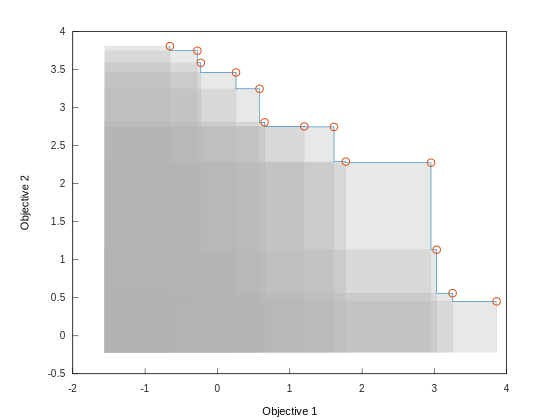

# Constructing fronts

Python:

```python
import pyfront
pf = pyfront.front(2)
```

C++, assuming we are in the `pareto_front` namespace:

```cpp
#include <pareto_front/front.h>
front<double, 2, unsigned> pf;
```

This is a 2-dimensional front with a few elements:


If you need to actually plot these fronts, have a look at [Matplot++](https://github.com/alandefreitas/matplotplusplus) or [Matplotlib](https://matplotlib.org). In particular, have a look at Scatter Plots for two-dimensional fronts, Plot matrices for three-dimensional fronts, or Parallel Coordinate Plots for many-objective fronts.
                                                                   
Note that the front dimension is defined at compile-time. Using the results from our benchmarks (See Section [Benchmarks](../benchmarks.md)), the default constructor will choose an appropriate spatial index to represent the front. Also, like a C++ `map` or a Python `dict`, each point in space is associated with an object. In your application, `unsigned` would probably be replaced by a pointer to an object that has the `double` attributes. 

If the dimensions are not supposed to be minimized, we can define one optimization direction for each dimension:

```python
pf = front(['minimization', 'maximization'])
print(pf)
print(len(pf), 'elements in the front')
if pf:
    print('Front is not empty')
print(pf.dimensions(), 'dimensions')
print('All' if pf.is_minimization() else 'Not all', 'dimensions are minimization')
print('Dimension 0 is', 'minimization' if pf.is_minimization(0) else 'not minimization')
print('Dimension 1 is', 'maximization' if pf.is_maximization(1) else 'not maximization')
```

In C++, the following examples assume `std::cout` and `std::endl` are visible in the current namespace:

```cpp
front<double, 2, unsigned> pf({minimization, maximization});
cout << pf << endl;
cout << pf.size() << " elements in the front" << endl;
if (!pf.empty()) {
    cout << "Front is not empty" << endl;
}
cout << pf.dimensions() << " dimensions" << endl;
cout << (pf.is_minimization() ? "All" : "Not all") << " dimensions are minimization" << endl;
cout << "Dimension 0 is " << (pf.is_minimization(0) ? "minimization" : "not minimization") << endl;
cout << "Dimension 1 is " << (pf.is_maximization(1) ? "maximization" : "not maximization") << endl;
```

If we set all directions to `maximization`, this is what a 2-dimensional front looks like: 



The interface permits choosing a specific data structure for the front through tags:

```python
pf = pyfront.front('list', 2)
pf = pyfront.front('quadtree', 2)
pf = pyfront.front('kdtree', 2)
pf = pyfront.front('boostrtree', 2)
pf = pyfront.front('rtree', 2)
pf = pyfront.front('rstartree', 2)
```

```cpp
front<double, 2, unsigned, vector_tree_tag> pf;
front<double, 2, unsigned, quad_tree_tag> pf;
front<double, 2, unsigned, kd_tree_tag> pf;
front<double, 2, unsigned, boost_tree_tag> pf;
front<double, 2, unsigned, r_tree_tag> pf;
front<double, 2, unsigned, r_star_tree_tag> pf;
```


<!-- Generated with mdsplit: https://github.com/alandefreitas/mdsplit -->
