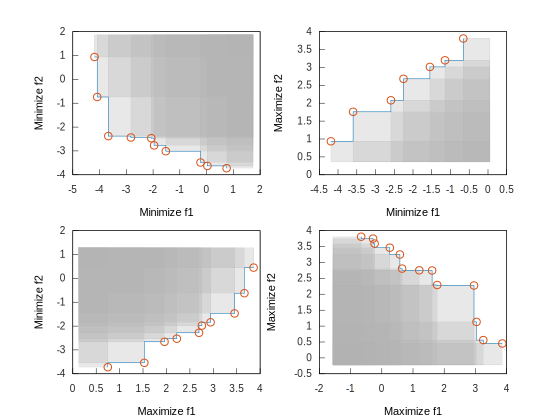
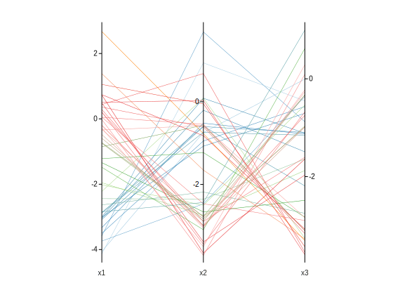

# Constructors

| Method                                                       |
| ------------------------------------------------------------ |
| **Container** + **AllocatorAwareContainer** Constructors     |
| `explicit front(const allocator_type &alloc = allocator_type())` |
| `front(const front &rhs)`                                    |
| `front(const front &rhs, const allocator_type &alloc)`       |
| `front(front &&rhs) noexcept`                                |
| `front(front &&rhs, const allocator_type &alloc) noexcept`   |
| **AssociativeContainer** + **AllocatorAwareContainer** Constructors |
| `explicit front(const C &comp, const allocator_type &alloc = allocator_type())` |
| `template <class InputIt> front(InputIt first, InputIt last, const C &comp = C(), const allocator_type &alloc = allocator_type())` |
| `front(std::initializer_list<value_type> il, const C &comp = C(), const allocator_type &alloc = allocator_type())` |
| `template <class InputIt> front(InputIt first, InputIt last, const allocator_type &alloc)` |
| `front(std::initializer_list<value_type> il, const allocator_type &alloc)` |
| **FrontContainer**                                          |
| `template <class InputIt, class DirectionIt> front(InputIt first, InputIt last, DirectionIt first_dir, DirectionIt last_dir,       const dimension_compare &comp = dimension_compare(), const allocator_type &alloc = allocator_type())` |
| `template <class DirectionIt> front(std::initializer_list<value_type> il, DirectionIt first_dir, DirectionIt last_dir, const dimension_compare &comp = dimension_compare(), const allocator_type &alloc = construct_allocator<allocator_type>())` |
| `template <class InputIt> front(InputIt first, InputIt last, std::initializer_list<bool> il_dir, const dimension_compare &comp = dimension_compare(), const allocator_type &alloc = construct_allocator<allocator_type>())` |
| `front(std::initializer_list<value_type> il, std::initializer_list<bool> il_dir, const dimension_compare &comp = dimension_compare(),       const allocator_type &alloc = construct_allocator<allocator_type>())` |
| `front(std::initializer_list<bool> il_dir, const dimension_compare &comp = dimension_compare(), const allocator_type &alloc = construct_allocator<allocator_type>())` |
| `template <class InputIt, class DirectionIt> front(InputIt first, InputIt last, DirectionIt first_dir, DirectionIt last_dir, const allocator_type &alloc)` |
| `template <class DirectionIt> front(std::initializer_list<value_type> il, DirectionIt first_dir, DirectionIt last_dir, const allocator_type &alloc)` |
| `template <class InputIt> front(InputIt first, InputIt last, std::initializer_list<bool> il_dir, const allocator_type &alloc)` |
| `front(std::initializer_list<value_type> il, std::initializer_list<bool> il_dir, const allocator_type &alloc)` |
| `front(std::initializer_list<bool> il_dir, const allocator_type &alloc)` |
| **AssociativeContainer** + **AllocatorAwareContainer** Assignment |
| `front &operator=(const front &rhs)`                         |
| `front &operator=(front &&rhs) noexcept`                     |
| **AssociativeContainer** Assignment                          |
| `front &operator=(std::initializer_list<value_type> il) noexcept` |

**Parameters**

| Parameter               | Description                                                  |
| ----------------------- | ------------------------------------------------------------ |
| `alloc`                 | allocator to use for all memory allocations of this container |
| `comp`                  | comparison function object to use for all comparisons of keys |
| `first`, `last`         | the range to copy the elements from                          |
| `rhs`                   | another container to be used as source to initialize the elements of the container with |
| `il`                    | initializer list to initialize the elements of the container with |
| `first_dir`, `last_dir` | the range to copy the target directions from                 |
| `il_dir`                | initializer list to initialize the target directions of the container with |

**Requirements**

| Type requirements                                            |
| ------------------------------------------------------------ |
| -`InputIt` and `DirectionIt` must meet the requirements of [*LegacyInputIterator*](https://en.cppreference.com/w/cpp/named_req/InputIterator). |
| -`Compare` must meet the requirements of [*Compare*](https://en.cppreference.com/w/cpp/named_req/Compare). |
| -`Allocator` must meet the requirements of [*Allocator*](https://en.cppreference.com/w/cpp/named_req/Allocator). |

**Complexity**

| Method                              | Complexity                                         |
| ----------------------------------- | -------------------------------------------------- |
| Empty constructor                   | $O(1)$                                             |
| Copy constructor                    | $O(mn)$                                            |
| Move constructor                    | $O(1)$ if `get_allocator() == rhs.get_allocator()` |
| Construct from range, or assignment | $O(m n \log n)$                                    |

**Notes**

All constructors in **FrontContainer** replicate the constructors for spatial containers with an extra parameter to provide target directions (minimization / maximization). If the dimensions are not supposed to be minimized, we can define one optimization direction for each dimension. 

!!! note "Default directions"
    By default, all directions are minimized. Whenever we insert an element in a front, it erases all elements dominated by the new solution:

    

!!! example "Varying directions"
    If we set all directions to `maximization`, this is what a 2-dimensional front looks like:
    
    

    And these are the combinations for two-dimensional fronts:

    
    
    In more than two dimensions, we usually represent fronts with parallel coordinates:
    
    

!!! tip "Plotting fronts"
    The header [`pareto/matplot/front.h`](https://github.com/alandefreitas/pareto/blob/master/source/pareto/matplot/front.h) contains an example of a function to plot fronts with [Matplot++](https://github.com/alandefreitas/matplotplusplus). The file [`examples/matplotpp_example.cpp`](https://github.com/alandefreitas/pareto/blob/master/examples/matplotpp_example.cpp) includes an example that uses these plot functions. In Python, you can use [Matplotlib](https://matplotlib.org) like you would with any other linear list of points.

**Example**

=== "C++"

    ```cpp
    #include <pareto/front.h>
    #include <pareto/kd_tree.h>
    // ...
    // Constructing the default front
    front<double, 3, unsigned> pf({min, max, min});
    // Constructing a front based on kd trees
    front<double, 3, unsigned, kd_tree<double, 3, unsigned>> pf2({min, max, min});
    ```

=== "Python"

    ```python
    import pareto
    # ...
    # Constructing the default front
    pf = pareto.front(['min', 'max', 'min']);
    # Constructing a front based on kd trees
    pf2 = pareto.kd_front(['min', 'max', 'min']);
    ```


<!-- Generated with mdsplit: https://github.com/alandefreitas/mdsplit -->
