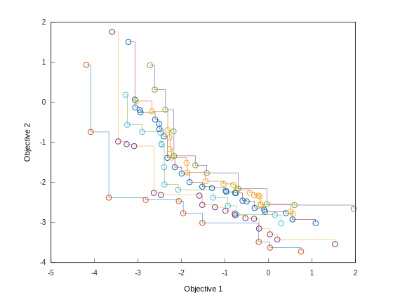

# Archive Container

The `pareto::archive` container is also both an adapter and an extension of spatial containers to cache objects representing conflicting alternatives:

=== "C++"

    ```cpp
    // Three-dimensional Pareto archive
    pareto::archive<double, 3, unsigned> m;
    ```

=== "Python"

    ```python
    # Python Three-dimensional Pareto archive
    m = pareto.archive()
    ```

They are useful in dynamic applications where the best objects might not be available in the future and we might need a second best. Archives are especially useful in all dynamic applications that use fronts, such as:

* P2P networks
* multi-criteria decision making
* generate-and-test optimization algorithms
* robust optimization

!!! tip
    You can think of archives as a multidimensional stack.

!!! example
    This is what a two-dimensional archive would look like:

    

!!! tip "Plotting Archives"
    The header `pareto/matplot/archive.h` includes some snippets to plot these archives with [Matplot++](https://github.com/alandefreitas/pareto/blob/master/).

!!! info "Archive Capacity"
    All archive constructors include an optional parameter to define the maximum number of elements in the archive. If no maximum capacity for the archive is explicitly set, the capacity is set to $\min(50 \times 2^m, 100000)$. The exponential factor $2^m$ in this heuristic is meant to take the curse of dimensionality in consideration.

Data scientists often use linear lists to represent these fronts, with a cost of $O(mn^3)$ 😱 for several operations. With spatial indexes, this cost reduces to just $O(m \log^2 n)$.

You have probably noticed by now that containers for fronts and archives have lots of use cases:

| Use case                                                     | Common keys                                                 |
| ------------------------------------------------------------ | ----------------------------------------------------------- |
| Machine Learning                                             | Accuracy vs. Complexity vs. Time                            |
| Approximation algorithms                                     | Error vs. Time                                              |
| Product design                                               | Investment vs. Profit vs. Safety vs. Performance  vs. Scope |
| P2P networks                                                 | Latency vs. Trust vs. Availability                          |
| Robust optimization                                          | Average quality vs. Robustness                              |
| Design                                                       | Average quality vs. Standard deviation                      |
| Systems control                                              | Performance vs. Price vs. Quality                           |
| Portfolio optimization                                       | Expected return vs. Risk                                    |
| [More...](https://en.wikipedia.org/wiki/Multi-objective_optimization#Examples_of_applications) | ...                                                         |


<!-- Generated with mdsplit: https://github.com/alandefreitas/mdsplit -->
