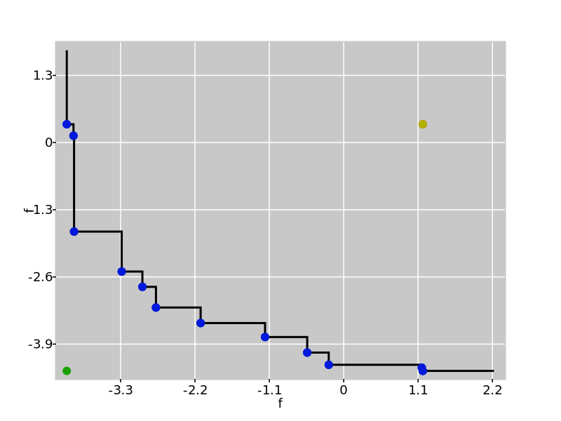
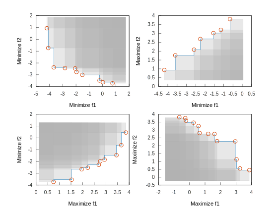
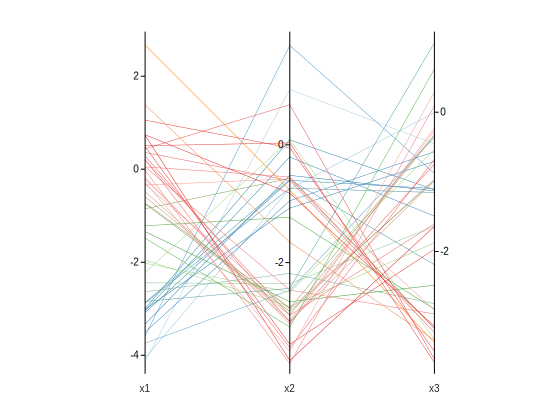

# Front Container

The `pareto::front` object defines a container for **Pareto fronts**, which is both an adapter and an extension of the spatial containers to deal with objects representing conflicting alternatives:

=== "C++"

    ```cpp
    // Three-dimensional Pareto front
    pareto::front<double, 3, unsigned> m;
    ```

=== "Python"

    ```python
    # Three-dimensional Pareto front
    # The dimension will be set when you insert the first element
    m = pareto.front()
    ```

When inserting a new element in the front, all solutions *dominated* by the new solution are erased with spatial queries. Pareto fronts are useful in any application where we need to store the best objects according to a number of criteria, such as:

* finance
* multi-criteria decision making
* optimization
* machine learning
* hyper-parameter tuning
* approximation algorithms
* P2P networks
* routing algorithms
* robust optimization
* design
* systems control

!!! tip 
    You can think of fronts as a container for dynamic multidimensional max/min-finding. 

!!! example 
     Suppose you want to choose between a number of investment portfolios. By looking at the historical data, you have noticed each portfolio has an average return and some average risk (something like the covariance between the assets). Because there is an exponential number of portfolio candidates, you can instead iteratively update the front with the best portfolios for your criteria and use these portfolios as a reference to test new portfolios. You would then have front like the following:

     

These objectives often go in different directions (e.g., minimize price vs. maximize quality). In these situations, you can specify a direction for each dimension.

=== "C++"

    ```cpp
    // C++ Three-dimensional Pareto front
    pareto::front<double, 2, unsigned> m({min, max});
    ```

=== "Python"

    ```python
    # Python Three-dimensional Pareto front
    m = pareto.front(['min','max'])
    ```

!!! example
    

    In more than two dimensions, we usually represent the fronts with parallel coordinates:

    

!!! tip "Plotting Fronts"
    The header `pareto/matplot/front.h` includes some snippets to plot these fronts with [Matplot++](https://github.com/alandefreitas/pareto/blob/master/).

Data scientists often use linear lists to represent these fronts, with a cost of $O(mn^2)$ for several operations. This
makes it unfeasible to represent the thousands or millions of solutions we usually have in a non-polynomial
multidimensional optimization problem due to the curse of dimensionality. With spatial indexes, this cost reduces to
only $O(m \log n)$.

!!! tip "Indicators"
Because Pareto fronts include solutions that are incomparable by definition, we need metrics to tell us the quality of a
front. The `front` objects implement lots of performance indicators that can give us measures of:

    * hypervolume
    * convergence
    * cardinality
    * distribution
    * correlation


<!-- Generated with mdsplit: https://github.com/alandefreitas/mdsplit -->
